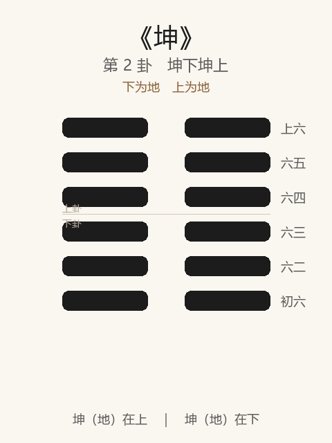

# 《坤》卦解读

## 卦象

<p align="center">
  
</p>

**䷁ 坤**（第 2 卦）｜**坤下坤上**（下为地，上为地）

| 下卦（内） | 上卦（外） |
|------------|------------|
| ☷ 坤（地） | ☷ 坤（地） |

```
━━  ━━  上六
━━  ━━  六五
━━  ━━  六四
━━  ━━  六三
━━  ━━  六二
━━  ━━  初六
```

> 阳爻为「九」（━━━━━━），阴爻为「六」（━━  ━━）；自下往上：初→上。

---

> 元亨，利牝马之贞。君子有攸往，先迷后得主，利；西南得朋，东北丧朋，安贞吉。
>
> 初六：履霜，坚冰至。
>
> 六二：直，方，大；不习，无不利。
>
> 六三：含章，可贞。或从王事，无成有终。
>
> 六四：括囊，无咎无誉。
>
> 六五：黄裳，元吉。
>
> 上六：龙战于野，其血玄黄。
>
> 用六：利永贞。

《坤》是纯阴之卦：六爻皆阴，象征柔顺、承载、含蓄、成全。与乾相对——乾开创，坤成就；乾主「健」，坤主「顺」。整体讲的是阴柔之德如何由微至著、由顺至极，以及「用六」守正之归。

---

## 卦辞

### 元亨，利牝马之贞

| 语 | 含义 |
|----|------|
| **元亨** | 与乾同有元、亨：能始、能通；坤之始在「承乾而化」，非自立其始 |
| **利牝马之贞** | 宜如牝马之正：柔顺而能行远、能负载，不争先、不背正 |

乾曰「利贞」，坤特言「牝马之贞」——刚之贞在守正而健，柔之贞在顺正而载。

### 君子有攸往，先迷后得主，利

有所前往时：若争先、自为主，则迷；后于阳、从得其主，则利。  
坤道贵**后、从、得主**，不贵领先自作主张。

### 西南得朋，东北丧朋，安贞吉

| 方位 | 象义 |
|------|------|
| **西南** | 坤之位（阴方），得同类之助 → 得朋 |
| **东北** | 艮、阳将生之方，阴气消散 → 丧朋 |

「丧朋」未必凶：离开私党之朋，归向正主、安于正固，反而是吉。  
合起来：**安于顺正，不妄求同类之聚，则吉。**

---

## 六爻：阴德由微至极

| 爻 | 爻辞 | 要旨 |
|----|------|------|
| **初六** | 履霜，坚冰至 | 阴始凝，履霜而知冰将至 → **见微知著，防渐慎始** |
| **六二** | 直，方，大；不习，无不利 | 得中得正，柔顺之德本具 → **正直广大，不假造作，无往不利** |
| **六三** | 含章，可贞。或从王事，无成有终 | 内蕴文采，守正可成；从君行事 → **有功不居，终能有成** |
| **六四** | 括囊，无咎无誉 | 紧闭如囊，慎密自守 → **无过亦无誉，处危以收敛** |
| **六五** | 黄裳，元吉 | 黄为中色，裳为下服 → **居尊而守中、处下，大吉** |
| **上六** | 龙战于野，其血玄黄 | 阴极与阳相争 → **柔极转刚、对抗不已，两伤** |

一条线：**霜 → 直方大 → 含章 → 括囊 → 黄裳 → 龙战**。

由「知微」而「成德」，由「含藏」而「居中」，至极则失顺而战——坤之戒在「极阴反刚」。

---

## 用六：利永贞

坤卦独有「用六」（乾有「用九」）。

六爻皆阴、皆可变。阴柔之用在于**长久守正**，不以柔而失正、不以顺而苟且。

- 用九：刚而不争首 → 吉  
- 用六：柔而能永贞 → 利  

柔顺若不能「永贞」，易流于邪佞、依附失主；能永贞，则柔成为大德。

---

## 一条贯通的读法

1. **德**：坤之德为「顺」——厚德载物；顺必须配「正」，故言牝马之贞、安贞、永贞。
2. **位**：坤不争乾之先，贵后、贵从、贵得主；六二「直方大」是坤德正位，六五「黄裳」是居尊而不失下。
3. **戒**：初戒在「渐」（霜知冰），上戒在「极」（龙战）；中戒在「张扬」——宜含章、括囊，不宜自炫。
4. **归**：用六收束为「利永贞」——柔能久正，方与乾之健相配成物。

---

## 与《乾》对照

| | 《乾》 | 《坤》 |
|---|--------|--------|
| 性 | 纯阳，刚健 | 纯阴，柔顺 |
| 德 | 自强不息 | 厚德载物 |
| 贞 | 利贞 | 利牝马之贞 / 安贞 / 永贞 |
| 极之戒 | 亢龙有悔 | 龙战于野 |
| 用 | 用九：群龙无首，吉 | 用六：利永贞 |
| 人事倾向 | 开创、担当、进德 | 承载、从辅、含蓄成终 |

乾坤并建：无乾则无始，无坤则无成；知健而不知顺，易亢；知顺而不知贞，易邪。

---

## 人事简表

| 所问 | 要点 |
|------|------|
| **事业** | 宜承、宜辅、宜后动；先迷后得主——找对依托与方向再行 |
| **修身** | 履霜知冰（慎渐）；直方大（存诚不伪）；含章括囊（韬光） |
| **处世** | 六五黄裳：有位仍守中处下；上六示戒：柔极而争则两伤 |
| **从属/协作** | 「或从王事，无成有终」——做事有功不居首，反能善终 |
