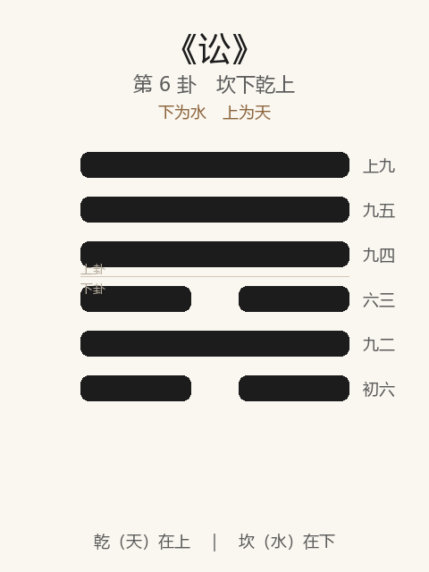

# 《讼》卦解读

## 卦象

<p align="center">
  
</p>

**䷅ 讼**（第 6 卦）｜**坎下乾上**（下为水，上为天）

| 下卦（内） | 上卦（外） |
|------------|------------|
| ☵ 坎（水） | ☰ 乾（天） |

```
━━━━━━  上九
━━━━━━  九五
━━━━━━  九四
━━  ━━  六三
━━━━━━  九二
━━  ━━  初六
```

> 阳爻为「九」（━━━━━━），阴爻为「六」（━━  ━━）；自下往上：初→上。

---

> 有孚窒惕，中吉；终凶，利见大人，不利涉大川。
>
> 初六：不永所事，小有言，终吉。
>
> 九二：不克讼，归而逋，其邑人三百户。无眚。
>
> 六三：食旧德，贞厉，终吉；或从王事，无成。
>
> 九四：不克讼，复即命，渝。安贞，吉。
>
> 九五：讼，元吉。
>
> 上九：或锡之鞶带，终朝三褫之。

《讼》为坎下乾上：下险上健，内心忧惧而外欲刚进，故成争讼。讼者，争也——**有孚而被窒，不得不惕**。整体讲争讼中如何早止、如何归命、如何见大人，以及「终讼」之凶。

---

## 卦辞：有孚窒惕，中吉；终凶，利见大人，不利涉大川

| 语 | 含义 |
|----|------|
| **有孚窒惕** | 本有诚信，却受阻窒，故须警惕 |
| **中吉** | 争讼之中，能持中、能适可而止则吉 |
| **终凶** | 讼若进行到底，凶；硬斗到底必伤 |
| **利见大人** | 宜求公正权威裁决，不可私斗 |
| **不利涉大川** | 讼时不宜冒险大举；险上加险 |

与《需》「利涉大川」相对：需是待而后济，讼是争而不宜济——**中吉终凶**是全卦之纲。

---

## 六爻：争讼中的进退

| 爻 | 爻辞 | 要旨 |
|----|------|------|
| **初六** | 不永所事，小有言，终吉 | 事不拖长 → **小有口舌，早罢则终吉** |
| **九二** | 不克讼，归而逋，其邑人三百户。无眚 | 讼不能胜，退归逃避 → **退可保众，无灾** |
| **六三** | 食旧德，贞厉，终吉；或从王事，无成 | 安于旧日之德 → **守成知危则终吉；从王事勿居功** |
| **九四** | 不克讼，复即命，渝。安贞，吉 | 讼不胜，回归正命、改变争心 → **安于正，吉** |
| **九五** | 讼，元吉 | 居中正听讼之位 → **以正断讼，大吉** |
| **上九** | 或锡之鞶带，终朝三褫之 | 或赏命服，一日三夺 → **讼胜无常，荣亦难久** |

一条线：**早止（初）→ 不克则退（二）→ 食旧德（三）→ 复命改过（四）→ 大人正讼（五）→ 终讼无常（上）**。

讼之要：**能不永、能不克而退、能复命；最忌讼到底。**

---

## 几处关键意象

### 中吉，终凶

| | 含义 |
|---|------|
| **中** | 持中、半途而止、见大人而平 |
| **终** | 缠讼到底、必欲胜人 |

卦辞已定调：讼本身不是吉道，吉只在「中」，凶在「终」。

### 不克讼

二、四皆「不克讼」：不是怂，而是知不可胜、不可终。  
二「归而逋」保邑人，四「复即命，渝」改心归正——**退与改，皆吉于硬扛。**

### 食旧德

六三柔而不亢：不靠争讼开新局，而靠守住已有之德。贞而知厉，反能终吉；即便做事，也「无成」（不居其成）。

### 鞶带三褫

上九或得荣赐，旋即三夺——说明**以讼求胜、以胜求荣，皆不牢**。终讼之象，应卦辞「终凶」。

---

## 一条贯通的读法

1. **时**：讼是争而有窒之时，诚信受阻，须惕。
2. **德**：有孚仍要中——争可暂，不可终；利见大人，不私斗。
3. **事**：初不永，二四不克则退改，五以正听，上戒荣之无常。
4. **戒**：不利涉大川；戒缠讼、戒恃刚求胜、戒因讼贪赏。

---

## 与《需》对照

| | 需 | 讼 |
|---|----|----|
| 序 | 5 | 6 |
| 象 | 健遇险（待） | 险遇健（争） |
| 大川 | 利涉大川 | 不利涉大川 |
| 要诀 | 有孚贞待 | 有孚窒惕，中吉终凶 |
| 关系 | 需而不进 | 进而不已则成讼 |

需极而进，健险相撞，故继之以讼。

---

## 人事简表

| 所问 | 要点 |
|------|------|
| **纠纷/诉讼** | 宜早了、宜和解、宜见公正之人；缠到底凶 |
| **已处下风** | 二、四：不克则退、复命改过，反无眚、反吉 |
| **自处** | 三：守旧德、知危厉；做事不居功 |
| **裁决者** | 五：居中正，断讼可元吉 |
| **得胜之后** | 上：荣可骤得骤失，勿因胜而骄、因赏而恃 |
