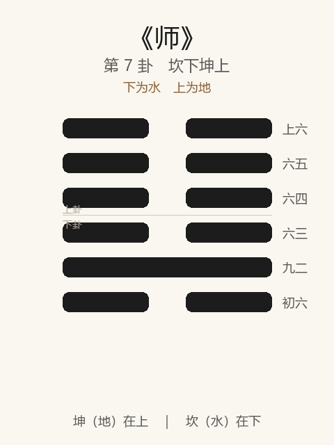

# 《师》卦解读

## 卦象

<p align="center">
  
</p>

**䷆ 师**（第 7 卦）｜**坎下坤上**（下为水，上为地）

| 下卦（内） | 上卦（外） |
|------------|------------|
| ☵ 坎（水） | ☷ 坤（地） |

```
━━  ━━  上六
━━  ━━  六五
━━  ━━  六四
━━  ━━  六三
━━━━━━  九二
━━  ━━  初六
```

> 阳爻为「九」（━━━━━━），阴爻为「六」（━━  ━━）；自下往上：初→上。

---

> 贞，丈人吉，无咎。
>
> 初六：师出以律，否臧凶。
>
> 九二：在师中，吉，无咎。王三锡命。
>
> 六三：师或舆尸，凶。
>
> 六四：师左次，无咎。
>
> 六五：田有禽，利执言，无咎。长子帅师，弟子舆尸，贞凶。
>
> 上六：大君有命，开国承家，小人勿用。

《师》为坎下坤上：地中有水，水聚于地，象征众、兵、众聚而听命。师者，众也——**兴师动众，必以正、必以贤将**。整体讲用兵（及凡举大事率众）的律、将、进退与功成用人。

---

## 卦辞：贞，丈人吉，无咎

| 语 | 含义 |
|----|------|
| **贞** | 师出须正：师出有名、目的正当 |
| **丈人吉** | 以老成持重、有德有威者统众则吉 |
| **无咎** | 得正得人，乃可无咎 |

师卦不轻言「亨」「元吉」，只言「贞，丈人吉」——**众事最重「正」与「人」。**

---

## 六爻：用众之法

| 爻 | 爻辞 | 要旨 |
|----|------|------|
| **初六** | 师出以律，否臧凶 | 出师先定律 → **纪律不善则凶** |
| **九二** | 在师中，吉，无咎。王三锡命 | 刚中在师，为众之主 → **得君信任，吉** |
| **六三** | 师或舆尸，凶 | 舆尸而归 → **任非其人，大败凶** |
| **六四** | 师左次，无咎 | 退舍、暂驻 → **知难而退，无咎** |
| **六五** | 田有禽，利执言，无咎。长子帅师，弟子舆尸，贞凶 | 田猎有获，宜执正言辞 → **用长子（贤将）吉；用弟子（不胜任者）则贞亦凶** |
| **上六** | 大君有命，开国承家，小人勿用 | 功成封赏 → **可开国承家；小人有功亦不可用** |

一条线：**以律出师 → 中将得命 → 忌舆尸 → 可左次 → 择将在贤 → 功成勿用小人**。

师之要：**律正、将贤、能退、论功而以德用人。**

---

## 几处关键意象

### 丈人与长子

| 称 | 所指 |
|----|------|
| **丈人** | 老成、威望、能服众者（卦辞） |
| **长子** | 正将、贤能可托者（六五） |
| **弟子** | 才德不足、不可帅师者 |

全卦反复强调：**不是有众即可战，而是有「人」方可师。**

### 师出以律

初六定调：律不善（否臧），出师即凶。纪律、号令、赏罚，是师之始，不是师之余事。

### 舆尸

三、五两见「舆尸」：载尸而还，败军之象。原因皆在**用人不当、号令不一**——与九二「在师中」之专一相对。

### 左次

六四「师左次」：偏次、退驻。师卦并非处处主进——**能进能退，退亦无咎**，胜于冒进舆尸。

### 开国承家，小人勿用

上六功成：可封诸侯、立家业，但**赏归赏，用归用**——小人即便有军功，也不可授以治国之柄。

---

## 一条贯通的读法

1. **时**：师是聚众、用众、不得已而动之时。
2. **德**：首在「贞」——师出有名；次在「丈人」——将得其人。
3. **事**：初严律，二得中得命，四可退，五慎择将，上慎封用。
4. **戒**：律败则凶，舆尸则凶，弟子帅师贞亦凶，功成用小人则乱。

---

## 与《讼》衔接

| | 讼 | 师 |
|---|----|----|
| 序 | 6 | 7 |
| 象 | 险遇健（争） | 地中有水（众） |
| 关系 | 争之不已 | 众起而成师 |
| 要诀 | 中吉终凶 | 贞，丈人吉 |

讼极而众怒、或争而需以众定之，故继之以师——然师必以正，不可沦为逞忿。

---

## 人事简表

| 所问 | 要点 |
|------|------|
| **用兵/竞争** | 师出以律；将用丈人、长子；可左次，忌舆尸 |
| **带团队** | 号令专一（九二在师中）；忌多头指挥、任非其人 |
| **进退** | 有禽可执则动；势不可则左次，退亦无咎 |
| **论功行赏** | 可开国承家；小人有功可赏，不可重用 |
| **决策者** | 五：执言要正；择帅是吉凶关键，比「敢战」更要紧 |
