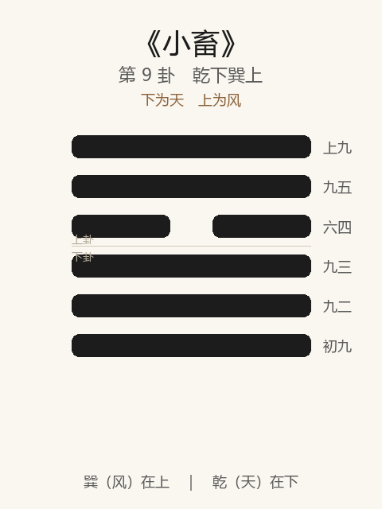

# 《小畜》卦解读

## 卦象

<p align="center">
  
</p>

**䷈ 小畜**（第 9 卦）｜**乾下巽上**（下为天，上为风）

| 下卦（内） | 上卦（外） |
|------------|------------|
| ☰ 乾（天） | ☴ 巽（风） |

```
━━━━━━  上九
━━━━━━  九五
━━  ━━  六四
━━━━━━  九三
━━━━━━  九二
━━━━━━  初九
```

> 阳爻为「九」（━━━━━━），阴爻为「六」（━━  ━━）；自下往上：初→上。

---

> 亨。密云不雨，自我西郊。
>
> 初九：复自道，何其咎？吉。
>
> 九二：牵复，吉。
>
> 九三：舆说辐，夫妻反目。
>
> 六四：有孚，血去惕出，无咎。
>
> 九五：有孚挛如，富以其邻。
>
> 上九：既雨既处，尚德载；妇贞厉，月几望；君子征凶。

《小畜》为乾下巽上：风行天上，以阴蓄阳，所蓄者小。畜者，止也、聚也——**力尚未大，密云而未雨**。整体讲小有蓄养、小有阻滞时如何复道、如何以孚相系，以及「既雨」之后当止勿进。

---

## 卦辞：亨。密云不雨，自我西郊

| 语 | 含义 |
|----|------|
| **亨** | 小畜亦有通：能蓄、能待，则亨 |
| **密云不雨** | 阴气已聚，却未成雨——事将成未成，气势未畅 |
| **自我西郊** | 云起西方（阴方），蓄之有自，尚未遍施 |

小畜之象：**不是无望，而是未满**——宜蓄不宜躁，宜复道不宜强行。

---

## 六爻：小有所蓄时的进退

| 爻 | 爻辞 | 要旨 |
|----|------|------|
| **初九** | 复自道，何其咎？吉 | 自行复归正道 → **何咎之有，吉** |
| **九二** | 牵复，吉 | 牵连而复（与初同道） → **相引归正，吉** |
| **九三** | 舆说辐，夫妻反目 | 车脱辐不能行；阴阳失和 → **强进则败，内生乖离** |
| **六四** | 有孚，血去惕出，无咎 | 一阴畜众阳，以诚信 → **伤害与忧惧可去，无咎** |
| **九五** | 有孚挛如，富以其邻 | 诚信固结如挛 → **与邻同富，德能及人** |
| **上九** | 既雨既处，尚德载；妇贞厉，月几望；君子征凶 | 雨已降、蓄已成 → **宜止宜载德；阴盛近满，君子出征则凶** |

一条线：**自复 → 牵复 → 忌脱辐反目 → 孚而去惕 → 孚而富邻 → 既雨当止**。

小畜之要：**复道、有孚、知止；忌强进、忌既满犹征。**

---

## 几处关键意象

### 密云不雨

全卦总象：条件在聚，成果未降。可理解为：计划已酝酿、力量在蓄积，但**还不是收获、施展之时**——亨在蓄，不在抢收。

### 复自道 / 牵复

初、二皆「复」：被小畜所止时，不硬闯，而回到自己的正道。二「牵复」更见同志相引——**小畜中，归正比冒进更吉。**

### 舆说辐，夫妻反目

九三过刚不中：车轮脱辐（说通「脱」），进不得；又象夫妻反目——阴阳相畜失和。小畜中若逞刚，则**外不能行，内不能和**。

### 有孚：血去惕出 / 挛如

四、五皆落在「有孚」：  
- 四以柔畜刚，靠诚信化解伤害与戒惧；  
- 五以孚固结，不但自富，且「富以其邻」。  

**小畜能亨，关键在孚，不在力。**

### 既雨既处，君子征凶

上九：密云终于成雨，蓄极而通，事已停住（处）。此时「尚德载」——以德承载成果即可；「月几望」阴德将满，再「征」则过——**成功在望时，最忌再进不止。**

---

## 一条贯通的读法

1. **时**：小有蓄、小有阻，云密而未雨之时。
2. **德**：亨在能蓄、能复、能孚；不在以小力扛大事。
3. **事**：初二复道，四以孚解危，五以孚联邻，上既雨则处。
4. **戒**：三戒强进反目；上戒满而犹征；全局戒把「小畜」当成「大有」。

---

## 与《比》衔接

| | 比 | 小畜 |
|---|----|------|
| 序 | 8 | 9 |
| 象 | 地上有水（亲附） | 风行天上（以阴畜阳） |
| 关系 | 比而后有所畜 | 所畜尚小 |
| 要诀 | 有孚比之 | 密云不雨；有孚挛如 |
| 戒 | 后夫、无首 | 脱辐反目、既雨征凶 |

得比则力量开始聚集，然积之未厚，故为小畜——宜养宜孚，不宜大举。

---

## 人事简表

| 所问 | 要点 |
|------|------|
| **事业进展** | 密云不雨：将近而未成，宜蓄势复道，勿强求结果 |
| **受阻时** | 初、二：回到正道、同志相牵则吉；忌九三式硬闯 |
| **合作** | 四、五：以孚消惕、以孚富邻；诚信是小畜中的杠杆 |
| **将成之际** | 上：既雨既处——收成后宜止、宜载德；再征则凶 |
| **关系** | 三之「夫妻反目」示戒：小阻滞中逞强，最易内讧 |
