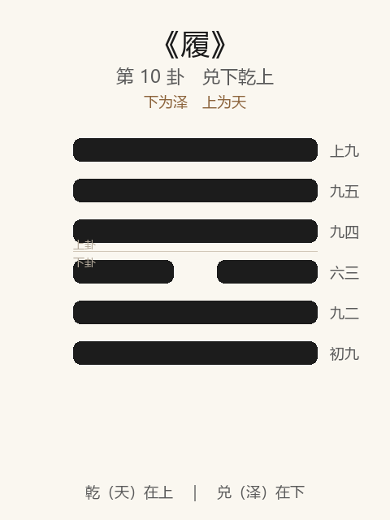

# 《履》卦解读

## 卦象

<p align="center">
  
</p>

**䷉ 履**（第 10 卦）｜**兑下乾上**（下为泽，上为天）

| 下卦（内） | 上卦（外） |
|------------|------------|
| ☱ 兑（泽） | ☰ 乾（天） |

```
━━━━━━  上九
━━━━━━  九五
━━━━━━  九四
━━  ━━  六三
━━━━━━  九二
━━━━━━  初九
```

> 阳爻为「九」（━━━━━━），阴爻为「六」（━━  ━━）；自下往上：初→上。

---

> 履虎尾，不咥人，亨。
>
> 初九：素履，往无咎。
>
> 九二：履道坦坦，幽人贞吉。
>
> 六三：眇能视，跛能履，履虎尾咥人，凶。武人为于大君。
>
> 九四：履虎尾，愬愬，终吉。
>
> 九五：夬履，贞厉。
>
> 上九：视履考祥，其旋元吉。

《履》为兑下乾上：上天下泽，天尊泽卑，上下有序。履者，礼也、践也——**行走于危，如履虎尾**。整体讲如何以礼、以慎行于刚强之前，终能亨通。

---

## 卦辞：履虎尾，不咥人，亨

| 语 | 含义 |
|----|------|
| **履虎尾** | 踩在虎尾上——处境危险，所行在刚强者之后 |
| **不咥人** | 虎不咬人——以柔顺、礼敬处危，可免伤害 |
| **亨** | 能慎能礼，则危中有通 |

履之亨，不在无虎，而在**履危而不失礼、不失慎**。

---

## 六爻：行于危境的几种走法

| 爻 | 爻辞 | 要旨 |
|----|------|------|
| **初九** | 素履，往无咎 | 朴素本分而行 → **按本色走，往无咎** |
| **九二** | 履道坦坦，幽人贞吉 | 行道平坦，幽静守正 → **不求闻达，贞吉** |
| **六三** | 眇能视，跛能履，履虎尾咥人，凶。武人为于大君 | 才不足而强为 → **履危被咥，凶；武人揽君权，亦戒** |
| **九四** | 履虎尾，愬愬，终吉 | 仍履虎尾，但恐惧戒慎 → **愬愬终吉** |
| **九五** | 夬履，贞厉 | 刚决而行 → **虽正亦危，不可恃刚** |
| **上九** | 视履考祥，其旋元吉 | 回顾所履，考其吉祥 → **循环审视，大吉** |

一条线：**素履 → 坦坦幽贞 → 忌强为被咥 → 愬愬终吉 → 夬履知厉 → 视履考祥**。

履之要：**素、慎、礼；忌才不称位而逞，忌刚决而不知危。**

---

## 几处关键意象

### 履虎尾

全卦总喻：乾为虎（刚在上），兑为悦/柔（在下）——柔履刚后，如蹑虎尾。  
同履虎尾：三「咥人，凶」，四「愬愬，终吉」——**危同而心不同，吉凶遂分。**

### 素履 / 履道坦坦

初「素」：不文饰、不僭越，按本分走。  
二「坦坦」「幽人」：心平路平，不炫不躁。  
二者皆是履礼之正：先正己，再行险。

### 眇能视，跛能履

六三：眼不明却自以为能看，腿不便却自以为能走——**能力与野心错位**，故咥人凶。「武人为于大君」：以武人身份行大君之事，越位强为，同戒。

### 愬愬与夬履

| 爻 | 态度 | 结果 |
|----|------|------|
| 九四 | 愬愬（戒惧） | 终吉 |
| 九五 | 夬履（刚决） | 贞厉 |

位越高越易刚决；履卦提醒：**越刚越要知厉，愬愬胜于夬。**

### 视履考祥，其旋元吉

上九：走完一程，回看足迹，考察吉凶祸福——「旋」有回环审视之义。履之终不在继续逞行，而在**省察所行，圆满则元吉**。

---

## 一条贯通的读法

1. **时**：行于尊刚之前、如履虎尾之时。
2. **德**：履即礼——分位、敬慎、不僭。
3. **事**：初素、二幽贞、四愬愬可过危；上考祥以成。
4. **戒**：三戒不胜任而强履；五戒刚决不知厉。

---

## 与《小畜》衔接

| | 小畜 | 履 |
|---|------|-----|
| 序 | 9 | 10 |
| 象 | 风行天上（蓄而未雨） | 上天下泽（以礼定分） |
| 关系 | 畜然后可履 | 所行须合礼 |
| 要诀 | 密云不雨，复道有孚 | 履虎尾，不咥人 |
| 戒 | 既雨征凶 | 咥人、夬履厉 |

物畜然后有礼：小有蓄积之后，进退须合于履——故继之以履。

---

## 人事简表

| 所问 | 要点 |
|------|------|
| **处危/伴强者** | 如履虎尾：敬慎可亨；愬愬终吉，强为则咥 |
| **自处** | 素履、坦坦幽贞——本分、平静、不炫 |
| **能力与职位** | 三：不胜任而揽大权最凶；量力而行 |
| **当位决事** | 五：可决而须知厉，不可刚愎 |
| **事后** | 上：视履考祥——复盘所行，乃得元吉 |
