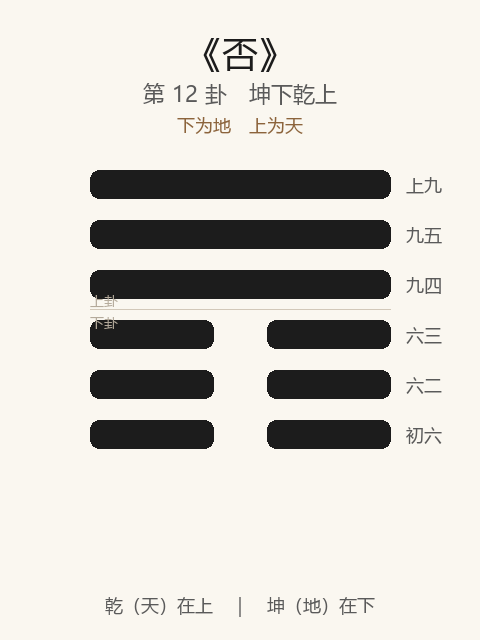

# 《否》卦解读

## 卦象

<p align="center">
  
</p>

**䷋ 否**（第 12 卦）｜**坤下乾上**（下为地，上为天）

| 下卦（内） | 上卦（外） |
|------------|------------|
| ☷ 坤（地） | ☰ 乾（天） |

```
━━━━━━  上九
━━━━━━  九五
━━━━━━  九四
━━  ━━  六三
━━  ━━  六二
━━  ━━  初六
```

> 阳爻为「九」（━━━━━━），阴爻为「六」（━━  ━━）；自下往上：初→上。

---

> 否之匪人，不利，君子贞；大往小来。
>
> 初六：拔茅茹，以其汇；贞吉，亨。
>
> 六二：包承，小人吉；大人否，亨。
>
> 六三：包羞。
>
> 九四：有命无咎，畴离祉。
>
> 九五：休否，大人吉；其亡其亡，系于苞桑。
>
> 上九：倾否；先否后喜。

《否》为坤下乾上：天地不交，阳气上亢、阴气下沉，闭塞不通。否者，塞也——**大往小来，小人道长**。整体讲闭塞之时如何守正、退避、待命，以及如何「休否」「倾否」而转喜。

---

## 卦辞：否之匪人，不利，君子贞；大往小来

| 语 | 含义 |
|----|------|
| **否之匪人** | 闭塞之世，非其人当道；君子与匪人隔绝 |
| **不利，君子贞** | 时势不利进取；君子宜守正，不苟合 |
| **大往小来** | 阳（大）往外，阴（小）来内——与泰相反 |

否之要：不是「胡作非为」，而是**不通之时，君子以贞自处，不与匪人混。**

---

## 六爻：闭塞中的退与转

| 爻 | 爻辞 | 要旨 |
|----|------|------|
| **初六** | 拔茅茹，以其汇；贞吉，亨 | 拔茅连类 → **同志退守，贞则吉亨** |
| **六二** | 包承，小人吉；大人否，亨 | 包容顺承 → **小人以此为吉；大人处否反能亨（不乱于否）** |
| **六三** | 包羞 | 包藏羞耻 → **苟容取羞，可鄙** |
| **九四** | 有命无咎，畴离祉 | 上有天命可奉 → **无咎；同类并得福** |
| **九五** | 休否，大人吉；其亡其亡，系于苞桑 | 休止闭塞 → **大人吉；危亡在念，系于苞桑乃固** |
| **上九** | 倾否；先否后喜 | 倾覆否运 → **否极将倾，先否后喜** |

一条线：**汇退守贞 → 大人否亨 → 忌包羞 → 有命畴祉 → 休否危惧 → 倾否后喜**。

否之要：**贞退、不苟容；待有命而转，休否以危惧之心，终可倾否。**

---

## 几处关键意象

### 大往小来 / 小往大来

| 卦 | 往来 | 时义 |
|----|------|------|
| 泰 | 小往大来 | 君子道长，交通 |
| 否 | 大往小来 | 小人道长，闭塞 |

泰否相对：一通一塞，一交一不交。

### 拔茅茹：泰进否退

初爻与泰初同辞「拔茅茹，以其汇」，而方向相反：  
- 泰：征吉（并进）  
- 否：贞吉，亨（并退守正）  

**同象异时：泰宜进，否宜退。**

### 包承与包羞

| 爻 | 辞 | 义 |
|----|----|----|
| 六二 | 包承 | 小人顺承时势则吉；大人不以其道，处否而亨 |
| 六三 | 包羞 | 包藏可耻之事、苟且求容 |

二尚可分大人小人；三则纯是羞——否中最戒**无骨气的依附**。

### 其亡其亡，系于苞桑

九五将休否：口中常念「将亡将亡」，如系于丛桑之根——**越是要扭转闭塞，越要危惧戒慎**，不可一见转机就放鬆。大人吉，正在于此。

### 倾否；先否后喜

上九否极：闭塞之势可倾。先否后喜——不是否认苦难，而是**否终有反，喜在倾否之后**。与泰上「城复于隍」成对：泰极转否，否极转泰。

---

## 一条贯通的读法

1. **时**：天地不交、上下不通、小人道长之时。
2. **德**：君子贞——不与匪人，不包羞；大人处否而能亨。
3. **事**：初汇退，四待命，五休否而危惧，上倾否。
4. **戒**：不利妄进；戒包羞苟容；戒转机时忘「其亡其亡」。

---

## 与《泰》对照

| | 泰 | 否 |
|---|----|----|
| 序 | 11 | 12 |
| 象 | 天地交 | 天地不交 |
| 往来 | 小往大来 | 大往小来 |
| 初爻 | 拔茅，征吉 | 拔茅，贞吉亨 |
| 极 | 城复于隍（泰极） | 倾否后喜（否极） |
| 要诀 | 包荒中行，艰贞 | 君子贞，休否危惧 |

无平不陂：泰极而否；否极而倾——循环在「交」与「不交」之间。

---

## 人事简表

| 所问 | 要点 |
|------|------|
| **局势** | 大往小来：闭塞不利进取；君子守正，勿与匪人合流 |
| **起步** | 初：连类退守，贞则吉亨（勿学泰初之征） |
| **自处** | 二：大人处否反亨——不求小人之吉；三：最忌包羞苟容 |
| **转机** | 四：有命则无咎，同志可同福 |
| **当位扭转** | 五：休否；常存「其亡」之惧，根基乃固 |
| **否极** | 上：倾否，先否后喜——坚持到势转，喜在后 |
