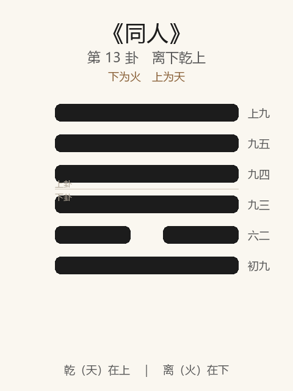

# 《同人》卦解读

## 卦象

<p align="center">
  
</p>

**䷌ 同人**（第 13 卦）｜**离下乾上**（下为火，上为天）

| 下卦（内） | 上卦（外） |
|------------|------------|
| ☲ 离（火） | ☰ 乾（天） |

```
━━━━━━  上九
━━━━━━  九五
━━━━━━  九四
━━━━━━  九三
━━  ━━  六二
━━━━━━  初九
```

> 阳爻为「九」（━━━━━━），阴爻为「六」（━━  ━━）；自下往上：初→上。

---

> 同人于野，亨，利涉大川，利君子贞。
>
> 初九：同人于门，无咎。
>
> 六二：同人于宗，吝。
>
> 九三：伏戎于莽，升其高陵，三岁不兴。
>
> 九四：乘其墉，弗克攻，吉。
>
> 九五：同人，先号咷，而后笑，大师克相遇。
>
> 上九：同人于郊，无悔。

《同人》为离下乾上：天与火，火炎上同于天，象征和同、团聚。同人者，与人同也——**于野而同，公而不私**。整体讲如何由近及远地「同」，以及私同、强同、争同之戒。

---

## 卦辞：同人于野，亨，利涉大川，利君子贞

| 语 | 含义 |
|----|------|
| **同人于野** | 在旷野与人同——至公、无私党、不限于门宗 |
| **亨** | 大同则通 |
| **利涉大川** | 得众同心，可越险济难 |
| **利君子贞** | 同须以正；君子之同，非小人之比 |

同人之亨，关键在**野（公）**与**贞（正）**，不在拉帮结派。

---

## 六爻：由门到野的「同」

| 爻 | 爻辞 | 要旨 |
|----|------|------|
| **初九** | 同人于门，无咎 | 刚出门外即同 → **尚未偏私，无咎** |
| **六二** | 同人于宗，吝 | 仅同于宗族门户 → **私狭，吝** |
| **九三** | 伏戎于莽，升其高陵，三岁不兴 | 伏兵草莽，登高窥视 → **疑忌备战，久不能兴** |
| **九四** | 乘其墉，弗克攻，吉 | 已登墙欲攻，却不克攻 → **知止不攻，吉** |
| **九五** | 同人，先号咷，而后笑，大师克相遇 | 先哭后笑 → **历经艰难，大军终能相遇同心** |
| **上九** | 同人于郊，无悔 | 同于郊外 → **未及于野之极公，亦无悔** |

一条线：**于门（始）→ 于宗（吝）→ 伏戎（争）→ 弗克攻（止）→ 号咷后笑（成）→ 于郊（近野）**。

同人之要：**公同于野；忌宗党之私、伏戎之疑；争而能止，难而后遇。**

---

## 几处关键意象

### 于野 / 于门 / 于宗 / 于郊

| 场所 | 含义 | 评价 |
|------|------|------|
| **野** | 至公大同 | 卦辞之理想，亨 |
| **门** | 门外初同 | 无咎 |
| **宗** | 宗族私同 | 吝 |
| **郊** | 郊外，近野未及野 | 无悔 |

越私越吝，越公越亨——**同的范围，决定同的品质。**

### 伏戎与弗克攻

三、四皆有争象：  
- 三伏戎升陵，疑心生暗鬼，三年不能兴——**以兵意求同，同不成**；  
- 四乘墉将攻，终「弗克攻」——能回头，故吉。  

同人卦中，**不攻比能攻更吉。**

### 先号咷而后笑

九五为同人之主：同心之路不平坦，先有悲痛号哭，后有欢笑——「大师克相遇」说明真同往往经过冲突与克服。  
**先难后得，是大同的代价，也是其真实。**

### 利君子贞

同可以是君子之同（以正以公），也可以是小人之同（以利以党）。卦辞特标「利君子贞」——与《比》之「元永贞」相呼应：合群必须合于正。

---

## 一条贯通的读法

1. **时**：否极思通，人求相与，乃同人之时。
2. **德**：同于野、利于贞——公而正，乃可涉大川。
3. **事**：门可同，宗则吝；争欲伏戎不如弗克攻；五历经号咷乃遇。
4. **戒**：私同于宗；以武力、疑忌强求同。

---

## 与《否》衔接

| | 否 | 同人 |
|---|----|------|
| 序 | 12 | 13 |
| 象 | 天地不交（塞） | 天火同人（同） |
| 关系 | 闭塞之后 | 求通求同 |
| 要诀 | 君子贞，大往小来 | 同人于野，利君子贞 |
| 方向 | 退而守 | 公而合 |

否之匪人隔绝，物不可以终否，故继之以同人——以公同打破闭塞。

---

## 人事简表

| 所问 | 要点 |
|------|------|
| **合作/联盟** | 宜于野（公开、公正、包容）；忌于宗（小圈子） |
| **起步** | 初：于门无咎——同心宜早，且勿限门户 |
| **冲突** | 三：伏戎久耗无益；四：攻而不能，收手则吉 |
| **艰难同心** | 五：先号咷后笑——真遇合往往在大难之后 |
| **未尽大同** | 上：于郊无悔——未臻极致也可止于无悔，不必强求 |
| **大事** | 利涉大川：同心且君子贞，乃可共渡险难 |
