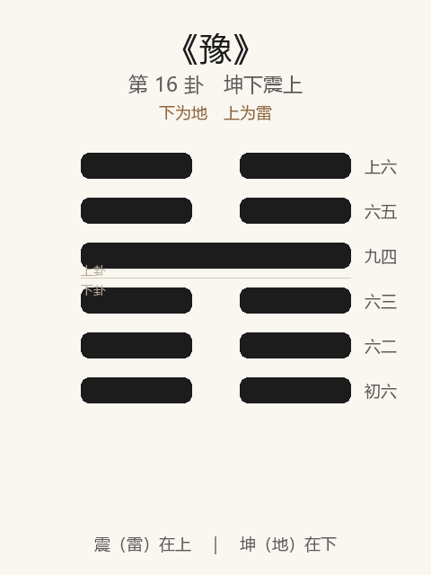

# 《豫》卦解读

## 卦象

<p align="center">
  
</p>

**䷏ 豫**（第 16 卦）｜**坤下震上**（下为地，上为雷）

| 下卦（内） | 上卦（外） |
|------------|------------|
| ☷ 坤（地） | ☳ 震（雷） |

```
━━  ━━  上六
━━  ━━  六五
━━━━━━  九四
━━  ━━  六三
━━  ━━  六二
━━  ━━  初六
```

> 阳爻为「九」（━━━━━━），阴爻为「六」（━━  ━━）；自下往上：初→上。

---

> 利建侯，行师。
>
> 初六：鸣豫，凶。
>
> 六二：介于石，不终日，贞吉。
>
> 六三：盱豫悔；迟有悔。
>
> 九四：由豫，大有得，勿疑。朋盍簪。
>
> 六五：贞疾，恒不死。
>
> 上六：冥豫，成有渝，无咎。

《豫》为坤下震上：雷出地奋，阴阳和畅，象征悦乐、和豫。豫者，乐也——**可建侯、可行师**。整体讲和乐之时如何自处：戒耽乐自鸣，贵介然知止，以及乐极能渝乃无咎。

---

## 卦辞：利建侯，行师

| 语 | 含义 |
|----|------|
| **利建侯** | 人心和乐，宜立侯封国、定秩序 |
| **行师** | 众志顺悦，亦利于兴师（师出得人和） |

与《屯》「利建侯」、《谦》「利用行师」相呼应：豫是**得众之和**，故建国、用兵皆利——前提是乐得其正，非荒淫之乐。

---

## 六爻：处「乐」的几种态度

| 爻 | 爻辞 | 要旨 |
|----|------|------|
| **初六** | 鸣豫，凶 | 自鸣得意于豫乐 → **凶** |
| **六二** | 介于石，不终日，贞吉 | 耿介如石，未终日即悟 → **守正则吉** |
| **六三** | 盱豫悔；迟有悔 | 仰视而求豫 → **已悔；迟疑不改，又悔** |
| **九四** | 由豫，大有得，勿疑。朋盍簪 | 豫乐之所由（为众乐之主） → **大有得；勿疑，朋友聚合** |
| **六五** | 贞疾，恒不死 | 守正而如有疾 → **常处危惧，反得不死** |
| **上六** | 冥豫，成有渝，无咎 | 沉迷于豫 → **能改变既成之乐，则无咎** |

一条线：**忌鸣豫 → 介于石 → 盱豫宜速改 → 由豫得朋 → 贞疾不死 → 冥豫能渝**。

豫之要：**乐不可自鸣、不可沉迷；介然知止，由正而得；极而能渝，乃无咎。**

---

## 几处关键意象

### 鸣豫 vs 鸣谦

| | 鸣谦 | 鸣豫 |
|---|------|------|
| 卦 | 谦 | 豫 |
| 义 | 谦德发闻 | 逸乐自炫 |
| 结果 | 贞吉 | 凶 |

同是「鸣」，所鸣之德不同，吉凶相反——**谦可鸣，豫不可鸣。**

### 介于石，不终日

六二：豫乐易溺，二独能耿介如石，转念极快（不终日）——不与初之鸣、三之盱同流。  
**处乐之正：清醒比享受更要紧。**

### 盱豫悔；迟有悔

六三：睁眼向上，攀附九四之豫以求欢——既已有悔；若迟迟不改，悔上加悔。  
示戒：**求乐于人、耽乐不决，悔必至。**

### 由豫，朋盍簪

九四一阳为卦主：众阴所由以致豫，如簪聚发——朋友聚合，大有得。  
「勿疑」：为乐之主须诚信不疑，乃得众。豫之建设性力量在此爻。

### 贞疾，恒不死 / 冥豫成有渝

| 爻 | 态度 | 结果 |
|----|------|------|
| 五 | 居尊而常如有疾（不安于乐） | 恒不死 |
| 上 | 冥然沉于乐，但能渝变 | 无咎 |

五以忧制乐，上以改救溺——**豫终无凶辞，因「疾」与「渝」皆能自救。**

---

## 一条贯通的读法

1. **时**：和乐、顺动、人心愉悦之时。
2. **德**：豫可建侯行师，然君子戒耽；介、贞、渝是护身符。
3. **事**：四为豫主，得朋大有得；二介石最快；上能改则无咎。
4. **戒**：鸣豫凶；盱豫悔；迟改加倍悔；冥豫而不渝则危。

---

## 与《谦》衔接

| | 谦 | 豫 |
|---|----|-----|
| 序 | 15 | 16 |
| 象 | 地中有山（卑下） | 雷出地奋（和乐） |
| 关系 | 谦然后豫 | 有德之和乐 |
| 「鸣」 | 鸣谦，贞吉 | 鸣豫，凶 |
| 要诀 | 君子有终 | 利建侯行师；介于石 |

有大而能谦，然后可豫——序卦：谦轻而豫乐。然乐生于正，一鸣豫则凶。

---

## 人事简表

| 所问 | 要点 |
|------|------|
| **局势** | 利建侯、行师——得人和，宜立事、宜举众 |
| **自处** | 忌鸣豫（炫耀享乐）；宜介于石，速离溺乐 |
| **求乐/攀附** | 三：盱豫有悔，迟则再悔——早断 |
| **为中心人物** | 四：由豫大有得，勿疑，同志自来 |
| **居高位** | 五：常存「疾」意，不安于逸，反能久 |
| **已沉迷** | 上：冥豫——能改（渝）则无咎，贵在变 |
