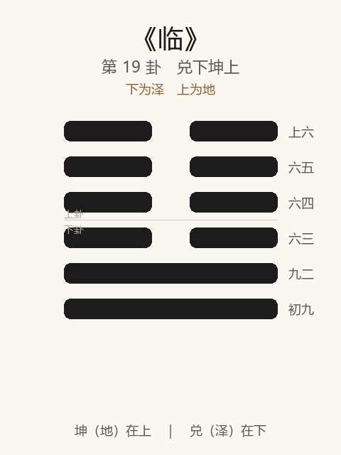

# 《临》卦解读

## 卦象

<p align="center">
  
</p>

**䷒ 临**（第 19 卦）｜**兑下坤上**（下为泽，上为地）

| 下卦（内） | 上卦（外） |
|------------|------------|
| ☱ 兑（泽） | ☷ 坤（地） |

```
━━  ━━  上六
━━  ━━  六五
━━  ━━  六四
━━  ━━  六三
━━━━━━  九二
━━━━━━  初九
```

> 阳爻为「九」（━━━━━━），阴爻为「六」（━━  ━━）；自下往上：初→上。

---

> 元，亨，利，贞。至于八月有凶。
>
> 初九：咸临，贞吉。
>
> 九二：咸临，吉无不利。
>
> 六三：甘临，无攸利。既忧之，无咎。
>
> 六四：至临，无咎。
>
> 六五：知临，大君之宜，吉。
>
> 上六：敦临，吉无咎。

《临》为兑下坤上：地上有泽，泽容水而地临之，又象二阳浸长、临于四阴。临者，大也、监临也——**元亨利贞，然至于八月有凶**。整体讲以德临人、以阳临阴之时：咸临、至临、知临、敦临可贵，甘临当戒；并警盛极将消。

---

## 卦辞：元，亨，利，贞。至于八月有凶

| 语 | 含义 |
|----|------|
| **元亨利贞** | 与乾同具四德：临道盛大，可通、宜正 |
| **至于八月有凶** | 阳长之临不能久：至「八月」（阴盛之时，或对观卦）则有凶——盛须知消退 |

临之独特：既言四德皆备，又预告**时限**——进长可喜，不可忘「八月有凶」。

---

## 六爻：临人的几种方式

| 爻 | 爻辞 | 要旨 |
|----|------|------|
| **初九** | 咸临，贞吉 | 以感应而临 → **守正则吉** |
| **九二** | 咸临，吉无不利 | 感应得中而临 → **吉，无不利** |
| **六三** | 甘临，无攸利。既忧之，无咎 | 以甜言、欢悦临人 → **无益；能忧改则无咎** |
| **六四** | 至临，无咎 | 亲近至诚而临 → **无咎** |
| **六五** | 知临，大君之宜，吉 | 以智慧临众 → **大君所宜，吉** |
| **上六** | 敦临，吉无咎 | 敦厚临下 → **吉，无咎** |

一条线：**咸临（贞）→ 咸临（无不利）→ 忌甘临 → 至临 → 知临 → 敦临**。

临之要：**以感、以至、以知、以敦；忌以甘；且不忘八月有凶。**

---

## 几处关键意象

### 至于八月有凶

临为十二月卦中阳气浸长之象（常与《复》《泰》等十二消息联系）；「八月」指向阴长阳消（对应《观》等）。  
义在人事：**事业上扬、权力临人时，要预知盛极必衰**——不是当下即凶，而是「至于」则凶，须早为收敛。

### 咸临

初、二皆「咸临」：咸，感也——以诚感应临人，非以势压。  
二得中，故「吉无不利」；初须「贞」乃吉。临之正道，始於**感通**，不始於威吓。

### 甘临

六三不中不正：以甘悦取媚而临——甜言、讨好、笼络。无攸利；若能「既忧之」（自知可忧而改）则无咎。  
**临人最戒讨好式领导：甜而不能久，忧改可救。**

### 至临 / 知临 / 敦临

| 名 | 爻 | 含义 |
|----|----|------|
| **至临** | 四 | 亲临、至诚抵达，无隔阂 |
| **知临** | 五 | 明智临众，任人得当——大君之宜 |
| **敦临** | 上 | 敦厚不薄，临之终而犹厚 |

由感而至、由至而知、由知而敦——临德递进；五「知临」为君道核心。

---

## 一条贯通的读法

1. **时**：阳长临阴、以上临下、事业进长之时。
2. **德**：元亨利贞皆备，然须正；感、知、敦优于甘。
3. **事**：初二咸临，四五至知，上敦；三甘而能忧可免。
4. **戒**：甘临；忘「八月有凶」而一味进取。

---

## 与《蛊》衔接

| | 蛊 | 临 |
|---|----|-----|
| 序 | 18 | 19 |
| 象 | 山下有风（治弊） | 地上有泽（临人） |
| 关系 | 蛊治然后可临 | 可大可监 |
| 要诀 | 元亨；先甲后甲 | 元亨利贞；八月有凶 |
| 方向 | 干事 | 临众 |

事治而可临民，故蛊后继临——临须有德，且知盛之有时。

---

## 人事简表

| 所问 | 要点 |
|------|------|
| **局势** | 元亨利贞：进长可通；同时警惕「八月有凶」——预留退路 |
| **领导/影响他人** | 咸临（感）、至临（亲）、知临（智）、敦临（厚） |
| **最忌** | 甘临：靠讨好、甜头压场，无攸利；能忧改则无咎 |
| **居上位** | 五：知临——明于知人善任，是大君之宜 |
| **长久** | 上：敦临——越到后面越要厚，不可薄待 |
| **时间意识** | 卦辞已写明：好景有期限，宜在盛时修德，勿待「八月」 |
