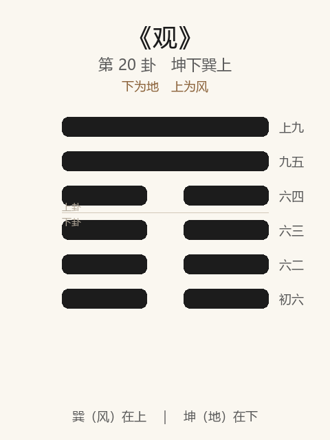

# 《观》卦解读

## 卦象

<p align="center">
  
</p>

**䷓ 观**（第 20 卦）｜**坤下巽上**（下为地，上为风）

| 下卦（内） | 上卦（外） |
|------------|------------|
| ☷ 坤（地） | ☴ 巽（风） |

```
━━━━━━  上九
━━━━━━  九五
━━  ━━  六四
━━  ━━  六三
━━  ━━  六二
━━  ━━  初六
```

> 阳爻为「九」（━━━━━━），阴爻为「六」（━━  ━━）；自下往上：初→上。

---

> 盥而不荐。有孚顒若。
>
> 初六：童观，小人无咎，君子吝。
>
> 六二：窥观，利女贞。
>
> 六三：观我生，进退。
>
> 六四：观国之光，利用宾于王。
>
> 九五：观我生，君子无咎。
>
> 上九：观其生，君子无咎。

《观》为坤下巽上：风行地上，遍触万物，又象四阴在下仰观二阳。观者，示也、瞻也——**在上以德示人，在下以诚仰观**。整体讲观仰的层次：从童观、窥观，到观我生、观国之光，终以孚诚顒若为上。

---

## 卦辞：盥而不荐。有孚顒若

| 语 | 含义 |
|----|------|
| **盥而不荐** | 祭祀已洗手洁身，尚未献飨——诚意已显，仪节未尽；以「将祭」之敬示人 |
| **有孚顒若** | 心怀诚信，仪容顒然尊敬 |

观之要：不在繁饰荐献，而在**盥时之孚、顒若之敬**——感人以诚，先于感人以礼文。

---

## 六爻：观的几种深度

| 爻 | 爻辞 | 要旨 |
|----|------|------|
| **初六** | 童观，小人无咎，君子吝 | 幼稚浅观 → **小人可谅；君子则吝** |
| **六二** | 窥观，利女贞 | 门缝窥视、所见偏狭 → **仅利女贞（柔顺自守）；非大丈夫之观** |
| **六三** | 观我生，进退 | 反观己之作为 → **据以决定进退** |
| **六四** | 观国之光，利用宾于王 | 观国之光华 → **宜为宾于王廷** |
| **九五** | 观我生，君子无咎 | 在上自观其生（德政） → **君子无咎** |
| **上九** | 观其生，君子无咎 | 观他人/民之生 → **君子无咎** |

一条线：**童观 → 窥观 → 观我生（进退）→ 观国之光 → 观我生（在上）→ 观其生**。

观之要：**由浅入深，由私窥到国光，由观己到观人；君子不可停留在童观、窥观。**

---

## 几处关键意象

### 盥而不荐

盥：洗手，祭前洁净；荐：献牲食。  
止於盥、不急於荐——强调**敬之在心已足感人**，不必等到仪节完成。在上者示人以孚，在下者见盥而知敬。

### 童观 / 窥观

| | 童观 | 窥观 |
|---|------|------|
| 爻 | 初六 | 六二 |
| 所见 | 幼稚、表面 | 偏狭、一隙 |
| 评价 | 小人无咎，君子吝 | 利女贞（器小可守柔） |

二者皆观之未大：小人、女子或可，**志在大者不当满足于此。**

### 观我生：三与五

同辞「观我生」，位不同：  
- **三**：下位，观己之生以定**进退**——自我检视，调整出处；  
- **五**：君位，观己之生（所化、所行）——**在上者先自省，乃君子无咎**。  

观人先观己；临众先省身。

### 观国之光，利用宾于王

六四：能见一国之文明光华，宜入朝为宾——**观有所得，则当用世**，不是为观而观。

### 观其生

上九：不在其位而观「其生」（他人、天下苍生）——超然旁观亦须君子之正，故无咎。与五「观我生」相对：一自省，一观人；皆归于君子。

---

## 一条贯通的读法

1. **时**：临后当「观」——阳渐消、阴浸长，宜仰观反省，以德示下。
2. **德**：盥而不荐，有孚顒若——诚敬为观之本。
3. **事**：戒童窥；三观己进退；四观光用宾；五上君子自观、观人。
4. **戒**：君子滞于童观；以窥管见自足；观人而不观己。

---

## 与《临》对照

| | 临 | 观 |
|---|----|-----|
| 序 | 19 | 20 |
| 象 | 泽上有地（以上临下） | 风行地上（遍观） |
| 消息 | 阳长临阴 | 阴长仰阳（八月之象所对） |
| 方向 | 主动临人 | 仰观、示人、自省 |
| 要诀 | 元亨利贞；八月有凶 | 盥而不荐；有孚顒若 |
| 关系 | 临之以德 | 观之以孚 |

临之「八月有凶」正与观相应：临极转观——由进临转为仰观、反省、以德为人所观。

---

## 人事简表

| 所问 | 要点 |
|------|------|
| **学习/见识** | 戒童观、窥观；求观国之光，开大格局 |
| **自省** | 三、五：观我生——检视言行与德政，以定进退 |
| **出处** | 四：见国有光，利用宾于王——可出仕、可参与正业 |
| **在上者** | 卦辞：以孚顒若示人；五：先观我生，乃无咎 |
| **旁观** | 上：观其生——观他人亦须君子之心，勿轻薄苛责 |
| **感化** | 盥而不荐——诚意已具，不必等「形式做满」才感人 |
