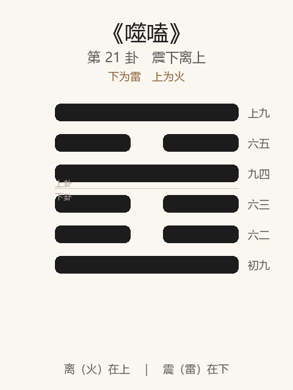

# 《噬嗑》卦解读

## 卦象

<p align="center">
  
</p>

**䷔ 噬嗑**（第 21 卦）｜**震下离上**（下为雷，上为火）

| 下卦（内） | 上卦（外） |
|------------|------------|
| ☳ 震（雷） | ☲ 离（火） |

```
━━━━━━  上九
━━  ━━  六五
━━━━━━  九四
━━  ━━  六三
━━  ━━  六二
━━━━━━  初九
```

> 阳爻为「九」（━━━━━━），阴爻为「六」（━━  ━━）；自下往上：初→上。

---

> 亨。利用狱。
>
> 初九：屦校灭趾，无咎。
>
> 六二：噬肤灭鼻，无咎。
>
> 六三：噬腊肉，遇毒；小吝，无咎。
>
> 九四：噬干胏，得金矢，利艰贞，吉。
>
> 六五：噬乾肉，得黄金，贞厉，无咎。
>
> 上九：何校灭耳，凶。

《噬嗑》为震下离上：雷电合而明威并用，颐中有物，象征咬合、决断、刑罚。噬嗑者，啮而合也——**亨，利用狱**。整体讲除间去梗、用法明刑：小惩则无咎，过极灭耳则凶。

---

## 卦辞：亨。利用狱

| 语 | 含义 |
|----|------|
| **亨** | 有物梗于颐中，噬而去之则合——梗阻得除则通 |
| **利用狱** | 宜用于狱讼、刑罚——明罚敕法，以刑去刑 |

观后继噬嗑：既观见其失，则当**依法决断**；亨在能噬，不在姑息。

---

## 六爻：由小惩到灭耳

| 爻 | 爻辞 | 要旨 |
|----|------|------|
| **初九** | 屦校灭趾，无咎 | 足着囚具，伤及脚趾 → **小惩于初，无咎** |
| **六二** | 噬肤灭鼻，无咎 | 咬柔肤，深及鼻 → **易噬而深，无咎** |
| **六三** | 噬腊肉，遇毒；小吝，无咎 | 咬坚腊，遇毒 → **小有不顺，无咎** |
| **九四** | 噬干胏，得金矢，利艰贞，吉 | 咬带骨干肉，得金矢 → **刚直艰贞，吉** |
| **六五** | 噬乾肉，得黄金，贞厉，无咎 | 咬干肉，得黄金 → **中正而知危，无咎** |
| **上九** | 何校灭耳，凶 | 肩荷囚具，伤及耳 → **恶积不改，凶** |

一条线：**灭趾（小惩）→ 噬肤 → 遇毒小吝 → 得金矢艰贞 → 得黄金贞厉 → 灭耳（大刑）**。

噬嗑之要：**初惩则无咎；中须艰贞；极则灭耳凶——刑宜早、宜明、宜不过于既积。**

---

## 几处关键意象

### 颐中有物

卦象：上下两阳如颐（口），中有一阳梗隔——不噬则不合。  
人事：有间、有梗、有恶，必须**咬断障碍**，关系、秩序才能重新合拢。

### 屦校灭趾 / 何校灭耳

| | 初九 | 上九 |
|---|------|------|
| 刑具 | 屦校（足械） | 何校（颈/肩枷） |
| 伤 | 灭趾 | 灭耳 |
| 义 | 恶小即惩，止于足下 | 恶大不改，刑及于首 |
| 结果 | 无咎 | 凶 |

《系辞》所谓：小惩大诫——**灭趾所以免灭耳**；拖到上九，则凶不可救。

### 噬之难易

| 爻 | 所噬 | 难易 |
|----|------|------|
| 二 | 肤 | 柔而易 |
| 三 | 腊肉 | 坚而遇毒 |
| 四 | 干胏（带骨） | 最难，故得金矢 |
| 五 | 乾肉 | 难，得黄金 |

越难噬，越要刚直（金矢）、中正（黄金）与艰贞——**难案更要正，不可含糊。**

### 金矢 / 黄金

- **金矢**：刚直之象——断狱如矢之直、金之坚；利艰贞，吉。  
- **黄金**：中之贵——六五柔中，得中道之罚；贞厉（常怀危惧）乃无咎。  

用狱之德：**刚而不枉，中而不滥。**

---

## 一条贯通的读法

1. **时**：有梗有恶、当明罚决断之时。
2. **德**：亨在噬合；利用狱——刑以弼教，非逞威。
3. **事**：初惩灭趾；中艰贞得金矢、黄金；上灭耳则凶。
4. **戒**：姑息养恶至灭耳；用狱不艰不贞；遇毒而废止。

---

## 与《观》衔接

| | 观 | 噬嗑 |
|---|----|------|
| 序 | 20 | 21 |
| 象 | 风行地上（仰观） | 雷电合章（威明） |
| 关系 | 观见其失 | 则当刑决 |
| 要诀 | 盥而不荐，有孚 | 亨，利用狱 |
| 方向 | 示德、省察 | 除梗、明罚 |

可观而后可刑：无观则刑滥，有观无刑则弊不解——故观后继噬嗑。

---

## 人事简表

| 所问 | 要点 |
|------|------|
| **纠纷/执法** | 利用狱：宜决断、宜依法；梗阻不除则不亨 |
| **小过** | 初：屦校灭趾——早惩早诫，无咎 |
| **难案** | 三遇毒不废；四噬干胏，利艰贞；五贞厉无咎 |
| **原则** | 刚直如金矢，中正如黄金——明威并用 |
| **积恶** | 上：何校灭耳——拖到极刑则凶；贵在初之灭趾 |
| **去障** | 凡事「中有梗」：咬开比绕开更能亨通 |
