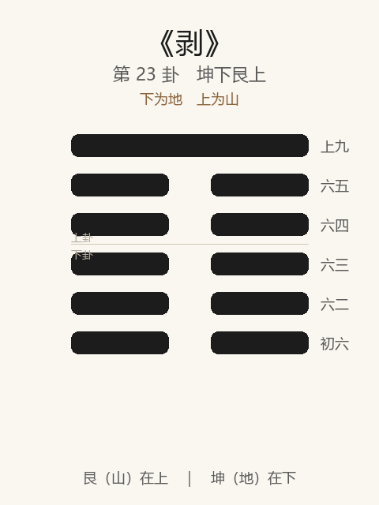

# 《剥》卦解读

## 卦象

<p align="center">
  
</p>

**䷖ 剥**（第 23 卦）｜**坤下艮上**（下为地，上为山）

| 下卦（内） | 上卦（外） |
|------------|------------|
| ☷ 坤（地） | ☶ 艮（山） |

```
━━━━━━  上九
━━  ━━  六五
━━  ━━  六四
━━  ━━  六三
━━  ━━  六二
━━  ━━  初六
```

> 阳爻为「九」（━━━━━━），阴爻为「六」（━━  ━━）；自下往上：初→上。

---

> 不利有攸往。
>
> 初六：剥床以足，蔑贞凶。
>
> 六二：剥床以辨，蔑贞凶。
>
> 六三：剥之，无咎。
>
> 六四：剥床以肤，凶。
>
> 六五：贯鱼，以宫人宠，无不利。
>
> 上九：硕果不食，君子得舆，小人剥庐。

《剥》为坤下艮上：山附于地，五阴在下消阳，一阳仅存于上。剥者，削也、落也——**阴长阳消，不利有攸往**。整体讲剥落之时：床足至肤，由下蚀上；君子顺时处剥，待硕果不食。

---

## 卦辞：不利有攸往

| 语 | 含义 |
|----|------|
| **不利有攸往** | 剥落之世，不宜进取有所往——阳道衰，动则易伤 |

贲后继剥：文饰穷极，则质见剥——时当收敛守正，**不宜主动开拓。**

---

## 六爻：由下而上的剥落

| 爻 | 爻辞 | 要旨 |
|----|------|------|
| **初六** | 剥床以足，蔑贞凶 | 剥及床足 → **蔑弃正道，凶** |
| **六二** | 剥床以辨，蔑贞凶 | 剥及床干（辨） → **继续蔑贞，凶** |
| **六三** | 剥之，无咎 | 在剥之中 → **能异于众阴（应上），无咎** |
| **六四** | 剥床以肤，凶 | 剥及肌肤 → **灾已及身，凶** |
| **六五** | 贯鱼，以宫人宠，无不利 | 如贯鱼依次，率宫人承宠 → **柔顺得中，无不利** |
| **上九** | 硕果不食，君子得舆，小人剥庐 | 硕果独存未被食尽 → **君子得车舆（为民载）；小人则剥及屋庐** |

一条线：**剥足 → 剥辨 → 剥之无咎 → 剥肤 → 贯鱼承宠 → 硕果不食**。

剥之要：**不利攸往；蔑贞则凶；能顺承上阳、异于党剥则无咎；终看硕果归于谁。**

---

## 几处关键意象

### 剥床：足 → 辨 → 肤

床为人所安：剥自下方始，由远及近。

| 爻 | 所剥 | 危急程度 |
|----|------|----------|
| 初 | 足 | 始蚀根基 |
| 二 | 辨（床干） | 结构受损 |
| 四 | 肤 | 已及身体 |

示：祸乱、腐蚀、小人势长，皆**自微而著**；「蔑贞」一贯，则由足至肤，凶不可免。

### 蔑贞凶

初、二同戒：不仅「剥」，而且**蔑视、抛弃正固**——剥之凶，在不正，不在时势本身。时已不利往，若再蔑贞，凶上加凶。

### 剥之，无咎

六三处群阴之中，独与上九相应——虽在剥时，能不与众阴同党尽剥，故无咎。  
**剥世中，站队与应正，是无咎关键。**

### 贯鱼，以宫人宠

六五居尊，柔顺率下：如鱼贯而进，以宫人之道宠承上阳——不争、不乱，故无不利。  
剥之上，五能**领阴从阳**，非领阴灭阳。

### 硕果不食

上九一阳仅存，如树上硕果未被食尽——剥不尽之阳，为复生之种。  
- **君子得舆**：民愿载之，硕果在君子则成载众之具；  
- **小人剥庐**：若小人居此，则剥及其所居，一无所剩。  

**同一硕果，君子小人所遇相反——剥之终，在德不在位。**

---

## 一条贯通的读法

1. **时**：阴盛阳衰、万物剥落、不利进取之时。
2. **德**：不可蔑贞；宜顺、宜应正、宜待硕果。
3. **事**：见剥自足始则早戒；三应上无咎；五贯鱼承阳；上硕果分野。
4. **戒**：有攸往；蔑贞；与众阴共剥正道。

---

## 与《贲》衔接

| | 贲 | 剥 |
|---|----|-----|
| 序 | 22 | 23 |
| 象 | 山下有火（文饰） | 山附于地（剥落） |
| 关系 | 文穷则剥 | 质见消蚀 |
| 要诀 | 亨，小利有攸往 | 不利有攸往 |
| 方向 | 文饰 | 收敛 |

物不可以终饰，饰极则剥——贲后继剥；剥不尽则有复（下一卦《复》）。

---

## 人事简表

| 所问 | 要点 |
|------|------|
| **局势** | 不利有攸往——收缩、守正、勿扩张 |
| **见微** | 初、二：床足、床干已剥——腐蚀在根基，忌再蔑贞 |
| **自处** | 三：虽在剥中，能应正、不党恶，无咎 |
| **及身之灾** | 四：剥肤——危险已近，凶 |
| **柔顺处剥** | 五：贯鱼承宠——以序以顺，无不利 |
| **结局** | 上：硕果不食——君子得民载，小人自毁其庐；保种待复 |
