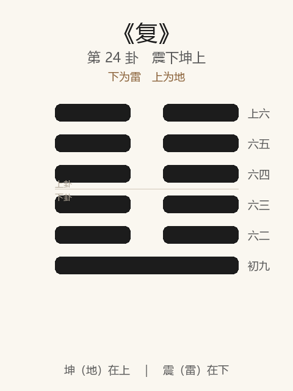

# 《复》卦解读

## 卦象

<p align="center">
  
</p>

**䷗ 复**（第 24 卦）｜**震下坤上**（下为雷，上为地）

| 下卦（内） | 上卦（外） |
|------------|------------|
| ☳ 震（雷） | ☷ 坤（地） |

```
━━  ━━  上六
━━  ━━  六五
━━  ━━  六四
━━  ━━  六三
━━  ━━  六二
━━━━━━  初九
```

> 阳爻为「九」（━━━━━━），阴爻为「六」（━━  ━━）；自下往上：初→上。

---

> 亨。出入无疾，朋来无咎。反覆其道，七日来复，利有攸往。
>
> 初九：不远复，无祗悔，元吉。
>
> 六二：休复，吉。
>
> 六三：频复，厉无咎。
>
> 六四：中行独复。
>
> 六五：敦复，无悔。
>
> 上六：迷复，凶，有灾眚。用行师，终有大败，以其国君，凶；至于十年，不克征。

《复》为震下坤上：雷在地中，一阳来复于下，五阴之上。复者，返也——**剥尽则复，阳气始生**。整体讲归来、悔改、复兴：不远复最吉，迷复则凶；与剥「不利有攸往」相反，复则「利有攸往」。

---

## 卦辞：亨。出入无疾，朋来无咎。反覆其道，七日来复，利有攸往

| 语 | 含义 |
|----|------|
| **亨** | 一阳复生，闭极而通 |
| **出入无疾** | 阳之出与入，皆无疾患——生长顺畅 |
| **朋来无咎** | 同志来聚，无咎 |
| **反覆其道，七日来复** | 按道循环往复；七日（阳数、周期）而复——剥极必返 |
| **利有攸往** | 复则宜进——与剥相反 |

复之亨，在**按时而返、得朋而进**；关键是「复」，不是硬闯。

---

## 六爻：复的几种质量

| 爻 | 爻辞 | 要旨 |
|----|------|------|
| **初九** | 不远复，无祗悔，元吉 | 失之不远即复 → **不至于大悔，元吉** |
| **六二** | 休复，吉 | 美善之复（下仁） → **吉** |
| **六三** | 频复，厉无咎 | 屡失屡复 → **危，然无咎** |
| **六四** | 中行独复 | 行于中，独能复 → **（应初，不从众阴）** |
| **六五** | 敦复，无悔 | 敦厚笃实地复 → **无悔** |
| **上六** | 迷复，凶，有灾眚…… | 迷而不复 → **凶；行师大败，十年不克征** |

一条线：**不远复（元吉）→ 休复 → 频复 → 独复 → 敦复 → 迷复（凶）**。

复之要：**早复、善复、笃复；可频不可迷；迷复则兵败国伤，久不能振。**

---

## 几处关键意象

### 剥尽则复 / 七日来复

消息卦中：剥为五阴一阳在上，复为五阴一阳在下——阴极而一阳生（如冬至一阳来复）。  
「七日」言周期：乱极、消极，**按道必有复时**；人事上即转机有期，宜顺势往。

### 不远复，元吉

初九为复之主：阳刚始生，一有偏离，立即返回——《系辞》赞颜回「不远复」「有不善未尝不知，知之未尝复行」。  
**复德之最上：错不远、改即复，故元吉。**

### 休复 / 频复 / 敦复 / 迷复

| 名 | 爻 | 含义 | 结果 |
|----|----|------|------|
| **休复** | 二 | 安然向善而复 | 吉 |
| **频复** | 三 | 频繁反复 | 厉，无咎 |
| **敦复** | 五 | 敦厚坚定之复 | 无悔 |
| **迷复** | 上 | 迷其复道 | 凶，灾眚 |

频复虽危，仍知回头故无咎；迷复则根本不返——**复与不复，是吉凶分水岭。**

### 中行独复

六四居群阴，独应初九——众人皆顺阴势，己独复于阳。  
示：复兴、改过，有时须**独行其道**，不随大流。

### 迷复与行师

上六迷复之凶特重：用兵则大败，累及国君，十年不能再征——**迷失归正之路，而犹逞力，祸及家国，恢复极慢。**

---

## 一条贯通的读法

1. **时**：剥极之后，一阳始生、转机初现之时。
2. **德**：亨在复；出入无疾，朋来无咎；利有攸往。
3. **事**：初不远复最善；二休、四独、五敦皆正；三频可恕，上迷不可救。
4. **戒**：迷复；失远而后复（不如不远）；复而不敦，或频而不安。

---

## 与《剥》对照

| | 剥 | 复 |
|---|----|-----|
| 序 | 23 | 24 |
| 象 | 山附于地（阳将尽） | 雷在地中（阳始生） |
| 攸往 | 不利有攸往 | 利有攸往 |
| 阳位 | 一阳在上（硕果） | 一阳在下（来复） |
| 要诀 | 蔑贞凶；硕果不食 | 七日来复；不远复元吉 |
| 关系 | 消 | 长 |

硕果不食，然后有复——剥终则复，循环之理。

---

## 人事简表

| 所问 | 要点 |
|------|------|
| **局势** | 亨，利有攸往——转机已至，可进取；朋来无咎 |
| **改过** | 初：不远复，元吉——早回头，不积悔 |
| **向善** | 二休复、五敦复——安然、笃实 |
| **反复摇摆** | 三：频复虽厉，只要还在复，无咎 |
| **独立** | 四：中行独复——众皆不返，己可独返 |
| **最戒** | 上：迷复——不认路、不回头；尤忌此时行师逞强，败深难复 |
