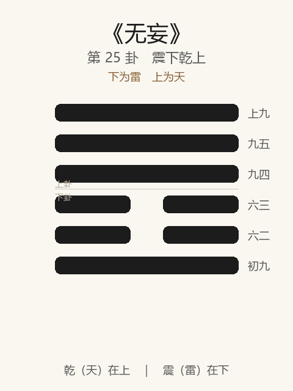

# 《无妄》卦解读

## 卦象

<p align="center">
  
</p>

**䷘ 无妄**（第 25 卦）｜**震下乾上**（下为雷，上为天）

| 下卦（内） | 上卦（外） |
|------------|------------|
| ☳ 震（雷） | ☰ 乾（天） |

```
━━━━━━  上九
━━━━━━  九五
━━━━━━  九四
━━  ━━  六三
━━  ━━  六二
━━━━━━  初九
```

> 阳爻为「九」（━━━━━━），阴爻为「六」（━━  ━━）；自下往上：初→上。

---

> 元，亨，利，贞。其匪正有眚，不利有攸往。
>
> 初九：无妄，往吉。
>
> 六二：不耕获，不菑畲，则利用攸往。
>
> 六三：无妄之灾，或系之牛，行人之得，邑人之灾。
>
> 九四：可贞。无咎。
>
> 九五：无妄之疾，勿药有喜。
>
> 上九：无妄，行有眚，无攸利。

《无妄》为震下乾上：天下雷行，物与无妄，象征真实无伪、天理流行。无妄者，不妄也——**元亨利贞，然匪正则有眚**。整体讲至诚无妄之时：正则往吉，不正则不利攸往；亦有无妄之灾、无妄之疾，须知时知止。

---

## 卦辞：元，亨，利，贞。其匪正有眚，不利有攸往

| 语 | 含义 |
|----|------|
| **元亨利贞** | 无妄合天，四德皆备——至诚可通 |
| **其匪正有眚** | 若偏离正道，则有灾患 |
| **不利有攸往** | （就「匪正」而言）不正而往，不利 |

卦辞两层：无妄本身元亨利贞；一旦「匪正」，立即有眚、不利往。  
**无妄不是「怎么都行」，而是「必须正」。**

---

## 六爻：无妄中的行止

| 爻 | 爻辞 | 要旨 |
|----|------|------|
| **初九** | 无妄，往吉 | 居无妄之始而往 → **吉** |
| **六二** | 不耕获，不菑畲，则利用攸往 | 不妄冀耕获、菑畲之利 → **无期望之心而往，则利** |
| **六三** | 无妄之灾，或系之牛，行人之得，邑人之灾 | 无妄而遭灾 → **牛被行人顺手牵走，邑人受过** |
| **九四** | 可贞。无咎 | 可守正 → **无咎** |
| **九五** | 无妄之疾，勿药有喜 | 无妄而病 → **不必服药，自有喜（勿妄治）** |
| **上九** | 无妄，行有眚，无攸利 | 时已极仍行 → **有灾，无攸利** |

一条线：**往吉 → 不耕获而往 → 无妄之灾 → 可贞 → 勿药有喜 → 行有眚**。

无妄之要：**正则可往；勿妄求、勿妄治、勿极而犹行；灾与疾或非己过，然匪正则必有眚。**

---

## 几处关键意象

### 天下雷行，物与无妄

雷动于天下，万物各正其性命——无妄即**不虚伪、不造作、不逆天理**。复后继无妄：既复于善，则当保其诚。

### 不耕获，不菑畲

菑：开荒；畲：熟田。二不把「耕」当「获」的保证，不把「菑」当「畲」的指望——**做事不挟妄念之收获预期**，则利用攸往。  
与「匪正有眚」相成：无妄包括「不妄求结果」。

### 无妄之灾

六三：牛本系于邑，行人得之，邑人受灾——无辜被牵连。  
示：至诚之世，仍有横祸；**无妄不能保证无灾**，但可保证无愧。邑人当知：灾在时与位，不在必有罪。

### 无妄之疾，勿药有喜

九五：病来得无妄（非自取），若再「妄药」反害——**勿过度干预，听其自愈，有喜**。  
与三之灾相对：灾须承，疾勿妄治；皆在「不妄动」。

### 初往吉 / 上行有眚

同是「无妄」：  
- 初：时位正，往吉；  
- 上：处极，行则有眚。  

**无妄不等于始终宜进——时极则止，强行亦妄。**

---

## 一条贯通的读法

1. **时**：一阳复后，天理真实流行、当守诚之时。
2. **德**：元亨利贞在正；匪正则有眚。
3. **事**：初往吉，二无妄求，四可贞，五勿药；三承灾，上戒行。
4. **戒**：不正而往；耕而必获之妄心；极而犹行；无疾而妄药。

---

## 与《复》衔接

| | 复 | 无妄 |
|---|----|------|
| 序 | 24 | 25 |
| 象 | 雷在地中（阳始生） | 天下雷行（物与无妄） |
| 关系 | 复于善 | 则当无妄 |
| 攸往 | 利有攸往 | 正则往吉；匪正不利 |
| 要诀 | 不远复，元吉 | 元亨利贞；匪正有眚 |

复是回头，无妄是不贰过、不虚行——既复，不可再妄。

---

## 人事简表

| 所问 | 要点 |
|------|------|
| **行动** | 正而无妄则往吉；匪正则有眚，不利攸往 |
| **动机** | 二：不耕获——不挟妄念求报，反而利往 |
| **意外之灾** | 三：无妄之灾——或非己过，宜承而不乱 |
| **守成** | 四：可贞，无咎 |
| **小恙/小问题** | 五：勿药有喜——勿过度干预、勿妄治 |
| **过犹不及** | 上：时已尽仍「无妄」地强行——有眚，无攸利 |
