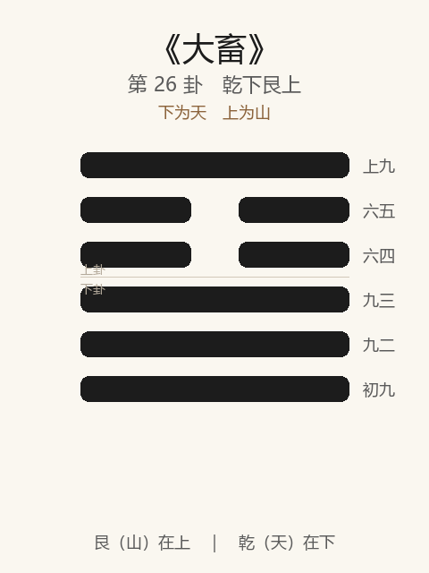

# 《大畜》卦解读

## 卦象

<p align="center">
  
</p>

**䷙ 大畜**（第 26 卦）｜**乾下艮上**（下为天，上为山）

| 下卦（内） | 上卦（外） |
|------------|------------|
| ☰ 乾（天） | ☶ 艮（山） |

```
━━━━━━  上九
━━  ━━  六五
━━  ━━  六四
━━━━━━  九三
━━━━━━  九二
━━━━━━  初九
```

> 阳爻为「九」（━━━━━━），阴爻为「六」（━━  ━━）；自下往上：初→上。

---

> 利贞，不家食吉，利涉大川。
>
> 初九：有厉利已。
>
> 九二：舆说輹。
>
> 九三：良马逐，利艰贞。日闲舆卫，利有攸往。
>
> 六四：童牛之牿，元吉。
>
> 六五：豶豕之牙，吉。
>
> 上九：何天之衢，亨。

《大畜》为乾下艮上：天在山中，刚健为山所止，象征大蓄、大止、畜德畜贤。大畜者，所畜者大也——**利贞，不家食吉，利涉大川**。整体讲蓄止刚健：危则宜已，脱輹则止；既畜既止，终能何天之衢。

---

## 卦辞：利贞，不家食吉，利涉大川

| 语 | 含义 |
|----|------|
| **利贞** | 畜须以正——蓄德、蓄贤、蓄力皆宜正固 |
| **不家食吉** | 不在家自食（食于朝廷、用于天下）→ 吉——贤德见用，非私畜 |
| **利涉大川** | 所畜既大且正，可越险济难 |

与小畜「密云不雨」相对：大畜力厚，故能不家食、能涉大川——**畜为用世，不为囤私。**

---

## 六爻：畜与止的进阶

| 爻 | 爻辞 | 要旨 |
|----|------|------|
| **初九** | 有厉利已 | 有危险 → **宜停止，勿进** |
| **九二** | 舆说輹 | 车脱去伏兔（輹） → **不能行，当止** |
| **九三** | 良马逐，利艰贞。日闲舆卫，利有攸往 | 良马驰逐 → **宜艰贞；日日习练车卫，乃利有攸往** |
| **六四** | 童牛之牿，元吉 | 童牛加横木（牿） → **止恶于未角，元吉** |
| **六五** | 豶豕之牙，吉 | 去势之豕，牙不足畏 → **制其猛性，吉** |
| **上九** | 何天之衢，亨 | 负荷天衢、通途大道 → **亨** |

一条线：**危则已 → 说輹止 → 艰贞闲习而往 → 牿童牛 → 制豕牙 → 天之衢亨**。

大畜之要：**当止则止，当畜则畜；止恶宜早，畜德宜正；畜极则通天衢。**

---

## 几处关键意象

### 天在山中

乾健在内，艮止在外——刚为所畜、为所止。  
大畜之「畜」有两义：**积蓄**（畜德畜贤）与**畜止**（止其过刚妄行）。二者相须。

### 有厉利已 / 舆说輹

初、二皆主止：  
- 初：见危而「已」（止）；  
- 二：车已脱輹，客观上不能进。  

无妄之后继大畜：诚而不妄，仍须**以止成畜**——该停就停。

### 良马逐，日闲舆卫

九三过刚欲进，如良马驰逐——可往，但须「利艰贞」，且「日闲舆卫」（每日熟练车马护卫）。  
**大畜中的进，不是蛮进，是蓄足技能与谨慎后再往。**

### 童牛之牿 / 豶豕之牙

| 爻 | 象 | 义 |
|----|----|-----|
| 四 | 童牛加牿 | 角未成先防——止恶于微，元吉 |
| 五 | 豶豕之牙 | 去其势，牙不足惧——治本制服刚暴 |

畜止之道：**防于早（牿），治于本（豶）**——皆吉。与其克猛虎于既成，不如牿童牛于未角。

### 何天之衢

上九畜极而通：如行走在天上的大路——所畜已成，亨通无阻。  
「不家食」「利涉大川」在此落实：私门之畜，化为通天之衢。

---

## 一条贯通的读法

1. **时**：无妄之后，当大蓄其德、畜止其刚之时。
2. **德**：利贞；不家食——畜为天下用。
3. **事**：初二止，三闲习而往，四五止恶制猛，上通衢。
4. **戒**：危而不已；无备而逐；家食自肥；恶成再制。

---

## 与《无妄》《小畜》对照

| | 小畜 | 无妄 | 大畜 |
|---|------|------|------|
| 序 | 9 | 25 | 26 |
| 畜 | 所畜者小，密云不雨 | — | 所畜者大，天之衢亨 |
| 关系 | — | 无妄然后可畜 | 畜德成大 |
| 攸往 | 复道为主 | 匪正不利 | 利涉大川 |
| 要诀 | 有孚挛如 | 元亨利贞 | 利贞，不家食吉 |

有无妄之诚，然后可大畜；畜之大，在正、在用世，不在私积。

---

## 人事简表

| 所问 | 要点 |
|------|------|
| **蓄积/培养** | 利贞，不家食吉——蓄德蓄才为用世，非为自肥 |
| **进退** | 初有厉利已；二说輹——该停则停 |
| **准备就绪后** | 三：艰贞 + 日闲舆卫，乃利有攸往 |
| **防患** | 四：童牛之牿——问题尚小就约束，元吉 |
| **制伏刚暴** | 五：豶豕之牙——治本去势，吉 |
| **蓄极** | 上：何天之衢，亨——大道开通，可涉大川 |
