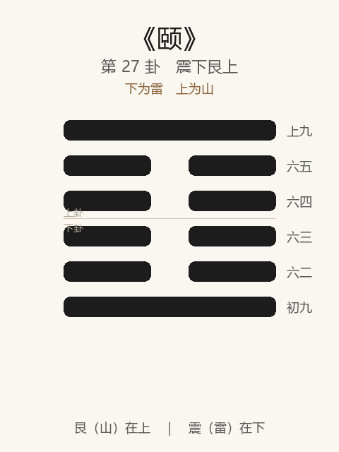

# 《颐》卦解读

## 卦象

<p align="center">
  
</p>

**䷚ 颐**（第 27 卦）｜**震下艮上**（下为雷，上为山）

| 下卦（内） | 上卦（外） |
|------------|------------|
| ☳ 震（雷） | ☶ 艮（山） |

```
━━━━━━  上九
━━  ━━  六五
━━  ━━  六四
━━  ━━  六三
━━  ━━  六二
━━━━━━  初九
```

> 阳爻为「九」（━━━━━━），阴爻为「六」（━━  ━━）；自下往上：初→上。

---

> 贞吉。观颐，自求口实。
>
> 初九：舍尔灵龟，观我朵颐，凶。
>
> 六二：颠颐，拂经，于丘颐，征凶。
>
> 六三：拂颐，贞凶，十年勿用，无攸利。
>
> 六四：颠颐吉，虎视眈眈，其欲逐逐，无咎。
>
> 六五：拂经，居贞吉，不可涉大川。
>
> 上九：由颐，厉吉，利涉大川。

《颐》为震下艮上：山下有雷，上下二阳中含四阴，如颐口之象。颐者，养也——**贞吉；观颐，自求口实**。整体讲养生、养德、养人：观其所养与自养是否正当；求养于己则吉，舍己求人、拂经妄养则凶。

---

## 卦辞：贞吉。观颐，自求口实

| 语 | 含义 |
|----|------|
| **贞吉** | 养须以正，乃吉 |
| **观颐** | 观察「如何养」——养什么人、用什么方式 |
| **自求口实** | 自己寻求口中之食——自养自立，不苟求于人 |

颐之纲：**养以正，观以明，求以自**——口实在己，不在羡慕他人。

---

## 六爻：养与求养

| 爻 | 爻辞 | 要旨 |
|----|------|------|
| **初九** | 舍尔灵龟，观我朵颐，凶 | 弃己之明（灵龟），羡人咀嚼 → **凶** |
| **六二** | 颠颐，拂经，于丘颐，征凶 | 颠倒求养，违背常理，求养于高丘 → **征凶** |
| **六三** | 拂颐，贞凶，十年勿用，无攸利 | 违背颐养之道 → **守此亦凶；久不可用，无攸利** |
| **六四** | 颠颐吉，虎视眈眈，其欲逐逐，无咎 | 虽颠（下求初阳）而得正养 → **专注如虎，欲有次第，无咎** |
| **六五** | 拂经，居贞吉，不可涉大川 | 不完全合常（柔居尊） → **居守则吉，不可涉险** |
| **上九** | 由颐，厉吉，利涉大川 | 众由之而得养 → **知危则吉，利涉大川** |

一条线：**忌观人朵颐 → 忌拂经求丘 → 忌拂颐 → 颠颐可吉 → 居贞勿涉川 → 由颐厉吉可涉川**。

颐之要：**自求口实；可颠而正，不可拂而邪；养人者厉乃吉。**

---

## 几处关键意象

### 观颐，自求口实

《颐》教人两观：  
1. 观人之所养（养贤与否、养口体还是养大体）；  
2. 观己之自养——**口实当自求**，人格、生计、学问皆然。

### 舍尔灵龟，观我朵颐

灵龟：静而明，不食而寿——自有之德、自足之明。  
朵颐：鼓腮咀嚼，眼前之食。  
弃灵明而盯别人嘴里——**羡慕、攀附、失去自主**，故凶。是卦辞「自求口实」的反面教材。

### 颠颐：二凶四吉

同言「颠颐」（颠倒向下求养）：

| 爻 | 所求 | 结果 |
|----|------|------|
| 六二 | 拂经，于丘颐（又求高又失正） | 征凶 |
| 六四 | 下应初阳，养得其正 | 吉，无咎 |

颠不足惧，**怕的是拂经**——违背养之常道。

### 虎视眈眈，其欲逐逐

六四养正：目光专一（眈眈），欲望有序推进（逐逐）——不是贪婪乱咬，而是**专注、有节的求养**，故无咎。

### 由颐，厉吉

上九为颐之主：天下由之得养（养贤养民）。位高责重，故「厉」——常怀危惧则吉，且利涉大川。  
与五「不可涉大川」相对：五柔居尊宜静守；上阳实能任重，**可济险以养天下**。

---

## 一条贯通的读法

1. **时**：大畜之后，当论所养——德已畜，须正其养。
2. **德**：贞吉；自求口实，不舍灵龟。
3. **事**：初戒羡人；二、三戒拂；四专一可吉；五居贞；上由颐济川。
4. **戒**：观人朵颐；拂经、拂颐；五之柔而强涉大川。

---

## 与《大畜》衔接

| | 大畜 | 颐 |
|---|------|-----|
| 序 | 26 | 27 |
| 象 | 天在山中（畜） | 山下有雷（养） |
| 关系 | 畜然后可养 | 观其所养 |
| 要诀 | 利贞，不家食吉 | 贞吉，自求口实 |
| 涉川 | 利涉大川 | 五不可；上利涉 |

物畜然后可养：大畜后继颐——问的是：畜得再多，**养得正不正？自求还是求人？**

---

## 人事简表

| 所问 | 要点 |
|------|------|
| **生计/修养** | 自求口实——自立、自养、自修；贞则吉 |
| **最忌** | 初：舍灵龟观朵颐——弃己能、羡人有 |
| **求人/依附** | 二、三：拂经拂颐则凶；四颠而正、专一有序则无咎 |
| **居位较弱** | 五：居贞吉，不可涉大川——守成勿冒险 |
| **责任在身** | 上：由颐——养人养事，厉（知危）则吉，可涉大川 |
| **观人** | 观颐：看他养口还是养德、养己还是养人 |
