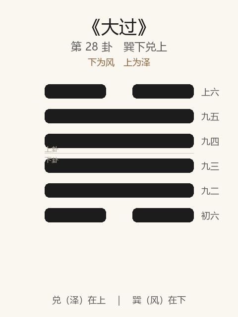

# 《大过》卦解读

## 卦象

<p align="center">
  
</p>

**䷛ 大过**（第 28 卦）｜**巽下兑上**（下为风，上为泽）

| 下卦（内） | 上卦（外） |
|------------|------------|
| ☴ 巽（风） | ☱ 兑（泽） |

```
━━  ━━  上六
━━━━━━  九五
━━━━━━  九四
━━━━━━  九三
━━━━━━  九二
━━  ━━  初六
```

> 阳爻为「九」（━━━━━━），阴爻为「六」（━━  ━━）；自下往上：初→上。

---

> 栋挠，利有攸往，亨。
>
> 初六：藉用白茅，无咎。
>
> 九二：枯杨生稊，老夫得其女妻，无不利。
>
> 九三：栋桡，凶。
>
> 九四：栋隆，吉；有它吝。
>
> 九五：枯杨生华，老妇得其士夫，无咎无誉。
>
> 上六：过涉灭顶，凶，无咎。

《大过》为巽下兑上：泽灭木，四阳居中、两阴在外，阳过而阴弱。大过者，大者过也——**栋挠，利有攸往，亨**。整体讲非常之时、过重之势：栋梁已弯，须非常之行；慎藉白茅，戒栋桡，明栋隆与灭顶之别。

---

## 卦辞：栋挠，利有攸往，亨

| 语 | 含义 |
|----|------|
| **栋挠** | 栋梁弯曲——中间过重，屋将不支；时势非常，结构失衡 |
| **利有攸往** | 不可坐视栋折 → 宜有所往，以非常之道济之 |
| **亨** | 能过而济，则通 |

颐后继大过：养过则肿，阳盛则过——**平常之法不够，须大过人之行，乃亨。**

---

## 六爻：过与济

| 爻 | 爻辞 | 要旨 |
|----|------|------|
| **初六** | 藉用白茅，无咎 | 垫以白茅（极敬慎） → **无咎** |
| **九二** | 枯杨生稊，老夫得其女妻，无不利 | 枯杨生嫩芽；老夫得少女 → **过而能济，无不利** |
| **九三** | 栋桡，凶 | 栋梁弯折 → **过刚无应，凶** |
| **九四** | 栋隆，吉；有它吝 | 栋梁隆起（能承） → **吉；另生他求则吝** |
| **九五** | 枯杨生华，老妇得其士夫，无咎无誉 | 枯杨开花；老妇得壮夫 → **可免咎，但无美誉** |
| **上六** | 过涉灭顶，凶，无咎 | 涉水过深，淹没头顶 → **凶；然当事宜然，无咎** |

一条线：**白茅慎始 → 生稊得女妻 → 栋桡凶 → 栋隆吉 → 生华无誉 → 灭顶凶而无咎**。

大过之要：**非常之时，过恭、过济可；过刚栋桡则凶；过涉可无咎，然仍凶——明知其难而任之。**

---

## 几处关键意象

### 栋挠与栋隆

| | 栋桡（三） | 栋隆（四） |
|---|-----------|-----------|
| 象 | 梁弯将折 | 梁高能承 |
| 因 | 过刚，失阴之助 | 下应初柔，能调和 |
| 果 | 凶 | 吉（忌有它） |

同处阳过之中：有应、能下则隆；无应、自用则桡——**大过成败，在刚能否得柔。**

### 藉用白茅

初六在大过之始：以白茅垫物，祭祀之至敬——事越大越危，起步越要**过人之慎**。无咎之基在此。

### 枯杨生稊 / 枯杨生华

| | 生稊（二） | 生华（五） |
|---|-----------|-----------|
| 象 | 根生嫩芽 | 枝梢开花 |
| 婚配 | 老夫女妻（阳得阴，可生） | 老妇士夫（阴过得阳，难育） |
| 评价 | 无不利 | 无咎无誉 |

二者皆「过」中求济：二得宜，有更生之机；五仅免咎，**华而不实，无誉。**

### 过涉灭顶，凶，无咎

上六：明知灭顶仍过涉——凶是客观结局，无咎是道义担当（如杀身成仁）。  
大过之终：**可以身殉道，不避灭顶；凶与无咎并存。**

### 「有它吝」

九四栋隆已吉，若「有它」（别生他求、旁骛）则吝——非常之任，**一心承栋即可，不可再生枝节。**

---

## 一条贯通的读法

1. **时**：阳过阴弱、栋已挠、须非常措置之时。
2. **德**：亨在能往能济；慎（白茅）、得配（生稊）、能承（栋隆）。
3. **事**：初慎，二济，四隆；三桡，五仅无誉，上灭顶而无咎。
4. **戒**：过刚无辅（栋桡）；栋隆有它；以无誉为足而不知生稊之贵。

---

## 与《颐》衔接

| | 颐 | 大过 |
|---|----|------|
| 序 | 27 | 28 |
| 象 | 山雷（口养） | 泽风（灭木） |
| 结构 | 外实中虚 | 中实外虚（阳过） |
| 关系 | 养过则肿 | 大者过 |
| 要诀 | 自求口实 | 栋挠，利有攸往 |
| 方向 | 养以正 | 过以济 |

颐养失度则致大过；大过须以过人行动济非常之难。

---

## 人事简表

| 所问 | 要点 |
|------|------|
| **局势** | 栋挠——非常、失衡；利有攸往，以非常之道求亨 |
| **起步** | 初：藉用白茅——过恭过慎，无咎 |
| **转机** | 二：枯杨生稊——虽老朽，得宜配可无不利 |
| **最戒** | 三：栋桡——刚愎无辅，凶 |
| **担当** | 四：栋隆吉——能扛则扛；有它吝——勿旁骛 |
| **勉强匹配** | 五：无咎无誉——可过关，难说好 |
| **极限奉献** | 上：过涉灭顶——事凶而义无咎；知难而任 |
