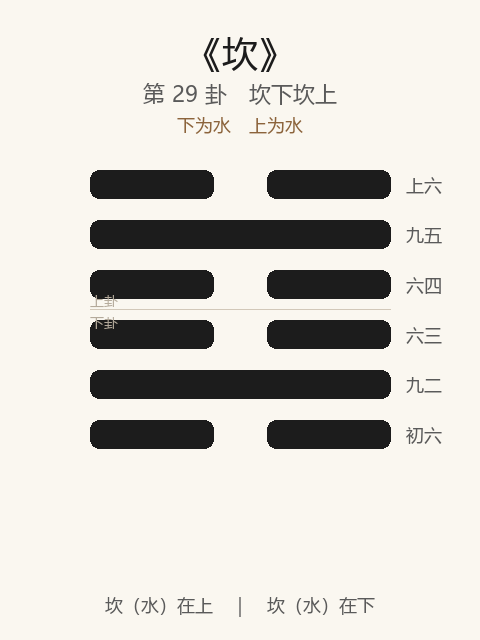

# 《坎》卦解读（习坎）

## 卦象

<p align="center">
  
</p>

**䷜ 坎**（第 29 卦）｜**坎下坎上**（下为水，上为水）

| 下卦（内） | 上卦（外） |
|------------|------------|
| ☵ 坎（水） | ☵ 坎（水） |

```
━━  ━━  上六
━━━━━━  九五
━━  ━━  六四
━━  ━━  六三
━━━━━━  九二
━━  ━━  初六
```

> 阳爻为「九」（━━━━━━），阴爻为「六」（━━  ━━）；自下往上：初→上。

---

> 有孚，维心亨，行有尚。
>
> 初六：习坎，入于坎窞，凶。
>
> 九二：坎有险，求小得。
>
> 六三：来之坎，坎险且枕，入于坎窞，勿用。
>
> 六四：樽酒簋贰，用缶，纳约自牖，终无咎。
>
> 九五：坎不盈，祗既平，无咎。
>
> 上六：系用徽纆，窴于丛棘，三岁不得，凶。

《坎》为坎下坎上：水洊至，险上加险，故称「习坎」。坎者，陷也、险也——**有孚，维心亨，行有尚**。整体讲处险之道：心诚则亨，宜小得、宜简约相与；戒深入窞中、戒久陷不得出。

---

## 卦辞：有孚，维心亨，行有尚

| 语 | 含义 |
|----|------|
| **有孚** | 心怀诚信——处险之本 |
| **维心亨** | 通在内心，不在外势——险中唯此可亨 |
| **行有尚** | 持孚而行，可有功尚（尚，配也、嘉也） |

大过之后继坎：过涉灭顶，则入险。坎之亨**不在脱险之快，而在心之不失孚**。

---

## 六爻：习险中的进退

| 爻 | 爻辞 | 要旨 |
|----|------|------|
| **初六** | 习坎，入于坎窞，凶 | 习于险而又陷坑中 → **凶** |
| **九二** | 坎有险，求小得 | 险中求取 → **只可小得** |
| **六三** | 来之坎，坎险且枕，入于坎窞，勿用 | 来去皆坎，险且依枕 → **深陷，勿用（勿有所作为）** |
| **六四** | 樽酒簋贰，用缶，纳约自牖，终无咎 | 一樽酒、二簋食，瓦缶简约，自牖纳信 → **终无咎** |
| **九五** | 坎不盈，祗既平，无咎 | 坎坑未满，但已近乎平 → **无咎** |
| **上六** | 系用徽纆，窴于丛棘，三岁不得，凶 | 绳索捆绑，置于丛棘 → **三年不得出，凶** |

一条线：**入窞凶 → 求小得 → 勿用 → 简约自牖无咎 → 不盈既平 → 丛棘三岁凶**。

坎之要：**孚在心；险中宜小、宜简、宜平；忌深陷入窞，忌久困不出。**

---

## 几处关键意象

### 习坎

「习」为重习、相仍：水水流至，险继以险。  
初六「习坎，入于坎窞」：已处险，又再陷一坑——**习惯危险或叠险冒进，最凶。**

### 维心亨

外皆坎陷，可通者唯心。有孚则心亨，心亨则行有尚——与《需》「有孚」、《讼》「有孚窒惕」同脉：险中第一件是**信不可丢**。

### 求小得

九二刚中在险：不求大成，只求小得——量力、渐进。  
处险妄求大功，往往再入坎窞；**小得是险中的智慧。**

### 樽酒簋贰，用缶，纳约自牖

六四：礼不在丰，诚在于约——酒食简单，从窗户递进信约（不走正门之显赫）。  
险难中交人以诚、以简，不讲排场——**终无咎**。是「有孚」的爻象落实。

### 坎不盈，祗既平

九五：坑尚未填满（不盈），但水已接近平满——不过满、不过刚，恰到将出未盈。  
君处险中：**不盈满自居，至平则无咎**——与上六久困相对。

### 徽纆丛棘，三岁不得

上六险极：如囚于绳索丛棘，三年不得解脱——**陷之既深且久，凶**。与初之入窞呼应：始陷已凶，终困更凶。

---

## 一条贯通的读法

1. **时**：险难重叠、进退维谷之时。
2. **德**：有孚，维心亨——通在心不在境。
3. **事**：二求小得，四简约孚信，五不盈既平；初、三、上戒深入久困。
4. **戒**：习险入窞；险中求大；枕险勿用而不知；终陷三岁。

---

## 与《大过》衔接

| | 大过 | 坎（习坎） |
|---|------|-----------|
| 序 | 28 | 29 |
| 象 | 泽灭木（过） | 水洊至（险） |
| 关系 | 过涉灭顶 | 则入于坎 |
| 要诀 | 栋挠，利有攸往 | 有孚，维心亨 |
| 方向 | 非常之济 | 处险守孚 |

大过之灭顶，继之以坎——过则陷；陷中唯孚与心亨可尚。

---

## 人事简表

| 所问 | 要点 |
|------|------|
| **处困境** | 维心亨——先守诚信与内心通畅；行有尚 |
| **进取** | 二：求小得——小步即可，勿求翻盘式大功 |
| **最戒** | 初、三：入于坎窞——越陷越深，勿用强为 |
| **交往/求助** | 四：简约、真诚、自牖纳约——不讲排场，终无咎 |
| **当位者** | 五：坎不盈——不过满，平实则无咎 |
| **久困** | 上：三岁不得——拖延至极则凶；宜早图小得出险 |
