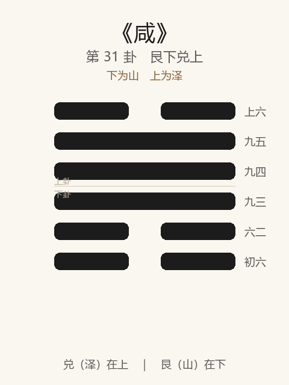

# 《咸》卦解读

## 卦象

<p align="center">
  
</p>

**䷞ 咸**（第 31 卦）｜**艮下兑上**（下为山，上为泽）

| 下卦（内） | 上卦（外） |
|------------|------------|
| ☶ 艮（山） | ☱ 兑（泽） |

```
━━  ━━  上六
━━━━━━  九五
━━━━━━  九四
━━━━━━  九三
━━  ━━  六二
━━  ━━  初六
```

> 阳爻为「九」（━━━━━━），阴爻为「六」（━━  ━━）；自下往上：初→上。

---

> 亨，利贞，取女吉。
>
> 初六：咸其拇。
>
> 六二：咸其腓，凶，居吉。
>
> 九三：咸其股，执其随，往吝。
>
> 九四：贞吉悔亡，憧憧往来，朋从尔思。
>
> 九五：咸其脢，无悔。
>
> 上六：咸其辅，颊，舌。

《咸》为艮下兑上：山上有泽，柔上而刚下，二气感应。咸者，感也——**亨，利贞，取女吉**。下经之始，言人伦：男女、身心以正相感。整体讲感应由下而上（拇→腓→股→心→脢→口），贵正、贵静，戒妄动、戒腾口。

---

## 卦辞：亨，利贞，取女吉

| 语 | 含义 |
|----|------|
| **亨** | 感应则通 |
| **利贞** | 感应须正——邪感不亨 |
| **取女吉** | 男下女、刚下柔（山泽）——婚姻以正感，吉 |

上经言天道，下经始咸：天地感而万物化生，圣人感人心而天下和平——**感以正，取女乃吉之象。**

---

## 六爻：感由下而上

| 爻 | 爻辞 | 要旨 |
|----|------|------|
| **初六** | 咸其拇 | 感在足拇 → **感应之始，动尚未进** |
| **六二** | 咸其腓，凶，居吉 | 感在小腿肚 → **躁动则凶，静居则吉** |
| **九三** | 咸其股，执其随，往吝 | 感在股，执意盲从 → **往则吝** |
| **九四** | 贞吉悔亡，憧憧往来，朋从尔思 | 感在心位 → **守正则吉悔亡；心神不定则仅朋从其思** |
| **九五** | 咸其脢，无悔 | 感在背肉（脢） → **静而不能躁感，无悔** |
| **上六** | 咸其辅，颊，舌 | 感在口颊舌 → **腾口说，感之末** |

一条线：**拇（始）→ 腓（宜居）→ 股（戒随）→ 心（贞／憧憧）→ 脢（无悔）→ 口舌（末）**。

咸之要：**感以正、以静、以心；忌腓躁、股随、憧憧、口舌。**

---

## 几处关键意象

### 山泽通气

艮止兑悦：少男在下，少女在上——男先下、女见悦，感之正象。  
取女吉，正在此「交感有序」，非勉强、非邪媚。

### 咸其拇 → 咸其腓 → 咸其股

感应自足端起：  
- **拇**：动之微，未有吉凶辞——感已生，行未成；  
- **腓**：欲行欲止之间，动则凶，居则吉；  
- **股**：随腿而动，「执其随」则盲从所感，往吝。  

示：感之初期，**宜静察，不宜随感而奔。**

### 贞吉悔亡 / 憧憧往来

九四当「心」：咸之主爻。  
- 贞 → 吉，悔亡；  
- 憧憧往来（心神不定、私意往来）→ 所从仅「朋从尔思」——同气相感于私念，感之不广。  

《系辞》言「天下何思何虑」「同归而殊途」——**正感无私，私感则狭。**

### 咸其脢

脢在心之上、口之下，背脊之肉，不能屈挠趋人——象感之正而静，不妄动求感，故无悔。  
与腓之躁、口之腾相对。

### 咸其辅，颊，舌

上六：感极于口——辅、颊、舌皆言语之具。感之以言，易流于说而不实，《易》不加吉辞——**感之浅者在口，感之深者在心与正。**

---

## 一条贯通的读法

1. **时**：下经人事之始，阴阳相感、婚媾交际之时。
2. **德**：亨在感，利在贞；取女吉在正感。
3. **事**：初微感，二宜居，三戒随，四贞心，五脢无悔，上戒口舌。
4. **戒**：腓动、股随、憧憧私感、以颊舌为感。

---

## 与上经之末、下经之始

| | 离（上经终） | 咸（下经始） |
|---|-------------|-------------|
| 序 | 30 | 31 |
| 域 | 天道、自然（水火） | 人事、人伦（感应） |
| 要诀 | 利贞，畜牝牛 | 亨，利贞，取女吉 |
| 关系 | 有天地然后有万物 | 有万物然后有男女 |

序卦：有天地然后有万物，有万物然后有男女——故下经首咸。

---

## 人事简表

| 所问 | 要点 |
|------|------|
| **感情/婚恋** | 利贞，取女吉——正感乃吉；忌邪媚、盲从、空口 |
| **感应初起** | 初咸拇：有感而已，勿遽动 |
| **想动时** | 二：居吉——静优于躁 |
| **追随他人** | 三：执其随，往吝——别被感觉牵着走 |
| **用心** | 四：贞则吉悔亡；憧憧则仅小圈子应和 |
| **自处** | 五：咸脢——沉静不妄求，无悔 |
| **言语** | 上：辅颊舌——少腾口，感不在说尽 |
