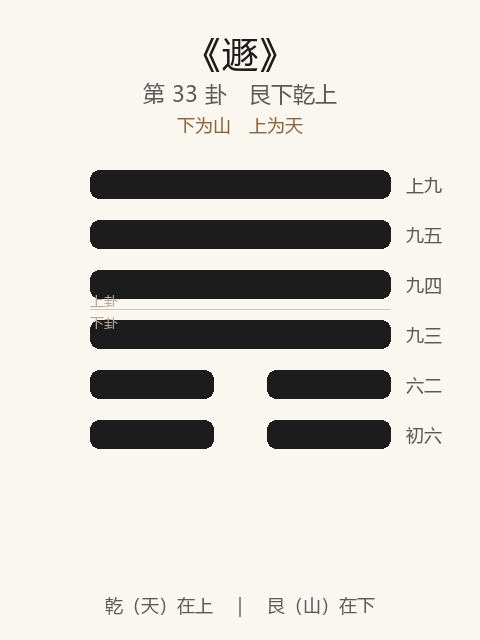

# 《遯》卦解读

## 卦象

<p align="center">
  
</p>

**䷠ 遯**（第 33 卦）｜**艮下乾上**（下为山，上为天）

| 下卦（内） | 上卦（外） |
|------------|------------|
| ☶ 艮（山） | ☰ 乾（天） |

```
━━━━━━  上九
━━━━━━  九五
━━━━━━  九四
━━━━━━  九三
━━  ━━  六二
━━  ━━  初六
```

> 阳爻为「九」（━━━━━━），阴爻为「六」（━━  ━━）；自下往上：初→上。

---

> 亨，小利贞。
>
> 初六：遯尾，厉，勿用有攸往。
>
> 六二：执之用黄牛之革，莫之胜说。
>
> 九三：系遯，有疾厉，畜臣妾吉。
>
> 九四：好遯君子吉，小人否。
>
> 九五：嘉遯，贞吉。
>
> 上九：肥遯，无不利。

《遯》为艮下乾上：天下有山，山高天退，二阴浸长而阳退避。遯者，退也、遁也——**亨，小利贞**。整体讲阴长之时君子退避：尾危、系疾，好遯、嘉遯、肥遯递进；退以正，乃亨。

---

## 卦辞：亨，小利贞

| 语 | 含义 |
|----|------|
| **亨** | 能遯则通——退不是败，是保身成道 |
| **小利贞** | 仅小利于守正（阴已长，不可大有作为）——宜贞，而所利者小 |

恒久之后，物不可终居于恒，故继遯——**时当退则退，亨在识时。**

---

## 六爻：退避的几种境界

| 爻 | 爻辞 | 要旨 |
|----|------|------|
| **初六** | 遯尾，厉，勿用有攸往 | 逃在末尾 → **危；勿有所往** |
| **六二** | 执之用黄牛之革，莫之胜说 | 用黄牛皮绳牢缚 → **志坚不可解脱（中正固守）** |
| **九三** | 系遯，有疾厉，畜臣妾吉 | 牵系而遯 → **有疾危；仅畜臣妾则吉** |
| **九四** | 好遯君子吉，小人否 | 爱好退避 → **君子吉；小人做不到** |
| **九五** | 嘉遯，贞吉 | 美善之遯 → **守正则吉** |
| **上九** | 肥遯，无不利 | 余裕充裕之遯 → **无不利** |

一条线：**忌遯尾 → 黄牛之革（固）→ 系遯有疾 → 好遯 → 嘉遯 → 肥遯**。

遯之要：**早退、决退、美退、裕退；忌尾、忌系；君子能退，小人不能。**

---

## 几处关键意象

### 天下有山

山止于下，天行于上——阴势渐长（下二阴），阳道退避。  
遯不是溃败，是**距离与高度**：山再高，也侵不到天。

### 遯尾，厉

初六居遯之末：退得太晚，落在队尾——危险已近，故厉；此时「勿用有攸往」——**晚退者不宜再动，只能慎避。**

### 黄牛之革，莫之胜说

六二柔中：如牛皮绳缚住——「说」通「脱」。中正之志被牢牢守住，阴长也不能夺。  
示：遯时在下者，**以坚韧之正自持**，不随势改节。

### 系遯 / 好遯 / 嘉遯 / 肥遯

| 名 | 爻 | 含义 | 结果 |
|----|----|------|------|
| **系遯** | 三 | 心有牵挂而退 | 有疾厉；畜臣妾吉 |
| **好遯** | 四 | 心悦诚服地退 | 君子吉，小人否 |
| **嘉遯** | 五 | 退得合宜美好 | 贞吉 |
| **肥遯** | 上 | 退得宽裕自在 | 无不利 |

退的品质层层升高：有牵挂 → 乐意 → 嘉美 → 肥余。  
**系则疾，肥则无不利。**

### 君子吉，小人否

九四：退需要见识与克制——君子能好遯，小人恋位恋利，否塞不能退。  
遯卦反复点明：**会不会退，是君子小人之分。**

---

## 一条贯通的读法

1. **时**：阴长阳消、不宜进取、当退避之时。
2. **德**：亨在能遯；小利贞——守正而勿图大。
3. **事**：二固志，四五上递进其遯；初戒尾，三戒系。
4. **戒**：退晚成尾；心系不舍；小人恋位；退而不贞。

---

## 与《恒》衔接

| | 恒 | 遯 |
|---|----|-----|
| 序 | 32 | 33 |
| 象 | 雷风（久） | 天下有山（退） |
| 关系 | 久不可终久 | 则当遯 |
| 要诀 | 利贞，利有攸往 | 亨，小利贞 |
| 攸往 | 利有攸往 | 尾则勿用有攸往 |

物不可久居其所，故恒后继遯——时变则退，退亦亨。

---

## 人事简表

| 所问 | 要点 |
|------|------|
| **局势** | 亨在退；只小利贞——收缩守正，勿扩张 |
| **退晚** | 初：遯尾厉——已落后，勿再往 |
| **下位自守** | 二：黄牛之革——中正牢不可夺 |
| **有牵挂** | 三：系遯有疾；只宜处理臣妾细务，不宜大事 |
| **主动退** | 四：好遯——君子能，小人不能 |
| **退得漂亮** | 五嘉遯、上肥遯——越从容越无不利 |
