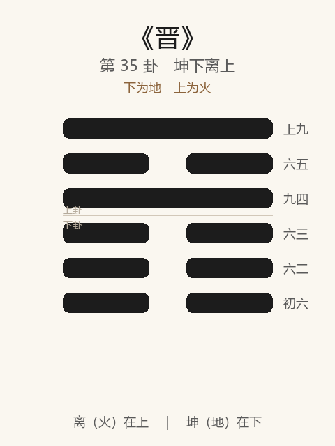

# 《晋》卦解读

## 卦象

<p align="center">
  
</p>

**䷢ 晋**（第 35 卦）｜**坤下离上**（下为地，上为火）

| 下卦（内） | 上卦（外） |
|------------|------------|
| ☷ 坤（地） | ☲ 离（火） |

```
━━━━━━  上九
━━  ━━  六五
━━━━━━  九四
━━  ━━  六三
━━  ━━  六二
━━  ━━  初六
```

> 阳爻为「九」（━━━━━━），阴爻为「六」（━━  ━━）；自下往上：初→上。

---

> 康侯用锡马蕃庶，昼日三接。
>
> 初六：晋如，摧如，贞吉。罔孚，裕无咎。
>
> 六二：晋如，愁如，贞吉。受兹介福于，其王母。
>
> 六三：众允，悔亡。
>
> 九四：晋如鼫鼠，贞厉。
>
> 六五：悔亡，失得勿恤，往吉无不利。
>
> 上九：晋其角，维用伐邑，厉吉无咎，贞吝。

《晋》为坤下离上：明出地上，太阳升起，象征进升、昭明。晋者，进也——**康侯锡马蕃庶，昼日三接**。大壮之后继晋：阳壮则明进。整体讲上进之道：摧如、愁如而贞则吉；众允悔亡；忌鼫鼠；失得勿恤；角进仅可伐邑。

---

## 卦辞：康侯用锡马蕃庶，昼日三接

| 语 | 含义 |
|----|------|
| **康侯** | 安国之侯——以进德安邦者 |
| **锡马蕃庶** | 天子赐马众多——宠遇隆厚 |
| **昼日三接** | 一日之内三次接见——亲密优渥 |

卦辞不言「元亨利贞」，而绘进用之象：明出地上，柔进上行，**得尊者之接，进在光明与柔顺。**

---

## 六爻：进升的诸态

| 爻 | 爻辞 | 要旨 |
|----|------|------|
| **初六** | 晋如，摧如，贞吉。罔孚，裕无咎 | 进又受摧折 → **守正则吉；未获信，宽裕则无咎** |
| **六二** | 晋如，愁如，贞吉。受兹介福于，其王母 | 进又含忧愁 → **守正则吉；大福来自王母（阴尊）** |
| **六三** | 众允，悔亡 | 众人信任允诺 → **悔亡** |
| **九四** | 晋如鼫鼠，贞厉 | 进如贪鼠 → **守此亦危** |
| **六五** | 悔亡，失得勿恤，往吉无不利 | 悔亡；不计较得失 → **往则吉，无不利** |
| **上九** | 晋其角，维用伐邑，厉吉无咎，贞吝 | 进用其角 → **仅宜伐邑；危而可吉无咎；守之则吝** |

一条线：**摧如贞吉 → 愁如受福 → 众允 → 忌鼫鼠 → 勿恤往吉 → 角进伐邑**。

晋之要：**柔进、贞进、得众；受摧受愁不改贞；忌贪进如鼠；极则勿角抵天下。**

---

## 几处关键意象

### 明出地上

离明在坤地之上——日出之象，普照而进。  
晋与明夷相反：晋为明出，明夷为明入地中。进升贵**光明正大、柔顺附丽**。

### 摧如 / 愁如，皆贞吉

| 爻 | 境遇 | 结果 |
|----|------|------|
| 初 | 晋而遭摧折 | 贞吉；罔孚则裕无咎 |
| 二 | 晋而含忧愁 | 贞吉；受介福于王母 |

进之路不平坦：有压制、有忧虑——**不因摧愁而改节，乃吉**；初未信则宽以待，二得阴尊之福。

### 众允，悔亡

六三：进至得众认同——允，信也。悔亡在「众」，不在一己硬闯。  
晋之道：**得人比得位更稳。**

### 晋如鼫鼠，贞厉

九四不中不正：如鼫鼠（五技而穷：能飞不能上屋等）——贪进、多欲、无实德。  
纵贞也厉——**不正之进，越「正固」越危。**

### 失得勿恤

六五柔中居尊：晋之主。不计较一得一失，往则无不利——**进到高位，格局要大，勿患得患失。**

### 晋其角，维用伐邑

上九刚极：进用其角（顶撞）——只可整顿「邑」（局部、自己的属地），不可任意扩张；虽厉而可吉无咎，然「贞吝」——**以角为常道则吝。**

---

## 一条贯通的读法

1. **时**：明出地上、才德得进、宠遇可至之时。
2. **德**：柔进上行；贞以处摧愁；勿恤失得。
3. **事**：初裕、二受福、三众允、五往吉；四戒鼠，上角仅伐邑。
4. **戒**：罔孚而不裕；进如鼫鼠；患得患失；以角进天下。

---

## 与《大壮》衔接

| | 大壮 | 晋 |
|---|------|-----|
| 序 | 34 | 35 |
| 象 | 雷在天上（壮） | 明出地上（进） |
| 关系 | 壮则可进 | 明而上升 |
| 要诀 | 利贞 | 康侯锡马，昼日三接 |
| 戒 | 用壮触藩 | 晋如鼫鼠 |

物大然后可进——大壮后继晋；壮须正，进须明而柔。

---

## 人事简表

| 所问 | 要点 |
|------|------|
| **升迁/进取** | 有明有顺则进；可获上层接引（锡马三接之象） |
| **受挫时** | 初摧如、二愁如——贞则吉；未获信则裕以待 |
| **得众** | 三：众允，悔亡——人心是进之基 |
| **最戒** | 四：晋如鼫鼠——贪进无德，贞亦厉 |
| **高位** | 五：失得勿恤，往吉无不利 |
| **已极** | 上：晋其角——只宜整顿局部；硬顶为常则吝 |
