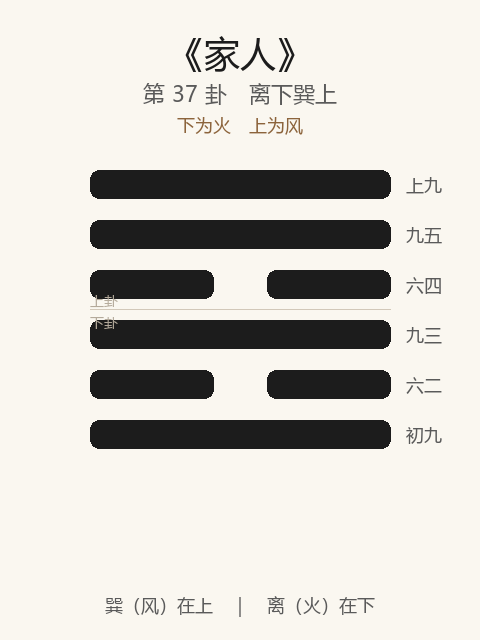

# 《家人》卦解读

## 卦象

<p align="center">
  
</p>

**䷤ 家人**（第 37 卦）｜**离下巽上**（下为火，上为风）

| 下卦（内） | 上卦（外） |
|------------|------------|
| ☲ 离（火） | ☴ 巽（风） |

```
━━━━━━  上九
━━━━━━  九五
━━  ━━  六四
━━━━━━  九三
━━  ━━  六二
━━━━━━  初九
```

> 阳爻为「九」（━━━━━━），阴爻为「六」（━━  ━━）；自下往上：初→上。

---

> 利女贞。
>
> 初九：闲有家，悔亡。
>
> 六二：无攸遂，在中馈，贞吉。
>
> 九三：家人嗃嗃，悔厉吉；妇子嘻嘻，终吝。
>
> 六四：富家，大吉。
>
> 九五：王假有家，勿恤，吉。
>
> 上九：有孚威如，终吉。

《家人》为离下巽上：风自火出，内明外巽，男女正位。家人者，家内之道也——**利女贞**。明夷之后，明伤于外则当齐家于内。整体讲治家：闲于始，女正中馈；严胜于嬉；富家、王假、孚威终吉。

---

## 卦辞：利女贞

| 语 | 含义 |
|----|------|
| **利女贞** | 利于女子守正——家道以女正为要；推之，家内各正其位 |

卦辞独言「利女贞」：家人之本，在内治、在柔正——二柔居内卦之中，正「女正位乎内」之象。

---

## 六爻：齐家的次序

| 爻 | 爻辞 | 要旨 |
|----|------|------|
| **初九** | 闲有家，悔亡 | 家之初即设防闲规矩 → **悔亡** |
| **六二** | 无攸遂，在中馈，贞吉 | 不自专成，主中馈（饮食家事） → **守正则吉** |
| **九三** | 家人嗃嗃，悔厉吉；妇子嘻嘻，终吝 | 家教严厉 → **有悔有危而吉；嬉笑无度，终吝** |
| **六四** | 富家，大吉 | 柔顺得位而富其家 → **大吉** |
| **九五** | 王假有家，勿恤，吉 | 王以至诚感格其家 → **不必忧，吉** |
| **上九** | 有孚威如，终吉 | 诚信而有威 → **终吉** |

一条线：**闲有家 → 中馈贞吉 → 嗃嗃胜嘻嘻 → 富家 → 王假勿恤 → 孚威终吉**。

家人之要：**闲于始，正于内，严胜嬉，孚而威；女贞是纲。**

---

## 几处关键意象

### 风自火出

火（离）在内，风（巽）在外——家之化，由内及外：修身齐家，而后风行。  
男女正：女内男外（二阴五阳得正），家道乃立。

### 闲有家

初九：闲，防也、阑也——家道之始就立规矩、别内外。  
悔亡在「早闲」：家乱多起于初无闲，末难收。

### 无攸遂，在中馈

六二：不专主外事之「遂」，而尽「中馈」之职——各正其位，非贬抑，而是**家人卦「女贞」的正位落实**。贞吉。

### 嗃嗃 / 嘻嘻

| | 嗃嗃 | 嘻嘻 |
|---|------|------|
| 象 | 严厉、苦热 | 嬉笑、轻慢 |
| 近效 | 悔厉（过严之悔与危） | 一时和乐 |
| 终局 | 吉 | 吝 |

治家宁可过严而悔厉，不可纵嬉而终吝——**严出孝，戏出慢。**

### 王假有家 / 有孚威如

- 五：假，至也——王者以道感格家庭，勿恤（不必忧）则吉；家齐而天下可假。  
- 上：家道之终，孚（爱）与威（严）并——有爱无威则慢，有威无孚则怨；**双美终吉。**

与《大有》六五「厥孚交如，威如」同旨：治众治家，皆孚威相济。

---

## 一条贯通的读法

1. **时**：明夷之后，当收明于家、齐家自保之时。
2. **德**：利女贞——家内以正，女正尤要。
3. **事**：初闲，二中馈，三严，四富，五感格，上孚威。
4. **戒**：始不闲；妇子嘻嘻；有孚无威或有威无孚。

---

## 与《明夷》衔接

| | 明夷 | 家人 |
|---|------|------|
| 序 | 36 | 37 |
| 象 | 明入地中（伤） | 风自火出（家） |
| 关系 | 外不可明 | 则正家于内 |
| 要诀 | 利艰贞 | 利女贞 |
| 方向 | 晦世保明 | 齐家孚威 |

伤于外者，齐其家——家正而后可徐图，故明夷后继家人。

---

## 人事简表

| 所问 | 要点 |
|------|------|
| **家庭** | 利女贞；闲于始，严胜嬉，孚威终吉 |
| **立规矩** | 初：闲有家，悔亡——越早定分越好 |
| **内职** | 二：在中馈，贞吉——位正则吉 |
| **管教** | 三：嗃嗃悔厉吉；嘻嘻终吝 |
| **家业** | 四：富家，大吉——顺正以致富 |
| **家长** | 五：以至诚感家，勿恤，吉 |
| **长久** | 上：有孚威如——恩威并济，终吉 |
