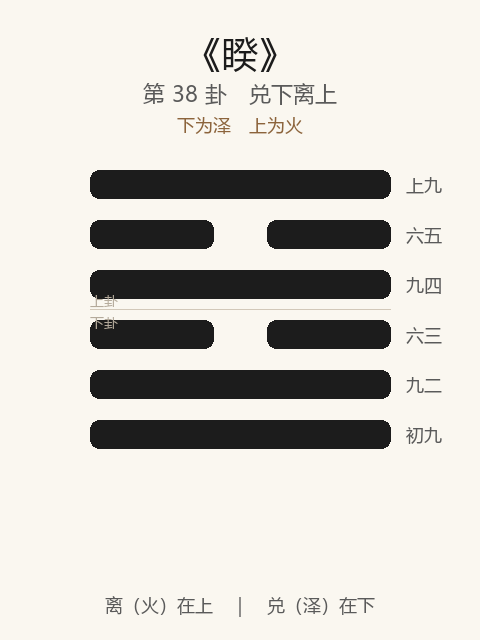

# 《睽》卦解读

## 卦象

<p align="center">
  
</p>

**䷥ 睽**（第 38 卦）｜**兑下离上**（下为泽，上为火）

| 下卦（内） | 上卦（外） |
|------------|------------|
| ☱ 兑（泽） | ☲ 离（火） |

```
━━━━━━  上九
━━  ━━  六五
━━━━━━  九四
━━  ━━  六三
━━━━━━  九二
━━━━━━  初九
```

> 阳爻为「九」（━━━━━━），阴爻为「六」（━━  ━━）；自下往上：初→上。

---

> 小事吉。
>
> 初九：悔亡，丧马勿逐，自复；见恶人无咎。
>
> 九二：遇主于巷，无咎。
>
> 六三：见舆曳，其牛掣，其人天且劓，无初有终。
>
> 九四：睽孤，遇元夫，交孚，厉无咎。
>
> 六五：悔亡，厥宗噬肤，往何咎？
>
> 上九：睽孤，见豕负涂，载鬼一车，先张之弧，后说之弧，匪寇婚媾，往遇雨则吉。

《睽》为兑下离上：上火下泽，火炎上、泽润下，两相背离。睽者，乖也、异也——**小事吉**。与家人相反：家人为同，睽为异。整体讲乖离之世如何合异：勿逐自复，遇主于巷；睽孤而交孚；疑极见鬼，释弧遇雨则吉。

---

## 卦辞：小事吉

| 语 | 含义 |
|----|------|
| **小事吉** | 睽违之时，大事难合，小事可为——求同于异，宜小不宜大 |

家人之道在齐同，睽则已乖——不可强求大同，**以小事缓合，吉。**

---

## 六爻：乖离中的合异

| 爻 | 爻辞 | 要旨 |
|----|------|------|
| **初九** | 悔亡，丧马勿逐，自复；见恶人无咎 | 失马勿追，自会回来 → **见恶人亦无咎（不拒不激）** |
| **九二** | 遇主于巷，无咎 | 于巷中遇其主 → **委曲相逢，无咎** |
| **六三** | 见舆曳，其牛掣，其人天且劓，无初有终 | 车拖牛掣，人遭天刑劓刑 → **始难终有成** |
| **九四** | 睽孤，遇元夫，交孚，厉无咎 | 乖离而孤，遇刚正之人 → **交以诚信，危而无咎** |
| **六五** | 悔亡，厥宗噬肤，往何咎？ | 悔亡；宗人如噬肤之亲 → **往有何咎** |
| **上九** | 睽孤……匪寇婚媾，往遇雨则吉 | 疑极见豕鬼，先张弓后脱弓 → **非寇实婚；往而遇雨则吉** |

一条线：**勿逐自复 → 遇主于巷 → 无初有终 → 遇元夫交孚 → 厥宗往 → 释疑遇雨**。

睽之要：**不强合、不深拒；委曲遇合；孤则交孚；疑极能释，乃吉。**

---

## 几处关键意象

### 上火下泽

火性炎上，泽性润下——同在一卦而方向相反，故睽。  
二女同居（兑少女、离中女）志不同行——象意见不合、各行其是。然《彖》言「天地睽而其事同」——**异中仍可成事，故小事吉。**

### 丧马勿逐，见恶人无咎

初九：乖离之始，失马不必追——越追越睽，静则自复。  
见恶人无咎：不因恶而绝交激变——睽世须能容纳异己，**拒之适增睽。**

### 遇主于巷

九二：不遇于朝，而遇于巷——正规场合难合，旁道委曲反能见主。  
示：睽时**不必执着正途相合，权宜相见亦无咎。**

### 无初有终

六三处境极难：车曳牛掣，人受墨刑、劓刑之辱——开头极不顺；然终与上合，**无初有终**。  
乖离之中，过程可丑，结局可成——宜忍。

### 睽孤，遇元夫，交孚

九四独处乖离（睽孤），得遇「元夫」（刚正之初九类）——以孚相交，虽厉无咎。  
六五「厥宗噬肤」：与二同宗相应，亲如咬肤之切——往何咎。  
**孤不致命，致命的是孤而不孚、不遇正人。**

### 见豕负涂，载鬼一车

上九疑心之极：见猪满泥、见鬼一车——本无而疑为有，先张弧欲射，后说（脱）弧而罢。  
「匪寇婚媾」：疑是寇，实是婚媾；「往遇雨则吉」——阴阳和（雨）则疑释而合。  
睽之终：**最大障碍往往是自己的猜疑；能放下弓，往而遇和，则吉。**

---

## 一条贯通的读法

1. **时**：意见相乖、关系疏离、各行其是之时。
2. **德**：小事吉——求合于微，不强同于大。
3. **事**：初勿逐、二遇巷、三忍终、四交孚、五往宗、上释疑遇雨。
4. **戒**：强合大事；绝恶人而激睽；睽孤而不遇不孚；疑豕疑鬼张弧不放。

---

## 与《家人》对照

| | 家人 | 睽 |
|---|------|-----|
| 序 | 37 | 38 |
| 象 | 风自火出（同） | 上火下泽（异） |
| 要诀 | 利女贞 | 小事吉 |
| 关系 | 家道同 | 同极则异 |
| 合异 | 闲、嗃、孚威 | 勿逐、交孚、遇雨 |
| 极 | 有孚威如 | 载鬼一车，说弧 |

家道穷则乖，故家人后继睽；睽而能以孚合异，则异不为害。

---

## 人事简表

| 所问 | 要点 |
|------|------|
| **分歧/不合** | 小事吉——先办得成的小共同点，勿强求大一统 |
| **失去/疏远** | 初：丧马勿逐，自复；见恶人无咎 |
| **求见/合作** | 二：遇主于巷——旁路委曲亦可 |
| **过程艰难** | 三：无初有终——开头惨，结局可成 |
| **孤立** | 四：遇元夫，交孚——找正人、交诚信 |
| **有应** | 五：厥宗噬肤，往何咎——亲应可往 |
| **猜疑** | 上：先张弧后说弧——疑是鬼，实是婚；往遇雨则吉 |
