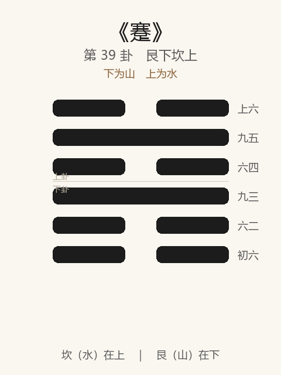

# 《蹇》卦解读

## 卦象

<p align="center">
  
</p>

**䷦ 蹇**（第 39 卦）｜**艮下坎上**（下为山，上为水）

| 下卦（内） | 上卦（外） |
|------------|------------|
| ☶ 艮（山） | ☵ 坎（水） |

```
━━  ━━  上六
━━━━━━  九五
━━  ━━  六四
━━━━━━  九三
━━  ━━  六二
━━  ━━  初六
```

> 阳爻为「九」（━━━━━━），阴爻为「六」（━━  ━━）；自下往上：初→上。

---

> 利西南，不利东北；利见大人，贞吉。
>
> 初六：往蹇，来誉。
>
> 六二：王臣蹇蹇，匪躬之故。
>
> 九三：往蹇来反。
>
> 六四：往蹇来连。
>
> 九五：大蹇朋来。
>
> 上六：往蹇来硕，吉；利见大人。
>
《蹇》为艮下坎上：水在山上，山下有险，见险而止。蹇者，难也、跛也——**利西南，不利东北；利见大人，贞吉**。睽后继蹇：乖离则难生。整体讲处险难：往则蹇，来则誉、反、连、朋、硕——宜回就、宜见大人，不宜硬闯东北。

---

## 卦辞：利西南，不利东北；利见大人，贞吉

| 语 | 含义 |
|----|------|
| **利西南** | 西南为坤方，顺、平、得众 → 宜往就安顺之地、求同志 |
| **不利东北** | 东北为艮方，山险 → 不宜硬闯险阻 |
| **利见大人** | 难中宜求有德有位者相济 |
| **贞吉** | 守正则吉——蹇中不改节 |

蹇之方向极明：**退就西南之顺，不犯东北之险；见大人，守正。**

---

## 六爻：往蹇而来得

| 爻 | 爻辞 | 要旨 |
|----|------|------|
| **初六** | 往蹇，来誉 | 往则遇难 → **来则有誉** |
| **六二** | 王臣蹇蹇，匪躬之故 | 王臣屡陷于蹇 → **非为一己，乃为公** |
| **九三** | 往蹇来反 | 往则蹇 → **来则返回（复其所）** |
| **六四** | 往蹇来连 | 往则蹇 → **来则联合同志** |
| **九五** | 大蹇朋来 | 大难之中 → **朋友来助** |
| **上六** | 往蹇来硕，吉；利见大人 | 往则蹇 → **来则收获丰硕，吉；利见大人** |

一条线：**来誉 → 蹇蹇匪躬 → 来反 → 来连 → 朋来 → 来硕见大人**。

蹇之要：**几乎皆「往蹇」；吉在「来」——回、连、得朋、见大人；二为公而蹇，无咎之义。**

---

## 几处关键意象

### 见险而止

内艮止，外坎险——知难而止，故能「来」而不一味「往」。  
与需「险在前」而待、蹇「见险而止」而反，皆处险之智。

### 西南 / 东北

与《坤》「西南得朋，东北丧朋」相发：  
- 西南：平顺、得朋、属阴方之安；  
- 东北：山险、阳将生而未畅。  

蹇时：**向安顺处靠，勿向更险处冲。**

### 往蹇，来誉 / 来反 / 来连 / 来硕

六爻除二、五特辞外，多「往蹇」而对以「来××」：

| 来 | 义 |
|----|-----|
| **来誉** | 退回得名声（知止为誉） |
| **来反** | 返回本位 |
| **来连** | 联合其类 |
| **来硕** | 所得丰厚 |

「往」不是绝对禁止，而是**往必遇蹇，价值在能来**——能收、能联、能见大人。

### 王臣蹇蹇，匪躬之故

六二柔中：为王事反复犯难，不是为私利——蹇中之忠臣象。  
示：难中可为公而蹇，虽蹇蹇而不失其正。

### 大蹇朋来 / 利见大人

五居尊而大蹇：难大则同志来聚。  
上「来硕」又「利见大人」——与卦辞相应：蹇之终，**退而得丰，并求大人，乃吉。**

---

## 一条贯通的读法

1. **时**：险在前、行不得、进退维谷之时。
2. **德**：贞吉；利见大人；为公可蹇蹇。
3. **事**：方向利西南；行动贵「来」不贵硬「往」。
4. **戒**：不利东北；往而不来；难中为私，或拒朋拒大人。

---

## 与《睽》衔接

| | 睽 | 蹇 |
|---|----|-----|
| 序 | 38 | 39 |
| 象 | 上火下泽（乖） | 水山（难） |
| 关系 | 乖则难生 | 见险而止 |
| 要诀 | 小事吉 | 利西南，利见大人 |
| 合异/济难 | 交孚，遇雨 | 来连，朋来 |

睽违之后，事多阻滞，故继之以蹇——乖异成难，难中求朋求大人。

---

## 人事简表

| 所问 | 要点 |
|------|------|
| **进退** | 往蹇来誉——宜收、宜回，不宜硬闯 |
| **方向** | 利西南（顺、得众），不利东北（险） |
| **求援** | 利见大人；五朋来；四来连 |
| **为公犯难** | 二：蹇蹇匪躬——可，非为私 |
| **自处** | 三来反——回到能站稳的位置 |
| **难极** | 上：来硕，吉——退而得丰；仍利见大人 |
