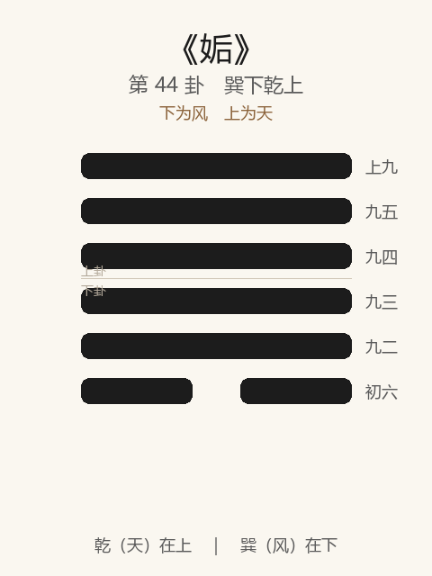

# 《姤》卦解读

## 卦象

<p align="center">
  
</p>

**䷫ 姤**（第 44 卦）｜**巽下乾上**（下为风，上为天）

| 下卦（内） | 上卦（外） |
|------------|------------|
| ☴ 巽（风） | ☰ 乾（天） |

```
━━━━━━  上九
━━━━━━  九五
━━━━━━  九四
━━━━━━  九三
━━━━━━  九二
━━  ━━  初六
```

> 阳爻为「九」（━━━━━━），阴爻为「六」（━━  ━━）；自下往上：初→上。

---

> 女壮，勿用取女。
>
> 初六：系于金柅，贞吉，有攸往，见凶，羸豕孚蹢躅。
>
> 九二：包有鱼，无咎，不利宾。
>
> 九三：臀无肤，其行次且，厉，无大咎。
>
> 九四：包无鱼，起凶。
>
> 九五：以杞包瓜，含章，有陨自天。
>
> 上九：姤其角，吝，无咎。

《姤》为巽下乾上：天下有风，一阴生于下而遇五阳。姤者，遇也——**女壮，勿用取女**。与夬相反：夬为五阳决一阴在上，姤为一阴遇五阳在下。整体讲阴始生、邂逅相遇：宜系止，宜包；勿取女、不利宾；包无鱼则凶，含章有陨自天。

---

## 卦辞：女壮，勿用取女

| 语 | 含义 |
|----|------|
| **女壮** | 一阴虽微，势将浸长——阴气始壮 |
| **勿用取女** | 不可娶此女——阴将消阳，遇而不可与之长久匹配 |

姤是「遇」，不是「配」：邂逅可有，**不可正式迎取而任其壮大。** 人事上即：不正之遇、将长之阴，宜防不宜纳。

---

## 六爻：遇与包系

| 爻 | 爻辞 | 要旨 |
|----|------|------|
| **初六** | 系于金柅，贞吉，有攸往，见凶，羸豕孚蹢躅 | 系于金属刹车木 → **守正则吉；往则见凶；如瘦猪躁动** |
| **九二** | 包有鱼，无咎，不利宾 | 包中有鱼（能容初阴） → **无咎；不宜用于宾客（私遇不可公）** |
| **九三** | 臀无肤，其行次且，厉，无大咎 | 行难如夬四 → **危，无大咎** |
| **九四** | 包无鱼，起凶 | 包中无鱼（失其遇） → **发起则凶** |
| **九五** | 以杞包瓜，含章，有陨自天 | 以杞柳包瓜，含藏文采 → **有自天而降之遇合** |
| **上九** | 姤其角，吝，无咎 | 遇于角（穷高） → **吝，无咎** |

一条线：**系金柅 → 包有鱼（不利宾）→ 次且无大咎 → 包无鱼起凶 → 杞包瓜有陨 → 姤角吝**。

姤之要：**阴始生宜系宜包；勿取、不利宾；有包则无咎，无鱼则凶；极高之遇吝。**

---

## 几处关键意象

### 天下有风

风行天下，无物不遇——姤为相遇之象。一阴在下，五月之卦（阴始生），故「女壮」。  
夬尽则姤：阳决尽阴于上，而阴又自下生——**消长无终，遇不可不慎。**

### 系于金柅 / 羸豕孚蹢躅

柅：止车之木。初阴宜系止，贞则吉；若有攸往（放任其长）则见凶。  
羸豕蹢躅：瘦弱之猪亦躁动不安——阴虽微，**志在前进，不可因其弱而忽之。**

### 包有鱼 / 包无鱼

| | 包有鱼（二） | 包无鱼（四） |
|---|-------------|-------------|
| 象 | 能包容初阴 | 远阴，包中空 |
| 义 | 遇在己，可制 | 失所遇，无制 |
| 果 | 无咎，不利宾 | 起凶 |

鱼为阴物：二近初，能包则无咎——但「不利宾」，私遇不可延为正式宾主之礼（应「勿用取女」）。  
四本与初应，却因二隔「包无鱼」——该有的遇失去，一动则凶。

### 以杞包瓜，含章，有陨自天

九五：杞高而包瓜（瓜柔蔓地）——在上以中正含章，等待天降之遇。  
「有陨自天」：非强求，而有天命之合——**正人之遇，含章以待，异于取女之邪遇。**

### 姤其角

上九穷高：遇于角端——刚极无阴可遇，或遇而不亲，故吝；然不涉邪，无咎。  
姤之终：无可遇或遇已尽，止于吝而已。

---

## 一条贯通的读法

1. **时**：一阴始生、邂逅相遇、阴将浸长之时。
2. **德**：勿用取女——遇可防，不可迎而成配。
3. **事**：初系柅，二包鱼不利宾，五含章待陨；四无鱼起凶。
4. **戒**：放阴使往；以私遇为宾为娶；包无鱼而妄动；忽羸豕之蹢躅。

---

## 与《夬》对照

| | 夬 | 姤 |
|---|----|-----|
| 序 | 43 | 44 |
| 象 | 泽上于天（决阴） | 天下有风（遇阴） |
| 阴阳 | 五阳决一阴在上 | 一阴遇五阳在下 |
| 要诀 | 扬于王庭，不利即戎 | 女壮，勿用取女 |
| 关系 | 决尽 | 阴复生而遇 |
| 戒 | 壮趾、无号 | 取女、包无鱼 |

阳决阴于上，阴又生于下而相遇——消长循环，夬后继姤。

---

## 人事简表

| 所问 | 要点 |
|------|------|
| **邂逅/不正之遇** | 勿用取女——可遇不可娶、不可任其壮大 |
| **防微** | 初：系于金柅，贞吉；往则凶——阴虽弱如羸豕，亦须止 |
| **能容能制** | 二：包有鱼，无咎；不利宾——私了即可，勿公开成礼 |
| **失遇** | 四：包无鱼，起凶——该有的关系空了，动则凶 |
| **正遇** | 五：含章，有陨自天——以德待天命之合 |
| **穷极** | 上：姤其角——遇于尽头，吝而无咎 |
