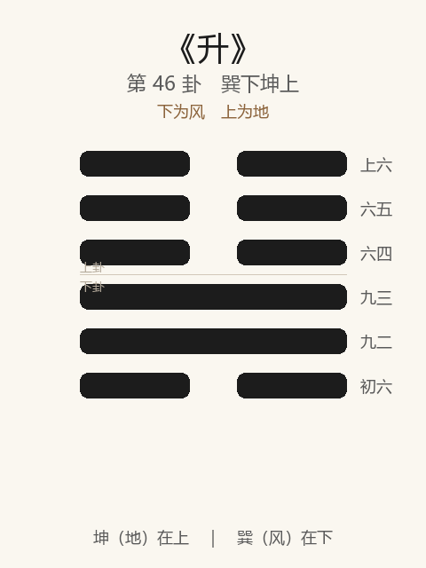

# 《升》卦解读

## 卦象

<p align="center">
  
</p>

**䷭ 升**（第 46 卦）｜**巽下坤上**（下为风，上为地）

| 下卦（内） | 上卦（外） |
|------------|------------|
| ☴ 巽（风） | ☷ 坤（地） |

```
━━  ━━  上六
━━  ━━  六五
━━  ━━  六四
━━━━━━  九三
━━━━━━  九二
━━  ━━  初六
```

> 阳爻为「九」（━━━━━━），阴爻为「六」（━━  ━━）；自下往上：初→上。

---

> 元亨，用见大人，勿恤，南征吉。
>
> 初六：允升，大吉。
>
> 九二：孚乃利用禴，无咎。
>
> 九三：升虚邑。
>
> 六四：王用亨于岐山，吉无咎。
>
> 六五：贞吉，升阶。
>
> 上六：冥升，利于不息之贞。

《升》为巽下坤上：地中生木，木升破土，象征上升、进升。升者，登也——**元亨，用见大人，勿恤，南征吉**。与萃相对：萃为聚，升为进。整体讲上升之道：允升大吉，孚禴无咎；虚邑可入，亨岐山；升阶贞吉；冥升须不息之贞。

---

## 卦辞：元亨，用见大人，勿恤，南征吉

| 语 | 含义 |
|----|------|
| **元亨** | 上升得时，大通 |
| **用见大人** | 宜进见有德有位者——升须有依 |
| **勿恤** | 不必忧虑——时可升 |
| **南征吉** | 南方为明、为进之方 → 向明而进则吉 |

萃聚之后，气盛则升——**见大人、勿恤、南征**，升之路正而明。

---

## 六爻：上升的阶次

| 爻 | 爻辞 | 要旨 |
|----|------|------|
| **初六** | 允升，大吉 | 信允而升（见许于上） → **大吉** |
| **九二** | 孚乃利用禴，无咎 | 有孚则薄祭亦利 → **无咎** |
| **九三** | 升虚邑 | 升入空虚无人之邑 → **（进无阻，义在能入）** |
| **六四** | 王用亨于岐山，吉无咎 | 王祭于岐山 → **吉，无咎** |
| **六五** | 贞吉，升阶 | 守正则吉 → **如升阶而进** |
| **上六** | 冥升，利于不息之贞 | 暗中盲目上升 → **宜不停息地守正** |

一条线：**允升大吉 → 孚禴 → 升虚邑 → 亨岐山 → 升阶 → 冥升不息贞**。

升之要：**见允、有孚、向南向明；阶进贞吉；极则冥，须以不息之贞救之。**

---

## 几处关键意象

### 地中生木

巽木在坤地之下——木生于地中，日积而升。升贵**积渐**，不贵躁跃；柔顺以时而进。

### 允升，大吉

初六：柔顺在下，见信于二阳（允），故升——大吉。  
升之始在「允」：被信任、被许可，不是强升。

### 孚乃利用禴

与萃六二同辞：有孚则禴祭（薄祭）亦通。  
升、萃皆聚进之事，**诚一则简礼亦无咎**——不在牺牲之厚。

### 升虚邑

九三：所升之邑空虚无阻——进路畅通。  
辞简无吉凶字：时可进取，**虚则可入，义在勇往，亦在知所入非实敌。**

### 王用亨于岐山

六四：如文王亨于岐山——柔顺得正，上通而获吉。  
升至于此，以诚敬事神/事上，吉无咎——与萃「假庙」相呼应。

### 升阶 / 冥升

| | 升阶（五） | 冥升（上） |
|---|-----------|-----------|
| 象 | 拾级而上 | 昏冥而升 |
| 义 | 有序、守正 | 不知止、暗中求进 |
| 戒/救 | 贞吉 | 利于不息之贞 |

五居尊，贞则如升阶——一步一阶，吉。  
上已极仍升，如在暗中攀升——唯一补救是「不息之贞」：不停地守正，不可一息苟且。

---

## 一条贯通的读法

1. **时**：萃聚之后，气盛当升、可进见大人之时。
2. **德**：元亨；见大人，勿恤；南征向明。
3. **事**：初允升，二孚禴，三入虚邑，四亨岐山，五升阶；上冥则不息贞。
4. **戒**：无允强升；无孚而求厚礼；冥升而不贞。

---

## 与《萃》对照

| | 萃 | 升 |
|---|----|-----|
| 序 | 45 | 46 |
| 象 | 泽上于地（聚） | 地中生木（升） |
| 关系 | 聚则升 | 升须有据 |
| 大人 | 利见大人 | 用见大人，勿恤 |
| 同辞 | 孚乃利用禴（二） | 孚乃利用禴（二） |
| 要诀 | 王假有庙 | 南征吉；升阶 |
| 极 | 赍咨涕洟 | 冥升，不息之贞 |

聚而上升，故萃后继升——升以允、以孚、以阶，异于冥升无度。

---

## 人事简表

| 所问 | 要点 |
|------|------|
| **升迁/进取** | 元亨；见大人，勿恤，南征吉——向明而进 |
| **起步** | 初：允升——先获信任，大吉 |
| **诚敬** | 二：有孚则薄祭亦无咎 |
| **无阻时** | 三：升虚邑——可进，路空 |
| **上通** | 四：如亨于岐山——诚敬事上/事神，吉 |
| **正道** | 五：贞吉，升阶——按阶而升，勿躐等 |
| **已过高** | 上：冥升——唯利于不息之贞，不可一息失正 |
