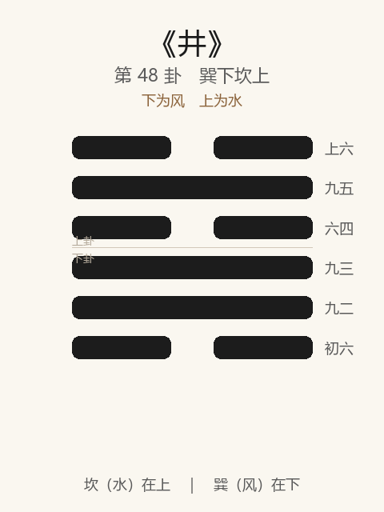

# 《井》卦解读

## 卦象

<p align="center">
  
</p>

**䷯ 井**（第 48 卦）｜**巽下坎上**（下为风，上为水）

| 下卦（内） | 上卦（外） |
|------------|------------|
| ☴ 巽（风） | ☵ 坎（水） |

```
━━  ━━  上六
━━━━━━  九五
━━  ━━  六四
━━━━━━  九三
━━━━━━  九二
━━  ━━  初六
```

> 阳爻为「九」（━━━━━━），阴爻为「六」（━━  ━━）；自下往上：初→上。

---

> 改邑不改井，无丧无得，往来井井。汔至，亦未繘井，羸其瓶，凶。
>
> 初六：井泥不食，旧井无禽。
>
> 九二：井谷射鲋，瓮敝漏。
>
> 九三：井渫不食，为我心恻，可用汲，王明，并受其福。
>
> 六四：井甃，无咎。
>
> 九五：井洌，寒泉食。
>
> 上六：井收勿幕，有孚元吉。

《井》为巽下坎上：木上有水，水井之象。井者，养而不穷也——**改邑不改井；无丧无得，往来井井；几至而羸瓶则凶**。困后继井：困于上则反下，井以养人。整体讲恒常之养：泥井、敝瓮须治；渫而不食可惜；甃、洌、收勿幕而有孚，乃元吉。

---

## 卦辞：改邑不改井，无丧无得，往来井井。汔至，亦未繘井，羸其瓶，凶

| 语 | 含义 |
|----|------|
| **改邑不改井** | 城邑可迁，井不可迁——位置、功用恒常 |
| **无丧无得** | 井不因人来而增、人去而减——公道常在 |
| **往来井井** | 来往者皆赖此井——秩序井然，养人不绝 |
| **汔至，亦未繘井，羸其瓶，凶** | 几至井口，绳未尽、瓶已毁 → 功亏一篑，凶 |

井之德：**恒、公、养**；井之戒：**几成而败（羸瓶）**。

---

## 六爻：井之修治与功用

| 爻 | 爻辞 | 要旨 |
|----|------|------|
| **初六** | 井泥不食，旧井无禽 | 井中唯泥，不可食 → **废井，禽亦不至** |
| **九二** | 井谷射鲋，瓮敝漏 | 井水仅射小鱼，瓮破漏 → **所养者小，器又敝** |
| **九三** | 井渫不食，为我心恻，可用汲，王明，并受其福 | 井已淘净却不食 → **可悯；若王明而用，则皆受福** |
| **六四** | 井甃，无咎 | 砌治井壁 → **无咎** |
| **九五** | 井洌，寒泉食 | 井水清澈，寒泉可食 → **（养人之正）** |
| **上六** | 井收勿幕，有孚元吉 | 汲成勿盖，开放共享 → **有孚，元吉** |

一条线：**泥井废 → 射鲋瓮漏 → 渫而不食（待明主）→ 井甃 → 寒泉食 → 收勿幕有孚**。

井之要：**治泥治瓮，淘而用之；洌以养人；成则勿幕，有孚元吉；戒羸瓶。**

---

## 几处关键意象

### 改邑不改井

邑可改，井不改——象制度、德性、养民之具有**不可轻变的常道**。往来井井：秩序与供给稳定，故无丧无得（不私增减）。

### 汔至……羸其瓶，凶

几乎成功：绳将尽、水将出，瓶却坏了——前功尽弃。  
示：养人济事，**末济最险**；器不固、行不终，则凶。与《既济》《未济》之旨相通。

### 井泥 / 井谷射鲋 / 井渫不食

| 阶段 | 象 | 义 |
|------|----|-----|
| 初 | 泥不食 | 完全废坏 |
| 二 | 射鲋、瓮漏 | 有水而无大用，器又敝 |
| 三 | 渫不食 | 已清洁，却未被用——人才埋没 |

三最可叹：井已可汲，「为我心恻」——待「王明」然后并受其福。  
**有德有才而不遇，是井卦之痛。**

### 井甃 / 井洌，寒泉食

四：甃，修砌——养之准备，无咎。  
五：洌而寒，清凉可食——君道之井，养人中正。  
由修到用，井德乃成。

### 井收勿幕，有孚元吉

上六：收，成也；勿幕——不要盖上私据。井成当开放，以孚待人，元吉。  
与卦辞「往来井井」相应：**养人之具，成则公之。**

---

## 一条贯通的读法

1. **时**：困后当养，求恒常、公道之供给之时。
2. **德**：改邑不改井——守常；无丧无得——公正；有孚勿幕。
3. **事**：治泥甃井，求洌可食；明主汲用；戒羸瓶。
4. **戒**：旧井不治；瓮敝；渫而不用；几成羸瓶；成而幕之私占。

---

## 与《困》对照

| | 困 | 井 |
|---|----|-----|
| 序 | 47 | 48 |
| 象 | 泽无水（困竭） | 木上有水（井养） |
| 关系 | 困于上 | 则反下求养 |
| 要诀 | 贞，大人吉；有言不信 | 改邑不改井；羸瓶凶 |
| 方向 | 穷 | 养而不穷 |

困则反下为井——水下漏为困，木上水为井；一竭一养。

---

## 人事简表

| 所问 | 要点 |
|------|------|
| **事业/制度** | 改邑不改井——根本之常不可轻改；往来井井 |
| **最戒** | 几至羸瓶——功亏一篑；器不固则凶 |
| **废坏** | 初泥、二瓮漏——先治其基与器 |
| **怀才不遇** | 三：井渫不食——待王明，并受其福 |
| **修治** | 四：井甃，无咎——把井壁修好 |
| **正成** | 五：井洌寒泉——清而能养 |
| **功成** | 上：收勿幕，有孚元吉——开放共享，勿私盖 |
