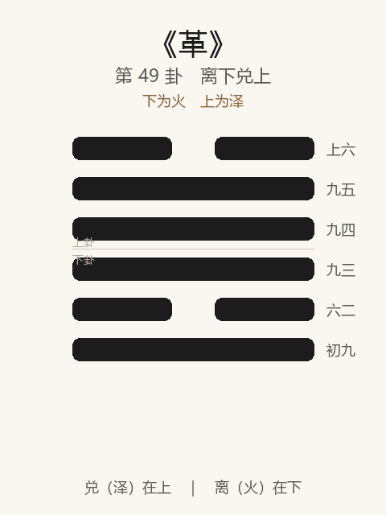

# 《革》卦解读

## 卦象

<p align="center">
  
</p>

**䷰ 革**（第 49 卦）｜**离下兑上**（下为火，上为泽）

| 下卦（内） | 上卦（外） |
|------------|------------|
| ☲ 离（火） | ☱ 兑（泽） |

```
━━  ━━  上六
━━━━━━  九五
━━━━━━  九四
━━━━━━  九三
━━  ━━  六二
━━━━━━  初九
```

> 阳爻为「九」（━━━━━━），阴爻为「六」（━━  ━━）；自下往上：初→上。

---

> 巳日乃孚，元亨利贞，悔亡。
>
> 初九：巩用黄牛之革。
>
> 六二：巳日乃革之，征吉，无咎。
>
> 九三：征凶，贞厉，革言三就，有孚。
>
> 九四：悔亡，有孚改命，吉。
>
> 九五：大人虎变，未占有孚。
>
> 上六：君子豹变，小人革面，征凶，居贞吉。

《革》为离下兑上：泽中有火，水火相息，象征变革、革命。革者，改也——**巳日乃孚，元亨利贞，悔亡**。井道不可不革，故井后继革。整体讲变革须时、须孚：巩而后革；巳日乃革；言三就；改命、虎变、豹变；小人仅革面，征凶居贞吉。

---

## 卦辞：巳日乃孚，元亨利贞，悔亡

| 语 | 含义 |
|----|------|
| **巳日乃孚** | 至巳日（事熟、信成之时）才获信任——变革不可躁，须待人信 |
| **元亨利贞** | 四德皆备——革而得正，可大通 |
| **悔亡** | 当革而革，悔恨消亡 |

革之关键：**时（巳日）+ 孚（人信）+ 正（贞）**——三者具，乃元亨悔亡。

---

## 六爻：变革的节奏

| 爻 | 爻辞 | 要旨 |
|----|------|------|
| **初九** | 巩用黄牛之革 | 用黄牛皮牢固捆住 → **未可革，宜固守** |
| **六二** | 巳日乃革之，征吉，无咎 | 至巳日乃变革 → **征吉，无咎** |
| **九三** | 征凶，贞厉，革言三就，有孚 | 急征则凶，守亦危 → **变革之言须再三成就，乃有孚** |
| **九四** | 悔亡，有孚改命，吉 | 悔亡 → **有诚信而改革天命/政令，吉** |
| **九五** | 大人虎变，未占有孚 | 大人如虎斑文变 → **未占已有孚（不待卜而人信）** |
| **上六** | 君子豹变，小人革面，征凶，居贞吉 | 君子如豹变（润色成文）→ **小人只改面孔；征凶，居守则吉** |

一条线：**巩而勿革 → 巳日乃革 → 言三就 → 有孚改命 → 虎变未占有孚 → 豹变／革面，居贞**。

革之要：**先巩后革；待巳日；言三就；改命须孚；成则虎豹之变；极则居贞，勿再征。**

---

## 几处关键意象

### 泽中有火

水火同处则相息——势不可不革。革是不得已之变，亦是文明之变（离明兑说）。

### 巳日乃孚 / 巳日乃革之

「巳」取已成、信立之义（亦有作「已日」者）。卦辞与六二相应：  
变革不是想改就改——**时机成熟、人心已孚，乃革之，征吉。**

### 巩用黄牛之革

初九在下：变革之始，用黄牛之革（中顺牢固）巩之——先稳住，不可妄动。  
与《遯》「黄牛之革」同象：**中正坚韧，未可轻变。**

### 革言三就，有孚

九三：急进征凶，贞亦厉——处境两难。唯「革言三就」：改革的主张、讨论须再三成熟，乃能有孚。  
示：革之难，**难在信，信在熟议。**

### 有孚改命 / 大人虎变

| 爻 | 象 | 义 |
|----|----|-----|
| 四 | 有孚改命 | 以诚信改易旧命/旧政，吉 |
| 五 | 虎变 | 大人变革如虎之文，炳然；未占有孚 |

五为革之主：德与时至，人自然信——**不待占问，孚已在。**

### 君子豹变，小人革面

上六革成之后：  
- **君子豹变**：如豹斑，愈变愈美（润色文明）；  
- **小人革面**：只改脸色，未改心。  

此时「征凶，居贞吉」——**大变已成，宜守成，不宜再征；防小人之面从。**

---

## 一条贯通的读法

1. **时**：井久弊生，水火相息，不得不变之时。
2. **德**：巳日乃孚；元亨利贞——时、信、正。
3. **事**：初巩，二巳日革，三言三就，四改命，五虎变，上居贞。
4. **戒**：未孚而革；壮征；言不三就；成后再征；以革面为已革心。

---

## 与《井》衔接

| | 井 | 革 |
|---|----|-----|
| 序 | 48 | 49 |
| 象 | 木上有水（常养） | 泽中有火（相息） |
| 关系 | 井久则浊 | 不可不革 |
| 要诀 | 改邑不改井 | 巳日乃孚，乃革之 |
| 常变 | 守常 | 当变 |

井道贵常，常极生弊，故继之以革——常与变相济。

---

## 人事简表

| 所问 | 要点 |
|------|------|
| **改革/转型** | 待巳日乃孚；元亨利贞则悔亡——时机与信任第一 |
| **未可动时** | 初：巩用黄牛之革——先巩固 |
| **可动时** | 二：巳日乃革之，征吉 |
| **争议中** | 三：革言三就——反复论证乃有孚；忌急征 |
| **改政令** | 四：有孚改命，吉 |
| **主事者** | 五：虎变——德至则未占有孚 |
| **变革之后** | 上：居贞吉，征凶；君子豹变，防小人革面 |
