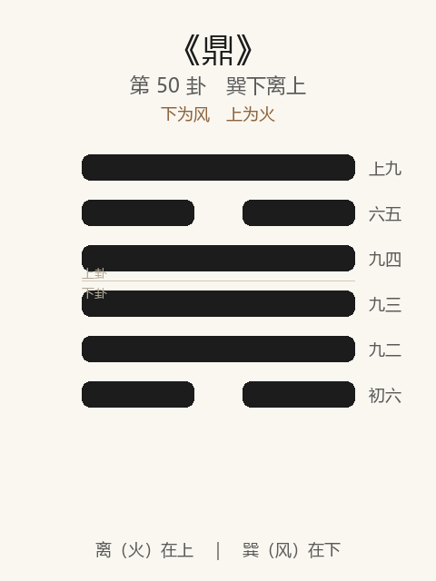

# 《鼎》卦解读

## 卦象

<p align="center">
  
</p>

**䷱ 鼎**（第 50 卦）｜**巽下离上**（下为风，上为火）

| 下卦（内） | 上卦（外） |
|------------|------------|
| ☴ 巽（风） | ☲ 离（火） |

```
━━━━━━  上九
━━  ━━  六五
━━━━━━  九四
━━━━━━  九三
━━━━━━  九二
━━  ━━  初六
```

> 阳爻为「九」（━━━━━━），阴爻为「六」（━━  ━━）；自下往上：初→上。

---

> 元吉，亨。
>
> 初六：鼎颠趾，利出否，得妾以其子，无咎。
>
> 九二：鼎有实，我仇有疾，不我能即，吉。
>
> 九三：鼎耳革，其行塞，雉膏不食，方雨亏悔，终吉。
>
> 九四：鼎折足，覆公餗，其形渥，凶。
>
> 六五：鼎黄耳金铉，利贞。
>
> 上九：鼎玉铉，大吉，无不利。

《鼎》为巽下离上：木上有火，烹饪之象，又为鼎器。鼎者，取新也——**元吉，亨**。与革相对：革去故，鼎取新。整体讲鼎新、养贤、成器：颠趾出否；有实远疾；戒折足覆餗；黄耳金铉、玉铉大吉。

---

## 卦辞：元吉，亨

| 语 | 含义 |
|----|------|
| **元吉，亨** | 鼎新得正，至善而通——革后成器，养人亨通 |

卦辞极简：革而得当，则鼎元吉而亨——**去故之后，贵在取新成器。**

---

## 六爻：鼎之颠、实、耳、足、铉

| 爻 | 爻辞 | 要旨 |
|----|------|------|
| **初六** | 鼎颠趾，利出否，得妾以其子，无咎 | 鼎足颠倒向上 → **利于倒出废物；得妾因子，无咎** |
| **九二** | 鼎有实，我仇有疾，不我能即，吉 | 鼎中有实 → **仇敌有疾，不能就我，吉** |
| **九三** | 鼎耳革，其行塞，雉膏不食，方雨亏悔，终吉 | 鼎耳变（不可举）→ **路塞，美食未食；将雨则悔消，终吉** |
| **九四** | 鼎折足，覆公餗，其形渥，凶 | 鼎足折，翻倒王公之粥 → **身被污渥，凶** |
| **六五** | 鼎黄耳金铉，利贞 | 黄耳、金铉（提环） → **利守正** |
| **上九** | 鼎玉铉，大吉，无不利 | 玉铉 → **大吉，无不利** |

一条线：**颠趾出否 → 有实远仇 → 耳革终吉 → 折足覆餗凶 → 黄耳金铉 → 玉铉大吉**。

鼎之要：**先出否，后有实；耳铉得中则举；折足任重则覆；成在金铉玉铉。**

---

## 几处关键意象

### 木上有火 / 革去故，鼎取新

巽木离火：烹饪成新。革是变旧制，鼎是立新命、养贤才——**革命之后，须有鼎新之实。**

### 鼎颠趾，利出否

初六：鼎颠倒，趾朝上——看似反常，却利于倒出陈污（否）。  
「得妾以其子」：因贱得贵（因子而贵）——始虽不正之象，结果无咎。  
示：鼎新之始，**先清除污秽，颠倒非常亦可。**

### 鼎有实，我仇有疾

九二：鼎中充实——有德有实，仇人自疾，不能侵近，故吉。  
**实是鼎的根本：有内容，邪不能即。**

### 鼎耳革 / 鼎折足

| | 耳革（三） | 折足（四） |
|---|-----------|-----------|
| 部件 | 耳（提举处） | 足（支撑处） |
| 问题 | 暂时不能行，雉膏不食 | 任重而折，覆公餗 |
| 结果 | 方雨亏悔，终吉 | 形渥，凶 |

耳革是暂时塞滞，终可吉；折足是德不称位、力不胜任——**公餗倾覆，凶不可救。**  
《系辞》以折足为「德薄而位尊，力小而任重」之戒。

### 黄耳金铉 / 玉铉

- 五：黄耳（中）、金铉（刚坚）——柔中居尊，得刚为助，利贞。  
- 上：玉铉——刚温如玉，居鼎之成，大吉无不利。  

铉所以举鼎：有耳有铉，鼎乃能行于天下——**成器在得中正之提挈。**

---

## 一条贯通的读法

1. **时**：革后取新、烹饪养贤、成器用事之时。
2. **德**：元吉亨——鼎新而正。
3. **事**：初出否，二有实，五上铉成；三暂塞终吉；四折足最戒。
4. **戒**：否不去；无实；折足覆公餗；德薄位尊。

---

## 与《革》对照

| | 革 | 鼎 |
|---|----|-----|
| 序 | 49 | 50 |
| 象 | 泽火（去故） | 火风／木火（取新） |
| 关系 | 革去故 | 鼎取新 |
| 要诀 | 巳日乃孚 | 元吉，亨 |
| 成败 | 虎变豹变 | 金铉玉铉／折足覆餗 |
| 方向 | 变旧 | 成新、养人 |

革而不鼎，则变而无成；鼎而不革，则新无从出——相须为用。

---

## 人事简表

| 所问 | 要点 |
|------|------|
| **开新/任用** | 元吉亨——去故之后，立新成器 |
| **起步** | 初：颠趾出否——先清污，非常之举可无咎 |
| **自处** | 二：鼎有实——充实自守，仇不能即 |
| **暂滞** | 三：耳革行塞——美食暂不得食；时至终吉 |
| **最戒** | 四：折足覆公餗——才不称任，凶 |
| **居中** | 五：黄耳金铉，利贞 |
| **大成** | 上：玉铉，大吉，无不利 |
