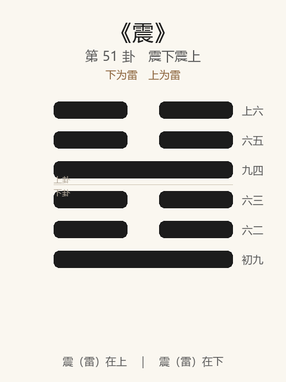

# 《震》卦解读

## 卦象

<p align="center">
  
</p>

**䷲ 震**（第 51 卦）｜**震下震上**（下为雷，上为雷）

| 下卦（内） | 上卦（外） |
|------------|------------|
| ☳ 震（雷） | ☳ 震（雷） |

```
━━  ━━  上六
━━  ━━  六五
━━━━━━  九四
━━  ━━  六三
━━  ━━  六二
━━━━━━  初九
```

> 阳爻为「九」（━━━━━━），阴爻为「六」（━━  ━━）；自下往上：初→上。

---

> 亨。震来虩虩，笑言哑哑。震惊百里，不丧匕鬯。
>
> 初九：震来虩虩，后笑言哑哑，吉。
>
> 六二：震来厉，亿丧贝，跻于九陵，勿逐，七日得。
>
> 六三：震苏苏，震行无眚。
>
> 九四：震遂泥。
>
> 六五：震往来厉，意无丧，有事。
>
> 上六：震索索，视矍矍，征凶。震不于其躬，于其邻，无咎。婚媾有言。

《震》为震下震上：洊雷，雷声相继。震者，动也、惊也——**亨；震来虩虩，笑言哑哑；震惊百里，不丧匕鬯**。鼎后继震：器成则动。整体讲恐惧修省：先惧后笑则吉；丧贝勿逐；戒遂泥、索索征凶；震在邻可无咎。

---

## 卦辞：亨。震来虩虩，笑言哑哑。震惊百里，不丧匕鬯

| 语 | 含义 |
|----|------|
| **亨** | 震动可通——惧以生慎，则亨 |
| **震来虩虩** | 雷来而恐惧战栗 |
| **笑言哑哑** | 事后谈笑自如——惧得正，后能安 |
| **震惊百里，不丧匕鬯** | 惊及百里，主祭者不失匕匙与鬯酒——诚敬不坠 |

震之德：**能惧，又能不失所持**——恐惧而主器不丧，故亨。

---

## 六爻：处震的态度

| 爻 | 爻辞 | 要旨 |
|----|------|------|
| **初九** | 震来虩虩，后笑言哑哑，吉 | 先惧后笑 → **吉** |
| **六二** | 震来厉，亿丧贝，跻于九陵，勿逐，七日得 | 震来危，估计丧财，登高避 → **勿追，七日自得** |
| **六三** | 震苏苏，震行无眚 | 惶恐不安 → **因震而行动，无灾** |
| **九四** | 震遂泥 | 震而陷于泥 → **（惧而不能拔，滞溺）** |
| **六五** | 震往来厉，意无丧，有事 | 往来皆危 → **意念无所丧，有所事事** |
| **上六** | 震索索，视矍矍，征凶……于其邻，无咎 | 颤栗目光不定 → **征则凶；震未及己而及邻，无咎；婚媾有言** |

一条线：**先惧后笑吉 → 丧贝勿逐 → 震行无眚 → 忌遂泥 → 意无丧有事 → 索索征凶／邻震无咎**。

震之要：**惧以始，安以继；失勿逐；行以免眚；戒泥、戒极而征；见邻震而戒，无咎。**

---

## 几处关键意象

### 洊雷，君子以恐惧修省

雷再作：震惊相继。君子不在掩饰恐惧，而在**因惧修省**——震之亨在此。

### 不丧匕鬯

匕、鬯为祭器祭酒：巨震之中，主祭者手不释诚——象**心有所主，变不夺志**。是「大人」处变之象。

### 虩虩 → 哑哑

初九与卦辞相应：恐惧在先，和乐在后——顺序不可倒。  
无惧则骄，长惧则馁；**先虩虩，后哑哑，吉。**

### 亿丧贝……七日得

六二：震中料想大损失，避于九陵——「勿逐」，失物不追；七日（周期）后自得。  
与《震》「七日」之数、《复》「七日来复」相发：**变中勿慌追，时至自复。**

### 震遂泥

九四阳陷阴中：震动却陷入泥泞——有惧无行，或行而不正，**滞于恐惧而不能自拔**。全卦最困之象。

### 震不于其躬，于其邻

上六：恐惧已极（索索、矍矍），自征则凶；若震打在邻人身上，自己尚无咎——**见祸于邻而知戒**。  
「婚媾有言」：亲近关系中仍有责言——极震之后，和合也不平静。

---

## 一条贯通的读法

1. **时**：巨变、惊变、需要行动与修省之时。
2. **德**：亨在能惧不失匕鬯；先惧后安。
3. **事**：初吉，二勿逐，三震行，五意无丧；四戒泥，上戒征。
4. **戒**：不惧而妄；长惧遂泥；丧而急逐；极震而征。

---

## 与《鼎》衔接

| | 鼎 | 震 |
|---|----|-----|
| 序 | 50 | 51 |
| 象 | 木火（成器） | 洊雷（动惊） |
| 关系 | 主器者 | 不丧匕鬯 |
| 要诀 | 元吉，亨 | 震来虩虩，笑言哑哑 |
| 方向 | 取新养人 | 恐惧修省 |

鼎为器，震言主器者处变——震惊百里而不丧匕鬯，器与人乃称。

---

## 人事简表

| 所问 | 要点 |
|------|------|
| **突变/惊吓** | 先虩虩后哑哑——允许怕，怕后要能安；守住「匕鬯」 |
| **正道** | 初：先惧后笑，吉 |
| **有损失** | 二：勿逐，七日得——别慌追 |
| **惶恐中** | 三：震行无眚——因惧而动，反无灾 |
| **最滞** | 四：震遂泥——怕到陷住，须拔出 |
| **往来皆危** | 五：意无丧，有事——心不丢，事还做 |
| **恐惧已极** | 上：征凶；见邻之震而戒则无咎 |
