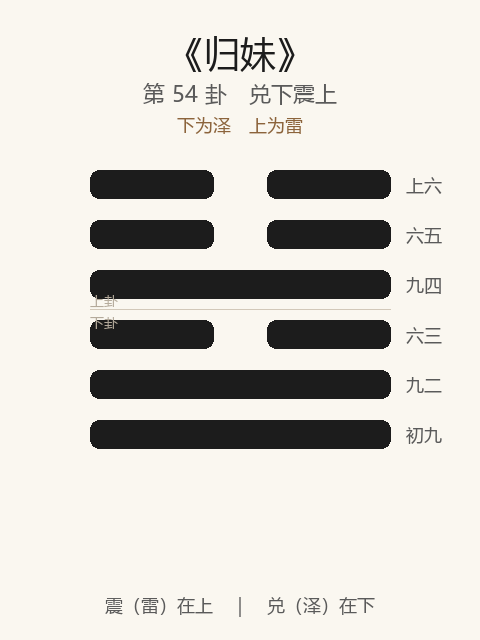

# 《归妹》卦解读

## 卦象

<p align="center">
  
</p>

**䷵ 归妹**（第 54 卦）｜**兑下震上**（下为泽，上为雷）

| 下卦（内） | 上卦（外） |
|------------|------------|
| ☱ 兑（泽） | ☳ 震（雷） |

```
━━  ━━  上六
━━  ━━  六五
━━━━━━  九四
━━  ━━  六三
━━━━━━  九二
━━━━━━  初九
```

> 阳爻为「九」（━━━━━━），阴爻为「六」（━━  ━━）；自下往上：初→上。

---

> 征凶，无攸利。
>
> 初九：归妹以娣，跛能履，征吉。
>
> 九二：眇能视，利幽人之贞。
>
> 六三：归妹以须，反归以娣。
>
> 九四：归妹愆期，迟归有时。
>
> 六五：帝乙归妹，其君之袂，不如其娣之袂良，月几望，吉。
>
> 上六：女承筐无实，士刲羊无血，无攸利。

《归妹》为兑下震上：泽上有雷，悦而动，少女从长男。归妹者，嫁少女也——**征凶，无攸利**。与渐相反：渐为女归以礼而吉，归妹为躁悦而归，卦辞严厉。整体讲不当之归：以娣、愆期、袂不如娣犹可；承筐无实则无攸利。

---

## 卦辞：征凶，无攸利

| 语 | 含义 |
|----|------|
| **征凶** | 进往则凶——悦动相从，名分不正，强进有害 |
| **无攸利** | 无所利——非正配之归，难以成终 |

渐「女归吉」，归妹「征凶，无攸利」——同是女归，**礼序与否，吉凶相反。**

---

## 六爻：归嫁的诸况

| 爻 | 爻辞 | 要旨 |
|----|------|------|
| **初九** | 归妹以娣，跛能履，征吉 | 以娣（陪嫁妾）身份归 → **如跛能走，征吉** |
| **九二** | 眇能视，利幽人之贞 | 如眇能视 → **宜幽人守正** |
| **六三** | 归妹以须，反归以娣 | 欲以贵女身份归 → **反降为娣** |
| **九四** | 归妹愆期，迟归有时 | 误了婚期 → **迟归仍有其时** |
| **六五** | 帝乙归妹……袂不如娣……月几望，吉 | 王姬下嫁，君袂不如娣袂美 → **近满月，吉** |
| **上六** | 女承筐无实，士刲羊无血，无攸利 | 女筐空，士宰羊无血 → **礼不成，无攸利** |

一条线：**以娣跛履征吉 → 眇视幽贞 → 须反为娣 → 愆期有时 → 帝乙归妹吉 → 筐空无攸利**。

归妹之要：**位卑而安（娣）可吉；越分则反；可迟不可伪；极则空礼无实。**

---

## 几处关键意象

### 泽上有雷 / 悦以动

兑悦在下，震动在上——因悦而动，动以嫁女。少女配长男，有「不正」之嫌（少配长，又以悦动），故卦辞凶。  
渐是止而巽（有礼），归妹是悦而动（易失礼）——**进退之别在「止」与「悦」。**

### 归妹以娣 / 跛能履

初九：不以正妻而以娣（侧室、陪嫁）归——名分低，如跛足，仍能履；承认其分而征，反吉。  
示：归妹卦中，**安于偏位，胜于妄求正位。**

### 眇能视，利幽人之贞

九二：能力有缺（眇），宜如幽人守静守正——不显不争。  
与《履》六三「眇能视，跛能履」同象而异用：履三凶，此则利幽贞——**知不足而守幽，乃利。**

### 以须 / 反归以娣

六三：须，待也（或作需贵之女）——想等更好的正配，结果反以娣归。  
越挑剔、越越分，越跌回妾位——**欲求正而得偏。**

### 愆期，迟归有时

九四：过了婚期，但「迟归有时」——晚不等于无。  
在归妹整体凶厉中，此爻留一线：可等待正当之时，**迟胜于乱。**

### 帝乙归妹……袂不如娣

六五：商王帝乙嫁女，正室之袂反不如娣之美——尊而能降，尚素朴，月几望（阴德将满）而吉。  
归妹中少有之吉：在上而能谦、能素，**不以文胜。**

### 承筐无实，刲羊无血

上六：婚礼之祭，女捧筐无实物，士宰羊无血——形式在，实质空，天地不交。  
归妹之终：**无实之合，无攸利**——应卦辞。

---

## 一条贯通的读法

1. **时**：渐进失序，或悦而动、嫁娶不正之时。
2. **德**：征凶，无攸利——不正之归不可进。
3. **事**：娣与幽贞可处；愆期可待；五能降则吉；上无实则终凶。
4. **戒**：以须求贵；空礼无实；不知眇跛而强征。

---

## 与《渐》对照

| | 渐 | 归妹 |
|---|----|------|
| 序 | 53 | 54 |
| 象 | 山上有木（序进） | 泽上有雷（悦动） |
| 女归 | 女归吉 | 征凶，无攸利 |
| 关系 | 有礼之归 | 失序之归 |
| 要诀 | 利贞，鸿渐 | 以娣、愆期、无实 |
| 终 | 羽为仪 | 筐无实 |

渐女归以礼，归妹则违礼而归——进必以正，否则无攸利。

---

## 人事简表

| 所问 | 要点 |
|------|------|
| **婚恋/合作/名分** | 卦辞严：不正则征凶、无攸利——先正名分 |
| **偏位** | 初：以娣，跛能履，征吉——安于配角可进 |
| **能力不足** | 二：眇能视——利幽人之贞，勿张扬 |
| **攀高** | 三：以须反归以娣——越求正位越降格 |
| **延迟** | 四：愆期，迟归有时——可等正当时机 |
| **居高能降** | 五：袂不如娣，月几望，吉——素朴谦下 |
| **空壳关系** | 上：承筐无实——无实质则无攸利 |
