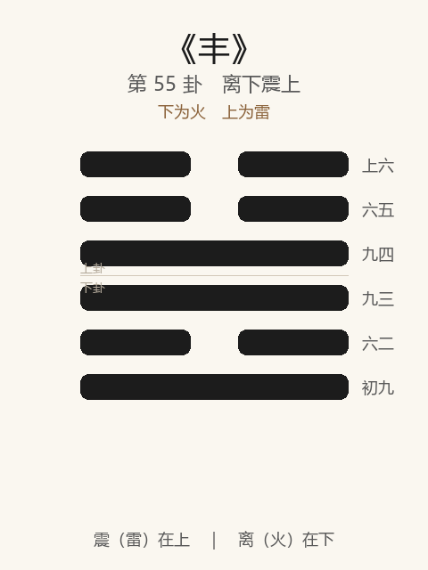

# 《丰》卦解读

## 卦象

<p align="center">
  
</p>

**䷶ 丰**（第 55 卦）｜**离下震上**（下为火，上为雷）

| 下卦（内） | 上卦（外） |
|------------|------------|
| ☲ 离（火） | ☳ 震（雷） |

```
━━  ━━  上六
━━  ━━  六五
━━━━━━  九四
━━━━━━  九三
━━  ━━  六二
━━━━━━  初九
```

> 阳爻为「九」（━━━━━━），阴爻为「六」（━━  ━━）；自下往上：初→上。

---

> 亨，王假之，勿忧，宜日中。
>
> 初九：遇其配主，虽旬无咎，往有尚。
>
> 六二：丰其蔀，日中见斗，往得疑疾，有孚发若，吉。
>
> 九三：丰其沛，日中见沫，折其右肱，无咎。
>
> 九四：丰其蔀，日中见斗，遇其夷主，吉。
>
> 六五：来章，有庆誉，吉。
>
> 上六：丰其屋，蔀其家，窥其户，阒其无人，三岁不觌，凶。

《丰》为离下震上：雷电皆至，明动相资，象征丰大、盛满。丰者，大也——**亨，王假之，勿忧，宜日中**。归妹后继丰：得所归则丰。整体讲处丰之道：宜日中；蔀蔽中须有孚；折肱无咎；来章有庆；戒丰屋无人。

---

## 卦辞：亨，王假之，勿忧，宜日中

| 语 | 含义 |
|----|------|
| **亨** | 丰盛则通 |
| **王假之** | 王以至诚感格丰道——盛大须有德者主之 |
| **勿忧** | 宜日中则不必忧盛极 |
| **宜日中** | 宜如日在中天——保持中正盛大，不过盈、不偏斜 |

丰之要诀：**盛大而持中**——日中则仄，故宜常若日中（明照不偏）。

---

## 六爻：丰与蔽

| 爻 | 爻辞 | 要旨 |
|----|------|------|
| **初九** | 遇其配主，虽旬无咎，往有尚 | 遇相配之主 → **虽均敌（旬）无咎，往有功** |
| **六二** | 丰其蔀，日中见斗，往得疑疾，有孚发若，吉 | 障蔽盛大，日中见北斗 → **往则遭疑；以孚启发，吉** |
| **九三** | 丰其沛，日中见沫，折其右肱，无咎 | 幡幔更暗，日中见小星 → **折右臂（不可用），无咎** |
| **九四** | 丰其蔀，日中见斗，遇其夷主，吉 | 同有蔀蔽 → **遇对等之主，吉** |
| **六五** | 来章，有庆誉，吉 | 招来章美（明） → **有福庆名誉，吉** |
| **上六** | 丰其屋，蔀其家……三岁不觌，凶 | 屋大而家被蔽，窥户无人 → **三年不见人，凶** |

一条线：**遇配主 → 蔀中有孚 → 沛暗折肱 → 遇夷主 → 来章庆誉 → 丰屋无人凶**。

丰之要：**持中配明；蔽中以孚；暗极自折可无咎；成在来章；忌丰而隔离。**

---

## 几处关键意象

### 雷电皆至 / 宜日中

震雷离电：明以动，动而明，故丰。  
「宜日中」：丰不是越满越好，而是**如日中天——普照、中正、不过午**。王假之者，以德居丰。

### 丰其蔀 / 日中见斗

蔀：障蔽光明之物。日正当中却看见北斗——大白天如夜，明被遮蔽。  
二、四同象：处丰而遇暗主/暗势——二以「有孚发若」启明则吉，四「遇其夷主」（对等之明友）则吉。  
**丰世仍有障蔽：破障靠孚与遇明主。**

### 丰其沛，折其右肱

九三：沛（幡幔）比蔀更暗，见沫（小星）——昏之甚。右肱折：才力不能施展。  
然「无咎」：时不可为，**自折其用，不强为，反无咎。**

### 来章，有庆誉

六五柔中：不自丰其障，而「来章」——招来文明章美，故有庆誉。  
丰卦君道：**以明来聚，不自蔽。**

### 丰其屋……三岁不觌，凶

上六：屋子极大，却蔀蔽其家，窥门无人，三年不见人——丰极而孤立，明尽而幽。  
与《丰》「宜日中」相反：**只丰其私屋，不丰其明与人，终凶。**

---

## 一条贯通的读法

1. **时**：明动相合、事业盛大之时。
2. **德**：亨在王假；宜日中——盛大守中，勿忧亦勿过。
3. **事**：初遇配，二孚发，四遇夷，五来章；三折肱；上戒无人。
4. **戒**：有障而无孚；暗中强往；丰屋蔀家，自绝于人。

---

## 与《归妹》衔接

| | 归妹 | 丰 |
|---|------|-----|
| 序 | 54 | 55 |
| 象 | 泽雷（悦动） | 雷火（明动） |
| 关系 | 得所归 | 则丰大 |
| 要诀 | 征凶，无攸利 | 宜日中，勿忧 |
| 极 | 筐无实 | 丰屋无人 |

得所归则必丰——归妹后继丰；丰须持中，否则屋丰而人亡。

---

## 人事简表

| 所问 | 要点 |
|------|------|
| **盛大/巅峰** | 宜日中——保持中正普照；王假之，勿忧 |
| **遇合** | 初遇配主、四遇夷主——势均亦可，往有尚／吉 |
| **被遮蔽** | 二：日中见斗——以孚启发，吉；勿疑而乱往 |
| **才不得展** | 三：折右肱——暂敛其用，无咎 |
| **当位** | 五：来章，有庆誉——招明纳贤 |
| **最戒** | 上：丰屋无人——盛大而孤立，三岁不觌，凶 |
