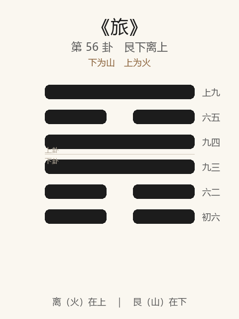

# 《旅》卦解读

## 卦象

<p align="center">
  
</p>

**䷷ 旅**（第 56 卦）｜**艮下离上**（下为山，上为火）

| 下卦（内） | 上卦（外） |
|------------|------------|
| ☶ 艮（山） | ☲ 离（火） |

```
━━━━━━  上九
━━  ━━  六五
━━━━━━  九四
━━━━━━  九三
━━  ━━  六二
━━  ━━  初六
```

> 阳爻为「九」（━━━━━━），阴爻为「六」（━━  ━━）；自下往上：初→上。

---

> 小亨，旅贞吉。
>
> 初六：旅琐琐，斯其所取灾。
>
> 六二：旅即次，怀其资，得童仆贞。
>
> 九三：旅焚其次，丧其童仆，贞厉。
>
> 九四：旅于处，得其资斧，我心不快。
>
> 六五：射雉一矢亡，终以誉命。
>
> 上九：鸟焚其巢，旅人先笑，后号啕。丧牛于易，凶。

《旅》为艮下离上：山上有火，火行不居，象征羁旅、寄寓。旅者，客也——**小亨，旅贞吉**。与丰相反：丰为日中盛大，旅为失其所居。整体讲处旅之道：琐琐取灾；即次怀资得仆；戒焚次丧仆；射雉得誉；鸟焚其巢则凶。

---

## 卦辞：小亨，旅贞吉

| 语 | 含义 |
|----|------|
| **小亨** | 羁旅之通，仅能小亨——不可图大 |
| **旅贞吉** | 在旅中守正则吉——客不骄、不苟 |

丰极则旅：日中则昃，失其居则在旅。旅之吉，全在**贞**；所亨者小，妄大则灾。

---

## 六爻：羁旅诸境

| 爻 | 爻辞 | 要旨 |
|----|------|------|
| **初六** | 旅琐琐，斯其所取灾 | 琐碎猥鄙 → **自取其灾** |
| **六二** | 旅即次，怀其资，得童仆贞 | 住进旅舍，怀藏资财，得童仆 → **守正** |
| **九三** | 旅焚其次，丧其童仆，贞厉 | 旅舍被焚，丧童仆 → **守此亦危** |
| **九四** | 旅于处，得其资斧，我心不快 | 暂有住处，得资斧 → **心仍不快（未得安）** |
| **六五** | 射雉一矢亡，终以誉命 | 射雉费一矢 → **终得名誉与爵命** |
| **上九** | 鸟焚其巢，旅人先笑后号啕。丧牛于易，凶 | 巢被焚，先笑后哭 → **丧牛于疆场，凶** |

一条线：**忌琐琐 → 即次得仆 → 忌焚次 → 处而不快 → 射雉誉命 → 焚巢号啕**。

旅之要：**柔顺中正，即次怀资；戒鄙琐、戒刚躁焚巢；小成可誉，极则凶。**

---

## 几处关键意象

### 山上有火

火在山上，延烧不久留——旅无常居。明（离）而止（艮）：寄寓须明察，亦须知止，不可久据。

### 旅琐琐，斯其所取灾

初六柔弱在下：处旅而计较琐碎、气质猥琐——灾不是外来，是自取。  
旅之第一戒：**穷途中更不可小器、自贱。**

### 即次 / 焚其次

| | 即次（二） | 焚其次（三） |
|---|-----------|-------------|
| 次 | 旅舍安顿 | 旅舍焚毁 |
| 仆 | 得童仆贞 | 丧其童仆 |
| 因 | 柔中得正 | 过刚不中 |
| 果 | 可守 | 贞厉 |

同是「次」与「童仆」：二柔安则得，三刚躁则丧——**旅中柔胜刚。**

### 旅于处……我心不快

九四：有处、有资斧（旅费、斧资），物质略备，心仍不快——未得真正归宿与正应。  
示：旅中小安不等于安；**身安而心悬，常情也。**

### 射雉一矢亡，终以誉命

六五柔中：旅而文明，如射雉虽费一矢，终获誉与命——小失换大得。  
旅卦少有之成：**以柔明得上赏，终吉。**

### 鸟焚其巢……丧牛于易

上九刚亢：巢焚——连临时栖所也毁；先笑后号啕——乐极生悲；丧牛于易（疆场/轻易之地）——失其顺（牛为顺畜）。  
旅之终：**高傲失所，先喜后悲，凶。**

---

## 一条贯通的读法

1. **时**：丰极失居、寄人篱下、行旅无定之时。
2. **德**：小亨；旅贞吉——守正、柔顺、勿琐勿亢。
3. **事**：二即次，五射雉；初戒琐，三戒焚，上戒焚巢。
4. **戒**：琐琐取灾；刚而焚次；处而不知不足；先笑后哭。

---

## 与《丰》对照

| | 丰 | 旅 |
|---|----|-----|
| 序 | 55 | 56 |
| 象 | 雷火（盛大） | 山火（不居） |
| 关系 | 丰极 | 则旅 |
| 要诀 | 宜日中 | 小亨，旅贞吉 |
| 极 | 丰屋无人 | 鸟焚其巢 |
| 方向 | 持中盛大 | 寄寓守正 |

丰大而失所，则在旅——日中之后，宜知旅之戒。

---

## 人事简表

| 所问 | 要点 |
|------|------|
| **出差/寄居/过渡期** | 小亨，旅贞吉——图小安，守正即可 |
| **最戒** | 初琐琐取灾；三焚次丧仆；上焚巢号啕 |
| **安顿** | 二：即次，怀资，得童仆贞——柔顺得助 |
| **小安仍不安** | 四：有资斧而心不快——正常，未到归处 |
| **求成** | 五：射雉一矢亡，终以誉命——小失可换名誉任命 |
| **得意忘形** | 上：先笑后号啕——旅中不可亢极 |
