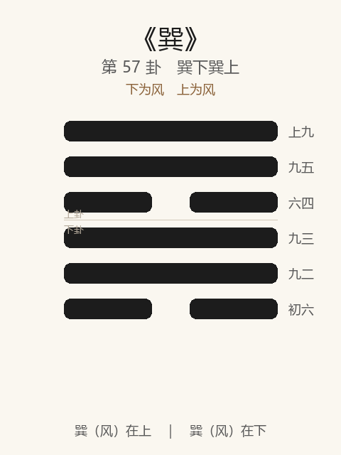

# 《巽》卦解读

## 卦象

<p align="center">
  
</p>

**䷸ 巽**（第 57 卦）｜**巽下巽上**（下为风，上为风）

| 下卦（内） | 上卦（外） |
|------------|------------|
| ☴ 巽（风） | ☴ 巽（风） |

```
━━━━━━  上九
━━━━━━  九五
━━  ━━  六四
━━━━━━  九三
━━━━━━  九二
━━  ━━  初六
```

> 阳爻为「九」（━━━━━━），阴爻为「六」（━━  ━━）；自下往上：初→上。

---

> 小亨，利有攸往，利见大人。
>
> 初六：进退，利武人之贞。
>
> 九二：巽在床下，用史巫纷若吉，无咎。
>
> 九三：频巽，吝。
>
> 六四：悔亡，田获三品。
>
> 九五：贞吉悔亡，无不利。无初有终，先庚三日，后庚三日，吉。
>
> 上九：巽在床下，丧其资斧，贞凶。

《巽》为巽下巽上：随风，风与风相重。巽者，入也、顺也——**小亨，利有攸往，利见大人**。旅后继巽：旅无所容则入。整体讲逊顺深入：进退宜武人之贞；床下用史巫可吉；戒频巽；获三品；先庚后庚；极则丧资斧贞凶。

---

## 卦辞：小亨，利有攸往，利见大人

| 语 | 含义 |
|----|------|
| **小亨** | 巽顺之通，为小亨——柔入，不逞大壮 |
| **利有攸往** | 能入则可行 |
| **利见大人** | 宜见刚中之大人——巽须有所从 |

巽为风，无孔不入；又为逊顺。亨在小，往在顺，成在见大人——**顺而有主，乃利。**

---

## 六爻：巽入的分寸

| 爻 | 爻辞 | 要旨 |
|----|------|------|
| **初六** | 进退，利武人之贞 | 进退不定 → **宜如武人般果断守正** |
| **九二** | 巽在床下，用史巫纷若吉，无咎 | 过于卑顺在床下 → **用史巫纷然申诚则吉，无咎** |
| **九三** | 频巽，吝 | 屡次卑顺、反复不决 → **吝** |
| **六四** | 悔亡，田获三品 | 悔亡 → **田猎获三种猎物（有功）** |
| **九五** | 贞吉悔亡，无不利。无初有终，先庚三日，后庚三日，吉 | 守正则吉悔亡 → **无不利；事先事后慎重（庚），吉** |
| **上九** | 巽在床下，丧其资斧，贞凶 | 卑极在床下 → **丧失资斧，守此亦凶** |

一条线：**进退取武贞 → 床下史巫吉 → 忌频巽 → 获三品 → 先庚后庚 → 床下丧斧凶**。

巽之要：**顺而果（武人之贞）；过卑可申诚；戒频；中正先庚后庚；极巽则丧志丧斧。**

---

## 几处关键意象

### 随风，君子以申命行事

风相随而入：申命如风，遍入民心。巽之人事：**命令、说服、深入，贵申而顺，不贵暴。**

### 进退，利武人之贞

初六柔弱：进退犹豫。利「武人之贞」——不是教人好战，而是取武人**果断专一**之贞，以济巽之优柔。  
巽之始，最忌优柔不断。

### 巽在床下：二吉上凶

| | 九二 | 上九 |
|---|------|------|
| 象 | 巽在床下 | 巽在床下 |
| 救/果 | 用史巫纷若 → 吉无咎 | 丧其资斧 → 贞凶 |
| 义 | 过卑而以虔诚申明 | 卑极而丧刚断之具 |

同在床下：二有刚中，能以史巫（祝史、巫覡）纷然表达诚意，可救；上无应而极巽，连资斧（旅资、刚断之器）也丧——**顺过头即失自立。**

### 频巽，吝

九三：频繁表示顺从、朝令夕改其巽——无恒，故吝。  
与《恒》「不恒其德」通：巽可，频巽不可。

### 先庚三日，后庚三日

九五巽之主：庚为变更之始（与蛊「先甲后甲」相类）。事先三日谋，事后三日审——命令、改革皆慎始慎终。  
「无初有终」：开头或不足，有庚之慎则有终，吉。

### 田获三品

六四：柔得正，上承五——悔亡而田猎有获（三品：供祭、供宾、供君之用）。  
示：正当之巽，**顺以有功，非一无所成。**

---

## 一条贯通的读法

1. **时**：寄旅之后，当深入、申命、逊顺行事之时。
2. **德**：小亨；利往、利见大人——顺而从正。
3. **事**：初取武贞，二史巫，四获品，五先庚后庚；三戒频，上戒丧斧。
4. **戒**：优柔进退；频巽；极巽床下而失资斧。

---

## 与《旅》衔接

| | 旅 | 巽 |
|---|----|-----|
| 序 | 56 | 57 |
| 象 | 山火（不居） | 随风（深入） |
| 关系 | 旅无所容 | 则入 |
| 要诀 | 小亨，旅贞吉 | 小亨，利见大人 |
| 「床下」 | — | 二吉上凶 |
| 方向 | 寄寓 | 巽入申命 |

旅而入，入以巽——故旅后继巽。

---

## 人事简表

| 所问 | 要点 |
|------|------|
| **沟通/从属/深入** | 小亨；利往，利见大人——顺而有主 |
| **犹豫** | 初：进退——取武人之贞，果断守正 |
| **过卑** | 二：床下——以纷然诚意申明，吉；上则丧斧凶 |
| **反复讨好** | 三：频巽，吝 |
| **有功** | 四：田获三品——顺而得功 |
| **发令/改革** | 五：先庚三日，后庚三日——慎始慎终，贞吉 |
| **最戒** | 上：巽极丧资斧——顺到失去决断与凭依，贞凶 |
