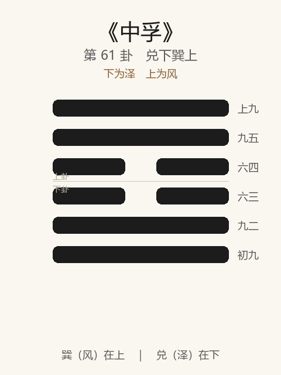

# 《中孚》卦解读

## 卦象

<p align="center">
  
</p>

**䷼ 中孚**（第 61 卦）｜**兑下巽上**（下为泽，上为风）

| 下卦（内） | 上卦（外） |
|------------|------------|
| ☱ 兑（泽） | ☴ 巽（风） |

```
━━━━━━  上九
━━━━━━  九五
━━  ━━  六四
━━  ━━  六三
━━━━━━  九二
━━━━━━  初九
```

> 阳爻为「九」（━━━━━━），阴爻为「六」（━━  ━━）；自下往上：初→上。

---

> 豚鱼吉，利涉大川，利贞。
>
> 初九：虞吉，有他不燕。
>
> 九二：鸣鹤在阴，其子和之，我有好爵，吾与尔靡之。
>
> 六三：得敌，或鼓或罢，或泣或歌。
>
> 六四：月几望，马匹亡，无咎。
>
> 九五：有孚挛如，无咎。
>
> 上九：翰音登于天，贞凶。
>
《中孚》为兑下巽上：泽上有风，中虚信实（二阴在中，四阳在外）。中孚者，信发于中也——**豚鱼吉，利涉大川，利贞**。节后继中孚：有节而信乃立。整体讲诚信：豚鱼可感；鹤鸣子和；戒有他、得敌无恒；挛如无咎；翰音登天贞凶。

---

## 卦辞：豚鱼吉，利涉大川，利贞

| 语 | 含义 |
|----|------|
| **豚鱼吉** | 诚信能感及豚鱼（微贱之物）→ 吉——信之至，物无不应 |
| **利涉大川** | 有中孚之信，可乘木舟涉险 |
| **利贞** | 信须正——邪信、虚声不利 |

中孚之象：中心虚而能容，外实而能守——**至诚如神，可感豚鱼，可涉大川。**

---

## 六爻：信的纯驳

| 爻 | 爻辞 | 要旨 |
|----|------|------|
| **初九** | 虞吉，有他不燕 | 安于专一之信 → **吉；有他念则不安** |
| **九二** | 鸣鹤在阴，其子和之，我有好爵，吾与尔靡之 | 鹤鸣于幽，子来应和 → **有美酒与尔共享** |
| **六三** | 得敌，或鼓或罢，或泣或歌 | 遇敌手/匹敌 → **或进或止，或哭或歌（无恒）** |
| **六四** | 月几望，马匹亡，无咎 | 月将近满，失去匹配之马 → **无咎（专向上）** |
| **九五** | 有孚挛如，无咎 | 诚信固结如挛 → **无咎** |
| **上九** | 翰音登于天，贞凶 | 鸡鸣之声欲登天 → **虚声上扬，守此亦凶** |

一条线：**虞吉忌有他 → 鹤鸣子和 → 得敌无恒 → 月望马亡 → 孚挛如 → 翰音登天凶**。

中孚之要：**专一、相应、挛固；忌他念、忌无恒、忌虚声登天。**

---

## 几处关键意象

### 泽上有风 / 中虚

风感泽水：诚信感通之象。中二阴为虚，虚则能孚——满则不能受。  
节以止，孚以感：有制度而无诚信，节为空壳。

### 豚鱼吉

豚鱼为祭之薄物、或微贱难感之物——至诚能及于此，则吉。  
示：信不在物丰位高，在**中心之实**；能感微贱，乃真孚。

### 虞吉，有他不燕

初九：虞，安也、专也——专一信赖则吉；「有他」则心有旁骛，不燕（不安）。  
中孚之始：**信贵专，忌二心。**

### 鸣鹤在阴，其子和之

九二中实：鹤鸣于幽阴之地，其子应和——《系辞》赞「同声相应」。  
「我有好爵，吾与尔靡之」——有美共享，不独享。  
**真信在幽微中相应，不在喧哗；有德愿与人共。**

### 得敌……或泣或歌

六三：得敌（相对、匹敌），情绪行动摇摆——鼓罢泣歌，无有恒。  
居两阴之中，信不专，故无吉辞——**无恒则无真孚。**

### 月几望，马匹亡

六四：阴德将满（月几望），「马匹亡」——失去匹配的并行者，专承九五。  
绝其党类之私匹，乃无咎——与《中孚》「有他不燕」同旨：**专则无咎。**

### 翰音登于天，贞凶

上九：翰音，鸡鸣（鸡曰翰音）——声欲上闻于天，信已外浮为虚名。  
极则信变为声，**虚声登天，贞亦凶**——与豚鱼之实感相反。

---

## 一条贯通的读法

1. **时**：节度既立，当以诚信感通之时。
2. **德**：豚鱼吉；利涉大川；利贞——至诚而正。
3. **事**：初虞，二鹤和，四五专挛；三戒无恒，上戒翰音。
4. **戒**：有他；得敌无恒；信变为虚声登天。

---

## 与《节》衔接

| | 节 | 中孚 |
|---|----|------|
| 序 | 60 | 61 |
| 象 | 水泽（限度） | 风泽（信感） |
| 关系 | 节而后信 | 信以成节 |
| 要诀 | 苦节不可贞 | 豚鱼吉，利涉大川 |
| 方向 | 立度 | 感通 |
| 极 | 苦节 | 翰音登天 |

有节而无信，人弗从；故节后继中孚——中心有信，乃可涉川。

---

## 人事简表

| 所问 | 要点 |
|------|------|
| **信任/盟约/感通** | 豚鱼吉——至诚可感微；利涉大川，利贞 |
| **专一** | 初：虞吉；有他不燕——别三心二意 |
| **相应** | 二：鹤鸣子和——同气相感，有美与共 |
| **摇摆** | 三：或鼓或罢，或泣或歌——无恒则难孚 |
| **绝私匹** | 四：马匹亡，无咎——专向上应 |
| **当位** | 五：有孚挛如——诚信固结，无咎 |
| **最戒** | 上：翰音登于天——虚名上扬，贞凶 |
