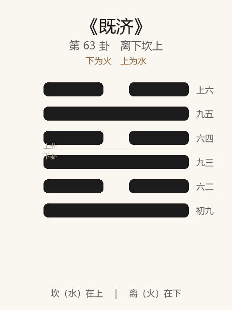

# 《既济》卦解读

## 卦象

<p align="center">
  
</p>

**䷾ 既济**（第 63 卦）｜**离下坎上**（下为火，上为水）

| 下卦（内） | 上卦（外） |
|------------|------------|
| ☲ 离（火） | ☵ 坎（水） |

```
━━  ━━  上六
━━━━━━  九五
━━  ━━  六四
━━━━━━  九三
━━  ━━  六二
━━━━━━  初九
```

> 阳爻为「九」（━━━━━━），阴爻为「六」（━━  ━━）；自下往上：初→上。

---

> 亨，小利贞，初吉终乱。
>
> 初九：曳其轮，濡其尾，无咎。
>
> 六二：妇丧其茀，勿逐，七日得。
>
> 九三：高宗伐鬼方，三年克之，小人勿用。
>
> 六四：繻有衣袽，终日戒。
>
> 九五：东邻杀牛，不如西邻之禴祭，实受其福。
>
> 上六：濡其首，厉。
>
《既济》为离下坎上：水在火上，烹饪既成；六爻皆当位。既济者，事已成也——**亨，小利贞，初吉终乱**。小过后继既济：过而趋于定。整体讲既成之后：曳轮濡尾；丧茀勿逐；伐鬼方小人勿用；终日戒；禴祭受福；戒濡首。

---

## 卦辞：亨，小利贞，初吉终乱

| 语 | 含义 |
|----|------|
| **亨** | 既成则通——水火相交，事已济 |
| **小利贞** | 仅小利于守正——成功之后，不可再图大变 |
| **初吉终乱** | 开始吉利，最终易乱——既济之戒：成则生怠，济极则反 |

既济表面最完美（爻位皆正），卦辞却点明**终乱**——《易》不以完成为终点，而以忧成。

---

## 六爻：济成之后的持守

| 爻 | 爻辞 | 要旨 |
|----|------|------|
| **初九** | 曳其轮，濡其尾，无咎 | 拖住车轮，湿了尾巴 → **知止缓进，无咎** |
| **六二** | 妇丧其茀，勿逐，七日得 | 妇人丢失车帘 → **勿追，七日自得** |
| **九三** | 高宗伐鬼方，三年克之，小人勿用 | 高宗征鬼方，三年才克 → **小人勿用** |
| **六四** | 繻有衣袽，终日戒 | 华服而备破衣 → **整日戒惧** |
| **九五** | 东邻杀牛，不如西邻之禴祭，实受其福 | 东邻杀牛厚祭 → **不如西邻薄祭更得实福** |
| **上六** | 濡其首，厉 | 水淹及头 → **危** |

一条线：**曳轮濡尾 → 丧茀勿逐 → 三年克之小人勿用 → 终日戒 → 禴祭受福 → 濡首厉**。

既济之要：**成后缓、戒、诚、勿用小人；初吉在敛，终乱在濡首忘忧。**

---

## 几处关键意象

### 水在火上 / 爻位皆正

坎水离火：水火相交而既济（如鼎烹已成）。初三五阳位皆阳，二四上阴位皆阴——最「正」之卦。  
正因太成，故戒「终乱」——**满则溢，安则危。**

### 曳其轮，濡其尾

初九：渡河既济之象——拖轮使缓，尾虽湿而无咎。  
成功之始，宜**减速、慎收**，不宜加速冲顶。

### 丧其茀，勿逐，七日得

六二：茀为车蔽；丢失小物，勿慌追——七日（周期）后自得。  
与震六二同旨：既济中小失，**静待自复，勿乱成局。**

### 高宗伐鬼方，三年克之，小人勿用

九三：殷高宗克鬼方，历时三年——既济中仍有大役，成之艰难。  
「小人勿用」：成功之后最忌用非其人——**克敌难，用人更关终乱。**

### 繻有衣袽，终日戒

六四：穿着细绢，却备着破絮（袽）——盛时思破。  
「终日戒」：既济之心法——**无时不戒，乃可延吉。**

### 东邻杀牛 / 西邻禴祭

九五：东邻厚祭（杀牛）反不如西邻薄祭（禴）得实福——与损「二簋」、萃「孚乃利用禴」同。  
既济之主：**实诚胜虚文；受福在心不在物。**

### 濡其首，厉

上六：渡水而头也湿——进过头，济极成溺。  
应「终乱」：初濡尾无咎，上濡首则厉——**同一济水，首尾之别即吉凶之别。**

---

## 一条贯通的读法

1. **时**：事已成就、水火既交、表面圆满之时。
2. **德**：亨而小利贞——守成以正；戒终乱。
3. **事**：初曳轮，二勿逐，三克而勿用小人，四终日戒，五禴受福。
4. **戒**：成而躁进；用小人；虚文厚祭；濡首忘戒。

---

## 与《小过》衔接，及开《未济》

| | 小过 | 既济 | 未济 |
|---|------|------|------|
| 序 | 62 | 63 | 64 |
| 象 | 山雷（过） | 水火（已成） | 火水（未成） |
| 要诀 | 可小事，宜下 | 初吉终乱 | （见下卦） |
| 关系 | 过而趋于定 | 定极则乱 | 乱中又待济 |

物不可穷，既济终则未济——《易》终未济，不终既济，深意在此。

---

## 人事简表

| 所问 | 要点 |
|------|------|
| **成功之后** | 亨，小利贞——宜守成；警惕初吉终乱 |
| **起步收势** | 初：曳其轮，濡其尾——减速慎收，无咎 |
| **小损失** | 二：勿逐，七日得 |
| **善后/用人** | 三：大功亦难；小人勿用 |
| **日常** | 四：终日戒——盛时备患 |
| **祭祀/表达** | 五：诚薄胜虚厚，实受其福 |
| **过满** | 上：濡其首，厉——别顶到头 |
