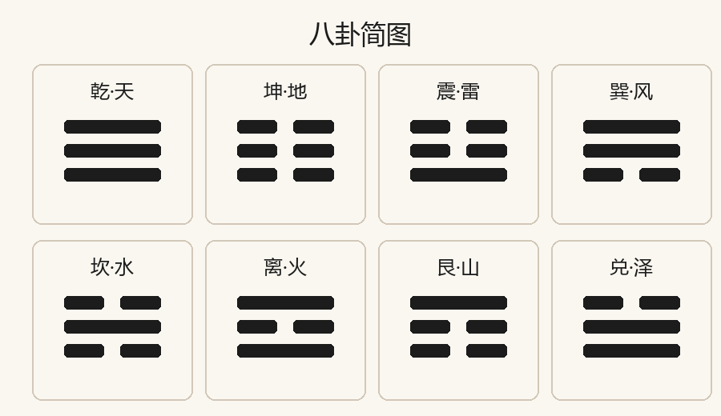
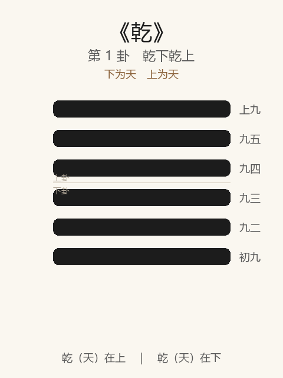

# 易经六十四卦解读

本仓库整理《周易》六十四卦解读。每卦文首含 **卦象图**（上下经卦 + 六爻），可在 GitHub 直接预览。

## 八卦

<p align="center">
  
</p>

更多说明见 [00-八卦简表.md](./00-八卦简表.md)

## 上经（1–30）

| 序 | 卦 | 解读 |
|----|----|------|
| 1 | 乾 | [01-乾卦解读.md](./01-乾卦解读.md) |
| 2 | 坤 | [02-坤卦解读.md](./02-坤卦解读.md) |
| 3 | 屯 | [03-屯卦解读.md](./03-屯卦解读.md) |
| 4 | 蒙 | [04-蒙卦解读.md](./04-蒙卦解读.md) |
| 5 | 需 | [05-需卦解读.md](./05-需卦解读.md) |
| 6 | 讼 | [06-讼卦解读.md](./06-讼卦解读.md) |
| 7 | 师 | [07-师卦解读.md](./07-师卦解读.md) |
| 8 | 比 | [08-比卦解读.md](./08-比卦解读.md) |
| 9 | 小畜 | [09-小畜卦解读.md](./09-小畜卦解读.md) |
| 10 | 履 | [10-履卦解读.md](./10-履卦解读.md) |
| 11 | 泰 | [11-泰卦解读.md](./11-泰卦解读.md) |
| 12 | 否 | [12-否卦解读.md](./12-否卦解读.md) |
| 13 | 同人 | [13-同人卦解读.md](./13-同人卦解读.md) |
| 14 | 大有 | [14-大有卦解读.md](./14-大有卦解读.md) |
| 15 | 谦 | [15-谦卦解读.md](./15-谦卦解读.md) |
| 16 | 豫 | [16-豫卦解读.md](./16-豫卦解读.md) |
| 17 | 随 | [17-随卦解读.md](./17-随卦解读.md) |
| 18 | 蛊 | [18-蛊卦解读.md](./18-蛊卦解读.md) |
| 19 | 临 | [19-临卦解读.md](./19-临卦解读.md) |
| 20 | 观 | [20-观卦解读.md](./20-观卦解读.md) |
| 21 | 噬嗑 | [21-噬嗑卦解读.md](./21-噬嗑卦解读.md) |
| 22 | 贲 | [22-贲卦解读.md](./22-贲卦解读.md) |
| 23 | 剥 | [23-剥卦解读.md](./23-剥卦解读.md) |
| 24 | 复 | [24-复卦解读.md](./24-复卦解读.md) |
| 25 | 无妄 | [25-无妄卦解读.md](./25-无妄卦解读.md) |
| 26 | 大畜 | [26-大畜卦解读.md](./26-大畜卦解读.md) |
| 27 | 颐 | [27-颐卦解读.md](./27-颐卦解读.md) |
| 28 | 大过 | [28-大过卦解读.md](./28-大过卦解读.md) |
| 29 | 坎 | [29-坎卦解读.md](./29-坎卦解读.md) |
| 30 | 离 | [30-离卦解读.md](./30-离卦解读.md) |

## 下经（31–64）

| 序 | 卦 | 解读 |
|----|----|------|
| 31 | 咸 | [31-咸卦解读.md](./31-咸卦解读.md) |
| 32 | 恒 | [32-恒卦解读.md](./32-恒卦解读.md) |
| 33 | 遯 | [33-遯卦解读.md](./33-遯卦解读.md) |
| 34 | 大壮 | [34-大壮卦解读.md](./34-大壮卦解读.md) |
| 35 | 晋 | [35-晋卦解读.md](./35-晋卦解读.md) |
| 36 | 明夷 | [36-明夷卦解读.md](./36-明夷卦解读.md) |
| 37 | 家人 | [37-家人卦解读.md](./37-家人卦解读.md) |
| 38 | 睽 | [38-睽卦解读.md](./38-睽卦解读.md) |
| 39 | 蹇 | [39-蹇卦解读.md](./39-蹇卦解读.md) |
| 40 | 解 | [40-解卦解读.md](./40-解卦解读.md) |
| 41 | 损 | [41-损卦解读.md](./41-损卦解读.md) |
| 42 | 益 | [42-益卦解读.md](./42-益卦解读.md) |
| 43 | 夬 | [43-夬卦解读.md](./43-夬卦解读.md) |
| 44 | 姤 | [44-姤卦解读.md](./44-姤卦解读.md) |
| 45 | 萃 | [45-萃卦解读.md](./45-萃卦解读.md) |
| 46 | 升 | [46-升卦解读.md](./46-升卦解读.md) |
| 47 | 困 | [47-困卦解读.md](./47-困卦解读.md) |
| 48 | 井 | [48-井卦解读.md](./48-井卦解读.md) |
| 49 | 革 | [49-革卦解读.md](./49-革卦解读.md) |
| 50 | 鼎 | [50-鼎卦解读.md](./50-鼎卦解读.md) |
| 51 | 震 | [51-震卦解读.md](./51-震卦解读.md) |
| 52 | 艮 | [52-艮卦解读.md](./52-艮卦解读.md) |
| 53 | 渐 | [53-渐卦解读.md](./53-渐卦解读.md) |
| 54 | 归妹 | [54-归妹卦解读.md](./54-归妹卦解读.md) |
| 55 | 丰 | [55-丰卦解读.md](./55-丰卦解读.md) |
| 56 | 旅 | [56-旅卦解读.md](./56-旅卦解读.md) |
| 57 | 巽 | [57-巽卦解读.md](./57-巽卦解读.md) |
| 58 | 兑 | [58-兑卦解读.md](./58-兑卦解读.md) |
| 59 | 涣 | [59-涣卦解读.md](./59-涣卦解读.md) |
| 60 | 节 | [60-节卦解读.md](./60-节卦解读.md) |
| 61 | 中孚 | [61-中孚卦解读.md](./61-中孚卦解读.md) |
| 62 | 小过 | [62-小过卦解读.md](./62-小过卦解读.md) |
| 63 | 既济 | [63-既济卦解读.md](./63-既济卦解读.md) |
| 64 | 未济 | [64-未济卦解读.md](./64-未济卦解读.md) |

## 图片路径

卦象文件在 [`images/`](./images/) 目录：`00.png`（八卦总图）、`01.png`–`64.png`（各卦）。

各卦解读文首引用格式：

```markdown

```
